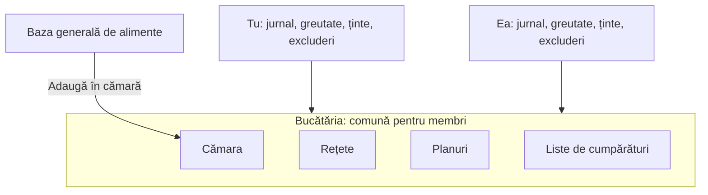

# Bucătăria: alimente comune, cămară și partajare

> **Construită pe 2026-10-04.** Codul: `api/MacroMate.Api/Features/Kitchens/`, `api/MacroMate.Api/Data/Kitchen.cs`, `web/src/components/app/kitchen-section.tsx`, `web/src/routes/invite.$token.tsx`, `web/src/db/kitchen.ts`. Cum funcționează: `docs/ghid/10-bucataria.md`. Față de textul de mai jos, s-a construit altfel: arhiva se aduce înapoi toată odată („Adu tot înapoi”), nu câte un lucru; partajarea în afara bucătăriei („Salvează la mine”) și înregistrarea din pagina de login nu sunt construite (contul nou se face doar din invitație sau cu `create-user`).

Specificația pentru schimbarea de model de date de după deploy. Stabilită cu Florin pe 2026-10-04.

## Ce se schimbă, pe scurt

Acum, toate conturile văd și pot șterge aceleași alimente, rețete, planuri și liste. După schimbare:

| Ce | Al cui e |
|---|---|
| **Baza generală de alimente** | a tuturor conturilor: alimentele de start și tot ce a scanat sau a scris cineva |
| **Bucătăria** | a membrilor ei: cămara, rețetele, planurile, listele de cumpărături |
| **Cămara** | alimentele alese de bucătărie din baza generală; înlocuiește favoritele |
| Jurnalul, planul zilei, greutatea, țintele, excluderile, „îmi place” | ale fiecărui om, mereu |

## Cămara

- Pe un aliment din baza generală: **„Adaugă în cămară”** / **„Scoate din cămară”**. Steluța de favorit dispare.
- La trecerea pe modelul nou, favoritele fiecăruia intră în cămara bucătăriei lui.
- Un aliment nou, scanat sau scris de tine, intră în baza generală și direct în cămara ta.
- Cămara e prima peste tot:
  - primul tab la „Adaugă”, în locul lui „Favorite”;
  - filtrul implicit din Alimente, cu baza generală la un click;
  - DeepSeek folosește întâi alimentele din cămară la rețetele generate;
  - alternativele unui ingredient vin întâi din cămară.

## Bucătăria

- Fiecare cont are **o bucătărie** și e într-o singură bucătărie la un moment dat.
- La un cont nou, bucătăria e goală și e doar a lui.

### Invitația

1. Din Profil: **„Invită în bucătărie”** dă un link.
2. Cine îl deschide își face cont din link sau se loghează, apoi acceptă.
3. Modalul la acceptare: **„Aduci și ce ai tu?”**, cu Da bifat implicit.
   - **Da**: cămara, rețetele, planurile și listele lui se adaugă în bucătăria comună. Un aliment pe care îl aveți amândoi în cămară apare o singură dată.
   - **Nu**: ce avea se mută în **arhiva lui**, neatins. O vede în Profil → „Arhiva mea” și poate aduce de acolo câte un lucru oricând.

### Plecarea

- Cine pleacă primește o bucătărie nouă, a lui, cu **o copie a tot ce era în bucătăria comună** în momentul plecării.
- Dacă are ceva în arhivă, apare modalul **„Aduci înapoi și ce aveai înainte?”**.
  - Da: arhiva se adaugă în bucătăria nouă, fără să dubleze alimentele din cămară.
  - Nu: arhiva rămâne și o poate aduce mai târziu.
- **Modalul apare doar dacă arhiva nu e goală.** Cine a făcut invitația nu are arhivă (ce avea el e chiar bucătăria comună), deci la plecare primește doar copia.
- Bucătăria comună rămâne la cei care nu pleacă, neschimbată. După plecare, nimic nu se mai sincronizează între cele două bucătării.
- **Proprietarul** bucătăriei e cine a creat-o. Doar el poate scoate un membru; ceilalți pot doar să plece. Cine a fost invitat nu-l poate scoate pe cel care l-a invitat.
- Dacă proprietarul pleacă, rolul trece la unul dintre membrii rămași.
- Dacă un membru e scos de proprietar, pentru el e la fel ca o plecare.

## Partajarea în afara bucătăriei

- O rețetă sau un plan se poate trimite oricui, ca link.
- Cine îl primește apasă **„Salvează la mine”** și primește o copie în bucătăria lui. Copia nu se mai sincronizează cu originalul.
- Un plan copiat aduce cu el și variantele de rețete pe care le folosește.

## Întrebări deschise

- **Cine modifică un aliment din baza generală?** Propunere: doar cine l-a adăugat. Ceilalți îl pot scoate din cămară, nu îl pot șterge pentru toți.
- **Înregistrarea din aplicație**: acum conturile se fac doar cu `create-user` pe server. Odată cu bucătăria, contul se face din link-ul de invitație sau din pagina de login.
