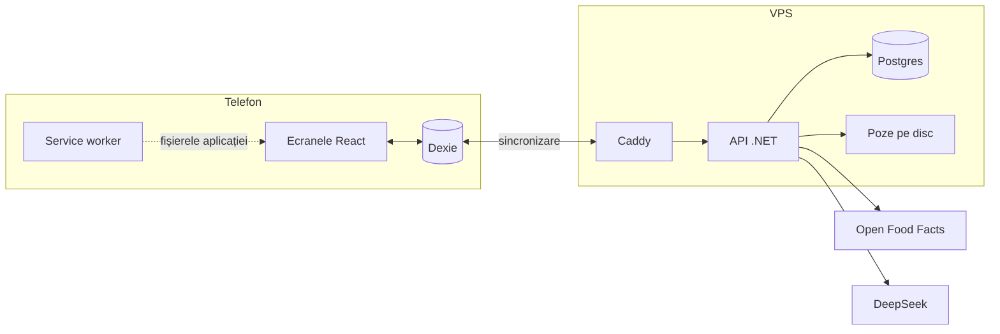
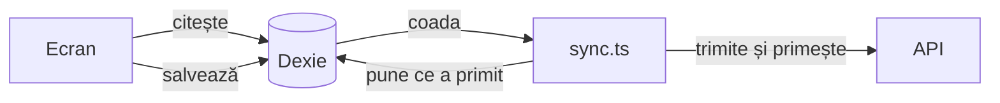

# 1. Harta aplicației

MacroMate are trei piese care rulează în locuri diferite:
- **aplicația din telefon**: React, plus o bază de date a browserului;
- **API-ul**: un program .NET pe server;
- **Postgres**: baza de date comună, tot pe server.

Pe lângă ele, API-ul vorbește cu două servicii din afară: Open Food Facts (produse după cod de bare) și DeepSeek (AI-ul).



| Piesa | Ce e | Unde e codul |
|---|---|---|
| Ecranele React | Paginile pe care le vezi: Azi, Planuri, Rețete, Alimente, Cumpărături, Profil | `web/src/routes/` |
| Dexie | O bibliotecă peste IndexedDB, adică peste baza de date pe care o are fiecare browser. Ține în telefon o copie a tuturor datelor și coada de modificări netrimise. | `web/src/db/` |
| Service worker | Un script pe care browserul îl ține instalat după prima vizită. Dă fișierele aplicației din cache, deci aplicația se deschide și fără internet. | generat din `web/vite.config.ts` |
| Caddy | Serverul web din fața API-ului. Pune singur certificatul HTTPS, dă fișierele aplicației și trimite tot ce începe cu `/api` la API. | `deploy/Caddyfile` |
| API .NET | Primește modificările, le verifică și le scrie în Postgres. Tot el vorbește cu DeepSeek și cu Open Food Facts. | `api/MacroMate.Api/` |
| Postgres | Baza de date comună pentru voi doi | tabelele: `api/MacroMate.Api/Data/` |

## Regula de bază: ecranele citesc doar din telefon

Niciun ecran nu cere date de la API când îl deschizi. Fiecare ecran citește din Dexie, care e în telefon.

Asta e o alegere făcută ca aplicația să meargă offline. Dacă ecranele ar cere datele de la server, fără internet ar fi goale.



- **Citirea**: ecranul folosește `useLiveQuery` din Dexie. Când un tabel din telefon se schimbă, Dexie redesenează singur ecranul.
- **Scrierea**: ecranul cheamă `saveRow`. Funcția scrie rândul în telefon și pune o copie în coadă (`outbox`).
- **Sincronizarea**: `web/src/db/sync.ts` trimite coada la API și aduce ce s-a schimbat pe server. Rulează în fundal: la deschiderea aplicației, când revii în ea, când revine internetul, la fiecare minut și la scurt timp după fiecare salvare.

Doar trei lucruri merg direct la API și au nevoie de internet: login-ul, căutarea după codul de bare și DeepSeek.

## Folderele

```
MacroMate/
├── api/
│   ├── MacroMate.Api/
│   │   ├── Program.cs              pornirea: servicii, login, endpoint-uri
│   │   ├── Data/                   tabelele (clase C#) și migrările
│   │   ├── Features/
│   │   │   ├── Auth/               login, logout, „cine sunt”
│   │   │   ├── Sync/               sincronizarea: citire, scriere, validare
│   │   │   ├── Foods/              căutarea după cod de bare (Open Food Facts)
│   │   │   ├── Ai/                 DeepSeek: note pentru alimente, rețete generate
│   │   │   └── Photos/             urcarea și descărcarea pozelor
│   │   ├── Admin/                  comenzile create-user și seed-foods
│   │   └── Seed/foods.json         cele 75 de alimente de start
│   └── MacroMate.Api.Tests/        testele API-ului, pe un Postgres real
├── web/
│   └── src/
│       ├── routes/                 un fișier pe ecran (TanStack Router)
│       ├── components/app/         bucăți refolosite: alegerea alimentelor, scannerul, +/-
│       ├── components/ui/          componentele shadcn
│       ├── db/                     Dexie, coada, sincronizarea, sesiunea
│       ├── lib/                    calculele (valori, note, ținte, cumpărături, căutare)
│       ├── hooks/                  citiri din Dexie gata de folosit în ecrane
│       └── api/                    clientul HTTP și tipurile generate din API
├── deploy/                         Docker Compose, Caddy, backup
└── docs/                           specificația și ghidul ăsta
```

## Unde schimbi ce

| Vrei să… | Atingi |
|---|---|
| adaugi un câmp la aliment | `Data/Food.cs`, o migrare nouă, `Features/Sync/SyncRules.cs` (validarea), `pnpm --dir web gen:api`, apoi `web/src/lib/food-draft.ts` și `components/app/food-form.tsx` |
| schimbi criteriile notelor | `Features/Ai/AiPrompts.cs` |
| adaugi o categorie | `Data/FoodCategories.cs` și `web/src/lib/categories.ts` |
| schimbi formula țintelor | `web/src/lib/targets.ts` și testul de lângă |
| schimbi cum se aleg alternativele | `alternativesFor` din `web/src/lib/nutrition.ts` |
| schimbi culorile | variabilele din `web/src/index.css` |
| adaugi un ecran | un fișier nou în `web/src/routes/`; router-ul îl găsește singur |
| adaugi alimente de start | `api/MacroMate.Api/Seed/foods.json` |
