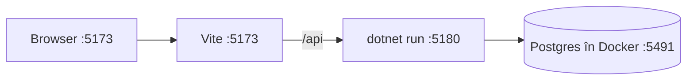

# 2. Pornirea pe laptop

Pe laptop rulează aceleași trei piese ca pe server, dar fiecare pornită de tine, cu o comandă:



- **Vite** e serverul de dezvoltare al frontend-ului. Dă fișierele aplicației și reîncarcă pagina când salvezi un fișier. Cererile care încep cu `/api` le trimite mai departe la API. Așa, și pe laptop totul pare că vine de pe același domeniu, exact ca în producție, unde face asta Caddy.
- **`dotnet run`** pornește API-ul.
- **Postgres** rulează într-un container Docker, ca să nu-l instalezi pe Mac.

## Pornirea

Din folderul `MacroMate/`, pornești întâi baza de date:

```bash
docker compose up -d
```

Caută: `Container macromate-db-1 Healthy` sau `Started`. Postgres ascultă acum pe portul 5491.

Pornești API-ul:

```bash
dotnet run --project api/MacroMate.Api
```

Caută: `Now listening on: http://localhost:5180`. La prima pornire, API-ul face singur trei lucruri:
1. creează tabelele, rulând migrările din `Data/Migrations`;
2. creează două conturi de test, din `appsettings.Development.json`, la `DevSeed`;
3. adaugă cele 75 de alimente din `Seed/foods.json`.

Instalezi pachetele frontend-ului, o singură dată:

```bash
pnpm --dir web install
```

Pornești frontend-ul:

```bash
pnpm --dir web dev
```

Caută: `Local: http://localhost:5173/`. Deschizi adresa și intri cu un cont de test. Email-ul și parola sunt în `api/MacroMate.Api/appsettings.Development.json`.

Pe laptop, aplicația merge fără service worker: Vite îl pornește doar în build-ul de producție. Offline-ul pentru date (Dexie, coada) merge însă la fel.

## Testele

Testele API-ului pornesc tot API-ul, dar pe o bază separată, `macromate_test`, pe care o șterg și o refac la fiecare rulare. Au nevoie de Postgres-ul din Docker pornit.

```bash
dotnet test api
```

Caută: `Passed! - Failed: 0, Passed: 7`.

Testele frontend-ului verifică doar calculele (`web/src/lib/*.test.ts`) și nu au nevoie de nimic pornit.

```bash
pnpm --dir web test
```

Caută: `Tests 17 passed`.

## Te uiți direct în baza de date

Te conectezi cu `psql` în containerul cu Postgres:

```bash
docker exec -it macromate-db-1 psql -U macromate
```

Câteva interogări utile:

```sql
\dt
select name, kcal, protein_g, glycemic_grade from foods order by name limit 10;
select name, version, deleted_at from recipes order by version desc;
select name, meals from meal_plans;
```

Caută la a treia: rândurile cu `version` cel mai mare sunt cele modificate cel mai recent. La a patra, coloana `meals` e JSON.

## Te uiți în baza din telefon (Dexie)

În Chrome, deschizi DevTools (`Cmd+Option+I`), apoi **Application → IndexedDB → macromate**. Vezi tabelele din telefon și `outbox`, coada. Dacă oprești API-ul și bifezi ceva în aplicație, rândul apare în `outbox`. Pornești API-ul la loc și, la următoarea sincronizare, `outbox` se golește.

## O iei de la zero

Ștergi baza de dezvoltare cu tot cu volumul ei:

```bash
docker compose down -v
```

Comenzile de mai sus o refac. În browser, la **Application → Storage → Clear site data**, ștergi și copia din telefon.
