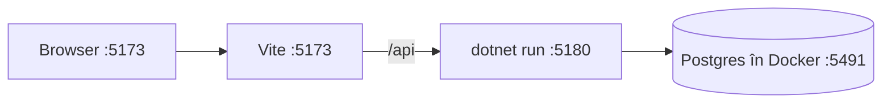

# 2. Pornirea pe laptop

Pe laptop rulează aceleași trei piese ca pe server, dar fiecare pornită de tine, cu o comandă:



- **Vite** e serverul de dezvoltare al frontend-ului. Dă fișierele aplicației și reîncarcă pagina când salvezi un fișier. Cererile care încep cu `/api` le trimite mai departe la API. Așa, și pe laptop totul pare că vine de pe același domeniu, exact ca în producție, unde face asta Caddy.
- **`dotnet run`** pornește API-ul.
- **Postgres** rulează într-un container Docker, ca să nu-l instalezi pe Mac.

## Pornirea dintr-o comandă

Din folderul `MacroMate/`:

```bash
./dev.sh
```

Caută: `Now listening on: http://localhost:5180` (API-ul) și `Local: http://localhost:5173/` (Vite). `dev.sh` pornește Postgres și așteaptă să fie gata, apoi pornește API-ul și Vite. `Ctrl+C` le oprește pe toate trei.

## Pornirea pe rând

Dacă vrei fiecare piesă în terminalul ei, pornești întâi baza de date:

```bash
docker compose up -d
```

Caută: `Container macromate-db-1 Healthy` sau `Started`. Postgres ascultă acum pe portul 5491.

Pornești API-ul:

```bash
dotnet run --project api/MacroMate.Api
```

Caută: `Now listening on: http://localhost:5180`. La prima pornire, API-ul face singur trei lucruri:
1. creează tabelele, rulând migrările din `Data/Migrations`;
2. creează două conturi de test, din `appsettings.Development.json`, la `DevSeed`, fiecare cu bucătăria lui;
3. adaugă cele 75 de alimente din `Seed/foods.json`.

Instalezi pachetele frontend-ului, o singură dată:

```bash
pnpm --dir web install
```

Pornești frontend-ul:

```bash
pnpm --dir web dev
```

Caută: `Local: http://localhost:5173/`. Deschizi adresa și intri cu un cont de test. Email-ul și parola sunt în `api/MacroMate.Api/appsettings.Development.json`.

Pe laptop, aplicația merge fără service worker: Vite îl pornește doar în build-ul de producție. Offline-ul pentru date (Dexie, coada) merge însă la fel.

## Cheia DeepSeek pe laptop

Fără cheie, aplicația merge, dar butoanele de AI arată „AI-ul nu e configurat: lipsește cheia DeepSeek pe server.”. Pe laptop, cheia stă în **user-secrets**: un fișier cu setări secrete pe care .NET îl ține în folderul tău de utilizator, în afara proiectului. Așa cheia nu ajunge niciodată în git.

Comanda te întreabă cheia; o lipești și apeși Enter:

```bash
read -rs "KEY?Cheia DeepSeek: " && dotnet user-secrets set DeepSeek:ApiKey "$KEY" --project api/MacroMate.Api; unset KEY
```

Caută: `Successfully saved DeepSeek:ApiKey to the secret store.` Repornești API-ul.

## Emailurile pe laptop

Pe laptop nu e cheie Resend, așa că API-ul nu trimite emailuri. Le scrie în terminalul în care rulează (`LogEmailSender`). Când ceri „Am uitat parola” sau schimbi emailul, linkul îl găsești acolo:

```
warn: MacroMate.Api.Features.Email.LogEmailSender[0]
      Email to cont2@macromate.local: Resetează parola MacroMate
```

Caută: rândul `Email to`, apoi linkul `http://localhost:5173/reset-password?…` câteva rânduri mai jos.

## Două conturi în același browser

Cookie-ul de login e legat de adresa din bară. `http://localhost:5173` și `http://[::1]:5173` sunt pentru browser două adrese diferite, deci pot avea două cookie-uri. Așa încerci bucătăria comună pe un singur laptop:
1. în `http://localhost:5173` te loghezi ca primul cont de test;
2. în `http://[::1]:5173` te loghezi ca al doilea (`cont2@macromate.local`);
3. din primul, Profil → Bucătăria → Invită; deschizi linkul în al doilea, schimbând adresa în `[::1]`.

Login-ul are o limită: cel mult 10 cereri pe minut de la aceeași adresă. Dacă primești „Prea multe cereri”, aștepți un minut.

## Testele

Testele API-ului pornesc tot API-ul, dar pe o bază separată, `macromate_test`, pe care o șterg și o refac la fiecare rulare. Au nevoie de Postgres-ul din Docker pornit. Nu cheamă DeepSeek.

```bash
dotnet test api
```

Caută: `Passed!` și `Failed: 0`. Numărul de teste crește odată cu aplicația.

Testele frontend-ului verifică calculele (`web/src/lib/*.test.ts`) și textele în cele două limbi (`web/src/i18n/i18n.test.ts`). Nu au nevoie de nimic pornit.

```bash
pnpm --dir web test
```

Caută: `Test Files  … passed` și `Tests  … passed`, fără `failed`.

## Te uiți direct în baza de date

Te conectezi cu `psql` în containerul cu Postgres:

```bash
docker exec -it macromate-db-1 psql -U macromate
```

Câteva interogări utile:

```sql
\dt
select name, name_en, kcal, protein_g, glycemic_grade from foods order by name limit 10;
select name, version, deleted_at, kitchen_id from recipes order by version desc;
select email, display_name, kitchen_id, archive_kitchen_id from users;
select name, meals from meal_plans;
```

Caută: la a treia, rândurile cu `version` cel mai mare sunt cele modificate cel mai recent. La a patra, conturile din aceeași bucătărie au același `kitchen_id`. La a cincea, coloana `meals` e JSON.

## Te uiți în baza din telefon (Dexie)

În Chrome, deschizi DevTools (`Cmd+Option+I`), apoi **Application → IndexedDB → macromate**. Vezi tabelele din telefon și `outbox`, coada. Dacă oprești API-ul și bifezi ceva în aplicație, rândul apare în `outbox`. Pornești API-ul la loc și, la următoarea sincronizare, `outbox` se golește.

Limba aleasă e la **Application → Local Storage**, cheia `macromate.language`.

## O iei de la zero

Ștergi baza de dezvoltare cu tot cu volumul ei:

```bash
docker compose down -v
```

Comenzile de mai sus o refac. În browser, la **Application → Storage → Clear site data**, ștergi și copia din telefon.
