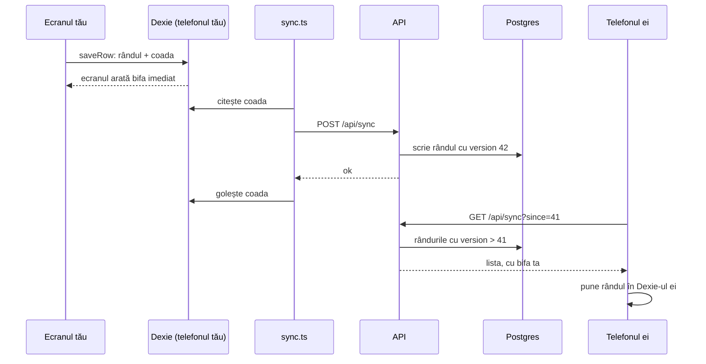
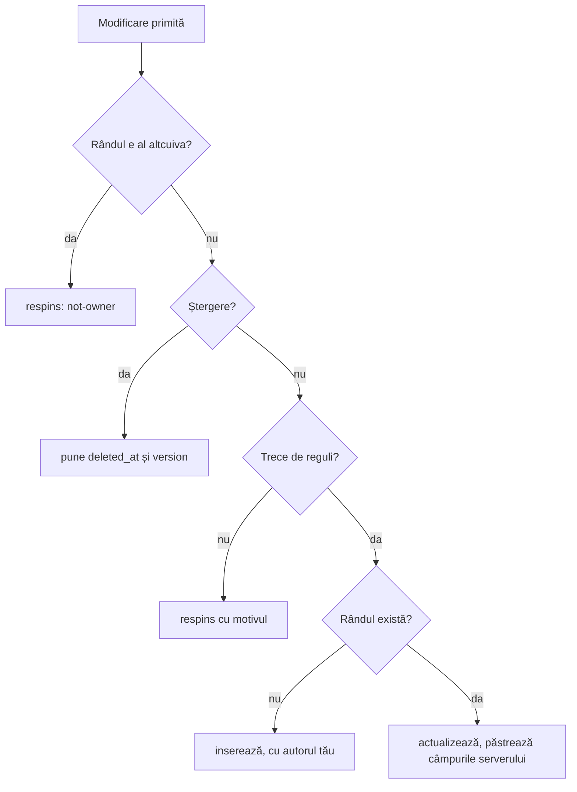

# 3. Drumul unei modificări

**Sincronizarea** e codul care ține la fel datele din telefonul tău, din telefonul ei și din Postgres. Capitolul o urmărește pe un caz concret: ești în magazin și bifezi „Ou întreg” pe lista de cumpărături. Prietena ta are aceeași listă deschisă pe telefonul ei.

## Tot drumul, într-un desen



## Pasul 1. Ecranul scrie în telefon

Bifa cheamă `toggle` din `web/src/routes/_app/shopping/$listId.tsx`. Funcția pune cheia produsului în `checkedKeys` și salvează lista:

```ts
function toggle(key: string) {
  void save({ checkedKeys: checked.has(key) ? list.checkedKeys.filter((k) => k !== key) : [...list.checkedKeys, key] })
}
```

`save` cheamă `saveRow` din `web/src/db/mutations.ts`. Ăsta e singurul loc din aplicație care scrie date:

```ts
await db.transaction('rw', [db.table(table), db.outbox], async () => {
  await db.table(table).put(full)
  await db.outbox.add({ table, op: 'upsert', rowId: row.id, data: full, createdAt: now })
})
requestSync()
```

Într-o singură tranzacție Dexie se întâmplă două lucruri:
1. rândul nou intră în tabelul `shoppingLists` din telefon;
2. o copie a lui intră în `outbox`, coada cu modificări netrimise.

Tranzacția înseamnă că se fac amândouă sau niciuna. Nu se poate ca rândul să fie salvat, iar coada să nu știe de el.

Ecranul citește lista cu `useLiveQuery`. Dexie vede că tabelul s-a schimbat și redesenează ecranul. Bifa apare imediat, fără să aștepte serverul.

## Pasul 2. Coada pleacă spre server

`requestSync()` pornește sincronizarea după 800 ms. Dacă mai bifezi ceva în timpul ăsta, cronometrul o ia de la capăt, iar toate bifele pleacă împreună.

`syncNow` din `web/src/db/sync.ts` face trei lucruri, în ordinea asta:
1. **urcă pozele** făcute offline;
2. **trimite coada**: `POST /api/sync`, cu cel mult 500 de modificări pe cerere;
3. **aduce ce s-a schimbat pe server**: `GET /api/sync?since=…`.

Fără internet, `syncNow` nu face nimic, iar coada rămâne în telefon. Când revine internetul, browserul trimite evenimentul `online` și sincronizarea pornește singură.

## Pasul 3. API-ul primește modificările

Cererea ajunge în `Push` din `api/MacroMate.Api/Features/Sync/SyncEndpoints.cs`:

```json
{ "changes": [ { "table": "shoppingLists", "op": "upsert", "id": "f9cd…", "data": { "name": "Cumpărături 4 octombrie", "checkedKeys": ["recipe:4c95…:2608…"] } } ] }
```

API-ul face patru lucruri:
1. **Păstrează ultima modificare a fiecărui rând.** Dacă în coadă sunt trei bife pe aceeași listă, contează doar ultima, pentru că ea are deja toată lista.
2. **Deschide o tranzacție și ia un lacăt.** Lacătul face ca două scrieri să nu se suprapună. Motivul e mai jos.
3. **Ia un număr nou din secvența `sync_version`**, de exemplu 42. Toate rândurile din cererea asta primesc `version = 42`.
4. **Aplică fiecare modificare** prin tabelul ei din `SyncTables.cs`.

```csharp
await using var tx = await db.Database.BeginTransactionAsync(ct);
await db.Database.ExecuteSqlAsync($"SELECT pg_advisory_xact_lock({WriteLockKey})", ct);
var version = await db.Database
    .SqlQueryRaw<long>("SELECT nextval('sync_version') AS \"Value\"")
    .SingleAsync(ct);

await write(version, DateTimeOffset.UtcNow);

await db.SaveChangesAsync(ct);
await tx.CommitAsync(ct);
```

## Pasul 4. Un rând trece prin `ApplyAsync`

`ApplyAsync` din `SyncTables.cs` e mirror-ul C# al lui `saveRow`: cel din telefon scrie în Dexie, cel de pe server scrie în Postgres. Pe server sunt însă mai multe verificări:



- **„Al altcuiva”** contează doar la datele personale: jurnalul, planul zilei, profilul. Rețetele, alimentele, planurile și listele sunt comune.
- **Regulile** sunt în `SyncRules.cs`. De exemplu: un aliment are nume, categorie din listă și calorii între 0 și 900 la 100 g. Un rând care nu trece e respins cu motivul, iar celelalte rânduri din cerere merg mai departe.
- **Câmpurile serverului** sunt `createdBy`, `userId`, `createdAt`, `version` și `deletedAt`. Ce trimite telefonul în ele se ignoră. Un telefon nu poate pretinde că o rețetă e a altcuiva și nu-și poate da singur un `version`. Testul `Server_fields_sent_by_the_client_are_ignored` verifică exact asta.

## Pasul 5. Telefonul ei află de bifă

Telefonul ei ține minte un număr, **cursorul**: cel mai mare `version` primit până acum. La fiecare sincronizare cere doar ce e mai nou:

```
GET /api/sync?since=41
```

Un exemplu de tabel `shopping_lists` în Postgres:

| id | name | version |
|---|---|---|
| a1 | Cumpărături 1 oct. | 12 |
| f9 | Cumpărături 4 oct. | **42** |

Cu `since=41`, vine doar rândul `f9`, iar cursorul ei devine 42. Pentru 2 rânduri n-ar conta, dar cu 2.000 de alimente contează: fiecare telefon primește doar ce s-a schimbat, nu toată baza.

`applyPull` din `sync.ts` pune rândurile primite în Dexie-ul ei. Lista ei se redesenează, cu bifa ta.

Rândurile care au încă modificări în coada telefonului nu sunt suprascrise. Dacă ea a bifat offline altceva pe aceeași listă, bifa ei nu se pierde până nu pleacă spre server.

## De ce e nevoie de lacăt

Fără lacăt, două cereri care ajung în același timp pot pierde un rând:

1. Telefonul tău ia `version 41`, iar telefonul ei ia `version 42`.
2. Cererea ei se termină prima: în bază există 42, dar încă nu există 41.
3. Un telefon cere `since=40` și primește 42. Cursorul lui devine 42.
4. Cererea ta se termină: acum apare și 41.
5. Telefonul cere de acum `since=42`. Rândul 41 nu-l mai primește niciodată.

Lacătul (`pg_advisory_xact_lock`) lasă o singură scriere la un moment dat. Numărul se ia după lacăt, așa că 41 se salvează înainte ca altcineva să poată lua 42. Citirea (`Pull`) folosește o tranzacție `RepeatableRead`, ca toate tabelele să fie citite în aceeași stare.

Pentru doi oameni lacătul nu se simte: o scriere durează câteva milisecunde.

## Când amândoi modificați același lucru

**Câștigă ultima salvare care ajunge la server**, pe tot rândul. Dacă tu schimbi numele unei rețete, iar ea, offline, schimbă timpul aceleiași rețete, rămâne varianta celui care sincronizează ultimul.

Pentru doi oameni regula e suficientă. Alternativa ar fi îmbinarea pe câmpuri, care e mult mai complicată.

**Ștergerea e definitivă.** Un rând șters primește `deleted_at` și nu mai poate fi modificat. Rândul nu dispare din bază: rămâne ca semn pentru celălalt telefon („ăsta a fost șters”). Dacă ar dispărea pur și simplu, telefonul ei n-ar avea de unde afla.

## Ce vezi în aplicație

Iconița de nor din colțul de sus arată starea sincronizării:

| Iconița | Înseamnă |
|---|---|
| nor cu bifă, verde | totul e trimis |
| nor cu săgeată și un număr | atâtea modificări așteaptă în coadă |
| nor tăiat | ești offline; modificările așteaptă |
| nor cu semn de exclamare | serverul n-a răspuns; mesajul e în Profil, la „Sincronizare” |

O atingere pe iconiță pornește sincronizarea imediat.

## Unde e codul

| Ce | Fișier |
|---|---|
| scrierea în telefon și coada | `web/src/db/mutations.ts` |
| trimis, adus, cursor, pornire automată | `web/src/db/sync.ts` |
| tabelele din telefon | `web/src/db/database.ts` |
| endpoint-urile | `api/MacroMate.Api/Features/Sync/SyncEndpoints.cs` |
| lacătul și numărul `version` | `api/MacroMate.Api/Features/Sync/SyncWriter.cs` |
| ce face fiecare tabel cu o modificare | `api/MacroMate.Api/Features/Sync/SyncTables.cs` |
| regulile | `api/MacroMate.Api/Features/Sync/SyncRules.cs` |
| testele | `api/MacroMate.Api.Tests/SyncTests.cs` |
