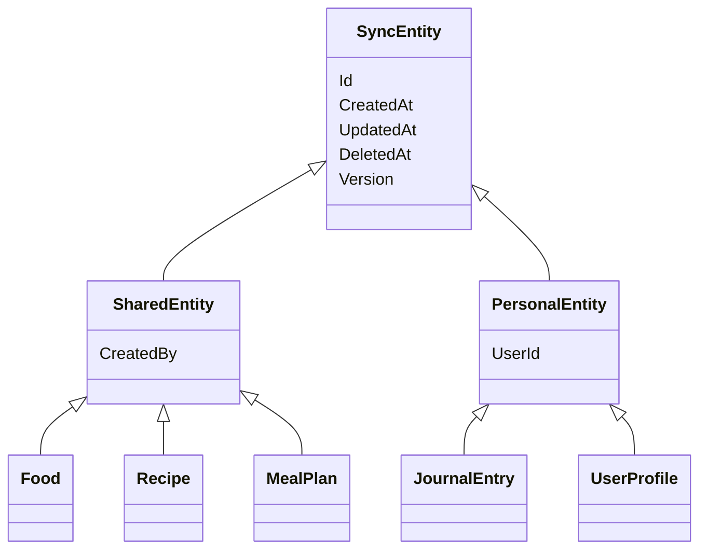

# 4. Baza de date

Baza e **PostgreSQL**. Nu scrii SQL de mână pentru ea: tabelele ies din clase C#, prin **EF Core**, ORM-ul din .NET. Un ORM e biblioteca care traduce între obiecte din cod și rânduri din tabele.

## De la clasa C# la tabel

În TypeScript, un aliment din aplicație arată așa (tipul e generat din API, în `web/src/api/schema.d.ts`):

```ts
type Food = {
  id: string
  name: string
  category: string
  kcal: number
  insulinGrade: null | string
}
```

Același lucru în C#, în `api/MacroMate.Api/Data/Food.cs`:

```csharp
public class Food : SharedEntity
{
    public string Name { get; set; } = "";
    public string Category { get; set; } = "";
    public double Kcal { get; set; }
    public string? InsulinGrade { get; set; }
}
```

`string?` e echivalentul lui `string | null` din TypeScript: câmpul poate lipsi.

Din clasă, EF Core scrie o **migrare**, adică un fișier C# care conține pașii pentru baza de date. La pornire, API-ul o rulează și o transformă în SQL:

```sql
CREATE TABLE foods (
    id uuid NOT NULL,
    name character varying(200) NOT NULL,
    category character varying(40) NOT NULL,
    kcal double precision NOT NULL,
    insulin_grade character varying(1),
    ...
);
```

Numele trec din `PascalCase` în `snake_case` (`InsulinGrade` → `insulin_grade`) prin `UseSnakeCaseNamingConvention()` din `Program.cs`. Așa se scriu de obicei numele în Postgres.

## Clasele de bază

Fiecare tabel sincronizat moștenește una din două clase:



- **`SharedEntity`** e pentru datele comune. `CreatedBy` e „adăugat de”.
- **`PersonalEntity`** e pentru datele fiecăruia. `UserId` spune al cui e rândul. Serverul nu dă rândul altcuiva.

## Tabelele

| Tabel | Al cui e | Ce ține |
|---|---|---|
| `foods` | comun | valori la 100 g, note, categorie, cod de bare, greutatea unei bucăți |
| `recipes` | comun | rețeta main: nume, preparare, timp, dificultate, lista de ingrediente fără cantități |
| `recipe_variants` | comun | o variantă: porții și ingrediente cu grame |
| `meal_plans` | comun | o zi: mesele și ce e în fiecare |
| `shopping_lists` | comun | planurile cu zile, ce s-a bifat |
| `day_plans` | al fiecăruia | ce plan ai ales pentru o zi |
| `journal_entries` | al fiecăruia | ce ai mâncat, cu valorile copiate în momentul notării |
| `user_profiles` | al fiecăruia | ținte, favorite, excluderi, „îmi place” |
| `users` și `user_*` | — | conturile (ASP.NET Core Identity) |

## De ce unele liste nu au tabel separat

Ingredientele unei variante nu au tabelul lor. Stau în coloana `ingredients`, de tip `jsonb`, adică JSON salvat de Postgres într-un format pe care îl poate citi repede:

```
select name, ingredients from recipe_variants;

  name    |                     ingredients
----------+------------------------------------------------------
 350 kcal | [{"Grams": 167, "FoodId": "2608…"}, {"Grams": 100, "FoodId": "8c1e…"}]
```

În C#, coloana e o listă obișnuită:

```csharp
public List<VariantIngredient> Ingredients { get; set; } = [];
```

În `AppDbContext.cs` scrie că lista se salvează ca JSON:

```csharp
b.ComplexCollection(v => v.Ingredients, c => c.ToJson());
```

**Criteriul**, cu două întrebări:
1. Copilul are sens fără părinte? Un ingredient cu 167 g nu are sens fără varianta lui.
2. Serverul caută vreodată înăuntrul listei? Nu: serverul nu întreabă „ce variante au ou”. Calculele se fac în telefon.

Dacă ambele răspunsuri sunt „nu”, lista stă în părinte. Câștigul: varianta se scrie, se sincronizează și se rezolvă la conflict dintr-o bucată.

Dacă la oricare răspunsul ar fi „da”, lista ar primi tabel separat, cu cheie străină spre părinte. Asta e regula de manual, pe care o vezi în majoritatea proiectelor.

Listele de id-uri simple, de exemplu ingredientele din rețeta main, sunt coloane `uuid[]`, adică vectori de id-uri. Postgres le are ca tip propriu, iar Npgsql le mapează direct pe `List<Guid>`.

## Secvența `sync_version`

Secvența e un contor din Postgres care dă numere mereu crescătoare: `nextval('sync_version')` întoarce 41, apoi 42, apoi 43. Fiecare scriere ia un număr din ea și îl pune în coloana `version` a rândurilor scrise. Pe ea se bazează sincronizarea, explicată în capitolul 3.

Fiecare tabel are un index pe `version`, pentru că telefonul cere mereu `where version > ...`.

## Adaugi un câmp, pas cu pas

Exemplu: vrei să ții la aliment și zahărul (`SugarG`).

1. Adaugi proprietatea în `Data/Food.cs`: `public double? SugarG { get; set; }`.
2. Generezi migrarea, din folderul `api/MacroMate.Api`:
   ```bash
   dotnet ef migrations add AddFoodSugar -o Data/Migrations
   ```
   Caută în `Data/Migrations/…_AddFoodSugar.cs`: `AddColumn<double>(name: "sugar_g", table: "foods", …)`.
3. Dacă are limite, adaugi regula în `Features/Sync/SyncRules.cs`.
4. Regenerezi tipurile TypeScript, din `MacroMate/`:
   ```bash
   pnpm --dir web gen:api
   ```
5. Pui câmpul în formular: `web/src/lib/food-draft.ts` și `web/src/components/app/food-form.tsx`.

La următoarea pornire, API-ul rulează singur migrarea, și pe laptop, și pe server.
