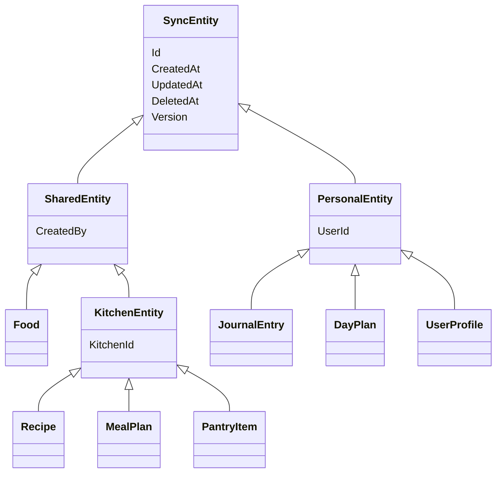

# 4. Baza de date

Baza e **PostgreSQL**. Nu scrii SQL de mână pentru ea: tabelele ies din clase C#, prin **EF Core**, ORM-ul din .NET. Un ORM e biblioteca care traduce între obiecte din cod și rânduri din tabele.

## De la clasa C# la tabel

În TypeScript, un aliment din aplicație arată așa (tipul e generat din API, în `web/src/api/schema.d.ts`):

```ts
type Food = {
  id: string
  name: string
  nameEn: null | string
  category: string
  kcal: number
  glycemicGrade: null | string
}
```

Același lucru în C#, în `api/MacroMate.Api/Data/Food.cs`:

```csharp
public class Food : SharedEntity
{
    public string Name { get; set; } = "";
    public string? NameEn { get; set; }
    public string Category { get; set; } = "";
    public double Kcal { get; set; }
    public string? GlycemicGrade { get; set; }
}
```

`string?` e echivalentul lui `string | null` din TypeScript: câmpul poate lipsi.

Din clasă, EF Core scrie o **migrare**, adică un fișier C# care conține pașii pentru baza de date. La pornire, API-ul o rulează și o transformă în SQL:

```sql
CREATE TABLE foods (
    id uuid NOT NULL,
    name character varying(200) NOT NULL,
    name_en character varying(200),
    category character varying(40) NOT NULL,
    kcal double precision NOT NULL,
    glycemic_grade character varying(1),
    ...
);
```

Numele trec din `PascalCase` în `snake_case` (`GlycemicGrade` → `glycemic_grade`) prin `UseSnakeCaseNamingConvention()` din `Program.cs`. Așa se scriu de obicei numele în Postgres.

## Clasele de bază

Fiecare tabel sincronizat moștenește una din trei clase:



- **`SharedEntity`** are `CreatedBy`, adică „adăugat de”. `Food` o moștenește direct și are în plus `KitchenId`, care poate fi gol: gol înseamnă baza generală, pe care o văd toate conturile; altfel, alimentul e al unei bucătării.
- **`KitchenEntity`** adaugă `KitchenId`: a cărei bucătării e rândul. Rețetele, variantele, planurile, listele și cămara o moștenesc. Le văd doar membrii bucătăriei.
- **`PersonalEntity`** e pentru datele fiecăruia. `UserId` spune al cui e rândul. Serverul nu dă rândul altcuiva.

## Tabelele

| Tabel | Al cui e | Ce ține |
|---|---|---|
| `foods` | baza generală sau o bucătărie | numele în română și în engleză (`name_en`), valori la 100 g, note, motivul notei glicemice în română și în engleză (`grades_reason_en`), categorie, cod de bare, greutatea unei bucăți, bucătăria (`kitchen_id`: gol pentru baza generală) |
| `recipes` | bucătăria | rețeta principală: nume, preparare, timp, dificultate, lista de ingrediente fără cantități |
| `recipe_variants` | bucătăria | o variantă: porții și ingrediente cu grame |
| `meal_plans` | bucătăria | o zi: mesele și ce e în fiecare |
| `shopping_lists` | bucătăria | planurile cu zile, ce s-a bifat |
| `pantry_items` | bucătăria | cămara: câte un rând pentru fiecare aliment din ea |
| `kitchens` | — | bucătăriile: id și proprietarul (`owner_id`) |
| `kitchen_invites` | — | invitațiile: token, bucătăria, data de expirare, când a fost folosită |
| `day_plans` | al fiecăruia | ce plan ai ales pentru o zi și dacă ziua e completă (`completed_at`) |
| `journal_entries` | al fiecăruia | ce ai mâncat, cu valorile copiate în momentul notării |
| `weight_entries` | al fiecăruia | cântăririle, una pe zi |
| `user_profiles` | al fiecăruia | ținte, obiectiv, rețete favorite, excluderi, „îmi place” |
| `users` și `user_*` | — | conturile (ASP.NET Core Identity), plus bucătăria contului (`kitchen_id`), arhiva lui (`archive_kitchen_id`), dacă e cont de probă (`is_demo`) și când se șterge (`demo_expires_at`) |
| `roles`, `user_roles` | — | rolurile (ASP.NET Core Identity): un rând `admin` în `roles`, iar în `user_roles` cine îl are |
| `food_reports` | — | greșelile raportate la alimentele din baza generală: alimentul, cine a raportat, mesajul (cel mult 500 de caractere), `resolved_at` când adminul apasă „Rezolvat” |
| `ai_usage` | — | câte cereri AI a făcut un cont într-o zi UTC: cheia e perechea (`user_id`, `day`), plus `count` |

`kitchens`, `kitchen_invites`, `roles`, `user_roles`, `food_reports` și `ai_usage` nu se sincronizează cu telefoanele: le citește și le scrie doar API-ul.

## De ce unele liste nu au tabel separat

Ingredientele unei variante nu au tabelul lor. Stau în coloana `ingredients`, de tip `jsonb`, adică JSON salvat de Postgres într-un format pe care îl poate citi repede:

```
select name, ingredients from recipe_variants;

  name    |                     ingredients
----------+------------------------------------------------------
 350 kcal | [{"Grams": 167, "FoodId": "2608…"}, {"Grams": 100, "FoodId": "8c1e…"}]
```

În C#, coloana e o listă obișnuită:

```csharp
public List<VariantIngredient> Ingredients { get; set; } = [];
```

În `AppDbContext.cs` scrie că lista se salvează ca JSON:

```csharp
b.ComplexCollection(v => v.Ingredients, c => c.ToJson());
```

**Criteriul**, cu două întrebări:
1. Copilul are sens fără părinte? Un ingredient cu 167 g nu are sens fără varianta lui.
2. Serverul caută vreodată înăuntrul listei? Nu: serverul nu întreabă „ce variante au ou”. Calculele se fac în telefon.

Dacă ambele răspunsuri sunt „nu”, lista stă în părinte. Câștigul: varianta se scrie, se sincronizează și se rezolvă la conflict dintr-o bucată.

Dacă la oricare răspunsul ar fi „da”, lista ar primi tabel separat, cu cheie străină spre părinte. Asta e regula de manual, pe care o vezi în majoritatea proiectelor.

Listele de id-uri simple, de exemplu ingredientele din rețeta principală, sunt coloane `uuid[]`, adică vectori de id-uri. Postgres le are ca tip propriu, iar Npgsql le mapează direct pe `List<Guid>`.

## Secvența `sync_version`

Secvența e un contor din Postgres care dă numere mereu crescătoare: `nextval('sync_version')` întoarce 41, apoi 42, apoi 43. Fiecare scriere ia un număr din ea și îl pune în coloana `version` a rândurilor scrise. Pe ea se bazează sincronizarea: fiecare telefon ține minte cel mai mare `version` primit și cere doar rândurile cu un număr mai mare.

Fiecare tabel are un index pe `version`, pentru că telefonul cere mereu `where version > ...`.

## Migrări care schimbă și date

Unele migrări nu doar adaugă coloane, ci scriu și date, cu SQL. Exemplu: `AddFoodNameEn` adaugă `name_en` și o completează pentru cele 75 de alimente de start:

```sql
UPDATE foods f
SET name_en = v.name_en, version = nextval('sync_version'), updated_at = now()
FROM (VALUES
    ('Roșii', 'Tomatoes'),
    ('Castravete', 'Cucumber'),
    ...
```

Rândurile primesc și un `version` nou. Telefoanele cer doar `where version > cursor`. Fără `version` nou, rândurile schimbate de migrare n-ar mai ajunge niciodată la telefoane.

Alte migrări care scriu date:
- `AddFoodReasonEn`: motivul notei glicemice în engleză, tot cu `version` nou;
- `AddKitchens`: o bucătărie pentru fiecare cont, `kitchen_id` pe rețete, planuri și liste (cu `version` nou), favoritele mutate în cămară;
- `AddKitchenOwner`: proprietarul fiecărei bucătării. Tabelul `kitchens` nu se sincronizează cu telefoanele, deci aici nu e nevoie de `version`;
- `AddAccountsAndRoles`: adaugă `foods.kitchen_id`, `users.is_demo`, `users.demo_expires_at` și tabelele `food_reports` și `ai_usage`, apoi marchează toate conturile existente ca confirmate (`UPDATE users SET email_confirmed = true`). Alimentele existente rămân cu `kitchen_id` gol, deci în baza generală. Rândul `admin` din `roles` nu e în migrare: îl face API-ul la pornire (`AppRoles.EnsureAsync`).

## Adaugi un câmp, pas cu pas

Exemplu: vrei să ții la aliment și zahărul (`SugarG`).

1. Adaugi proprietatea în `Data/Food.cs`: `public double? SugarG { get; set; }`.
2. Generezi migrarea, din folderul `api/MacroMate.Api`:
   ```bash
   dotnet ef migrations add AddFoodSugar -o Data/Migrations
   ```
   Caută în `Data/Migrations/…_AddFoodSugar.cs`: `AddColumn<double>(name: "sugar_g", table: "foods", …)`.
3. Dacă are limite, adaugi regula în `Features/Sync/SyncRules.cs`.
4. Regenerezi tipurile TypeScript, din `MacroMate/`:
   ```bash
   pnpm --dir web gen:api
   ```
5. Pui câmpul în formular: `web/src/lib/food-draft.ts` și `web/src/components/app/food-form.tsx`.

La următoarea pornire, API-ul rulează singur migrarea, și pe laptop, și pe server.
