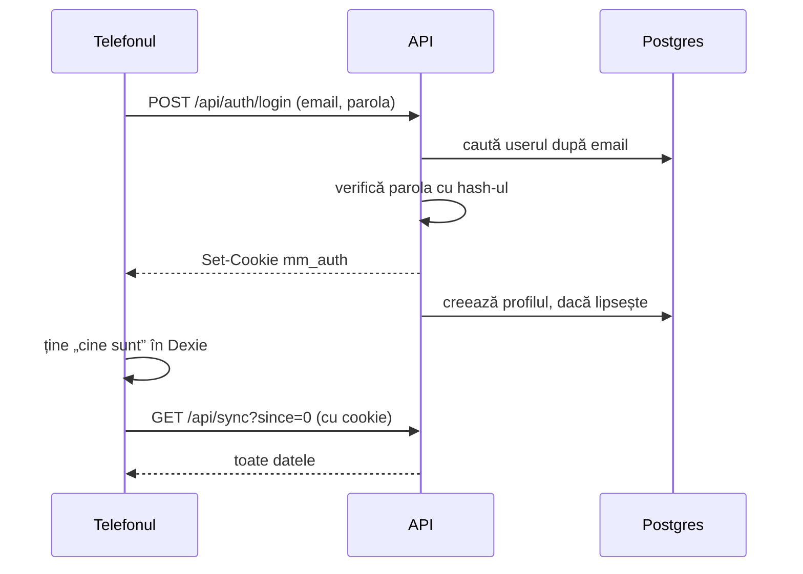

# 5. Login și securitate

Pentru conturi, .NET are un pachet de user management: **ASP.NET Core Identity**. Pachetul vine cu:
- tabelul de utilizatori;
- parolele salvate ca hash, nu în clar;
- blocarea contului după mai multe încercări greșite;
- verificarea parolei la login.

MacroMate îl folosește cu un **cookie**: după login, browserul primește un bilet semnat de server și îl trimite singur la fiecare cerere.

## Login-ul, pas cu pas



1. Telefonul trimite email-ul și parola la `/api/auth/login` (`Features/Auth/AuthEndpoints.cs`).
2. API-ul caută userul și cheamă `PasswordSignInAsync`. Funcția compară parola cu hash-ul din tabelul `users`.
3. Dacă parola e bună, API-ul pune în răspuns un cookie, `mm_auth`. Conținutul e criptat cu chei pe care le are doar serverul.
4. Telefonul ține în Dexie cine e logat, apoi face prima sincronizare, de la zero.

## Cookie-ul și ce face fiecare setare

Răspunsul la login conține:

```
set-cookie: mm_auth=…; expires=…; path=/; secure; samesite=lax; httponly
```

| Setare | Ce face | De ce |
|---|---|---|
| `httponly` | JavaScript-ul din pagină nu poate citi cookie-ul | Un script străin ajuns cumva în pagină nu poate fura sesiunea |
| `secure` | Cookie-ul pleacă doar pe HTTPS | Nu poate fi citit de pe o rețea Wi-Fi publică |
| `samesite=lax` | Cookie-ul nu pleacă la cererile `POST` venite de pe alt site | Un site străin nu poate face modificări în numele tău |
| `expires` + `SlidingExpiration` | 90 de zile, iar fiecare folosire le reia de la capăt | Nu te loghezi des de pe telefon |

Setările sunt în `Program.cs`, la `AddCookie`.

**De ce nu e nevoie de token anti-CSRF.** CSRF e atacul în care un site străin trimite o cerere spre API-ul tău, iar browserul atașează singur cookie-ul. Aici sunt două protecții:
- cu `samesite=lax`, cookie-ul nu pleacă la un `POST` venit de pe alt site;
- toate scrierile sunt JSON. Un formular de pe alt site nu poate trimite JSON fără să întrebe întâi serverul (cererea „preflight” de CORS). API-ul nu răspunde la ea, deci browserul nu trimite cererea.

**De ce cookie-urile supraviețuiesc unui deploy.** Cheile cu care se criptează cookie-ul stau în `/data/keys`, pe volumul serverului (`AddDataProtection().PersistKeysToFileSystem`). Fără ele, fiecare repornire ar face chei noi și v-ar deloga pe amândoi.

**De ce serverul știe că cererea a venit pe HTTPS.** Caddy primește cererea pe HTTPS și o trimite la API pe HTTP, în rețeaua internă Docker. În header-ul `X-Forwarded-Proto: https` îi spune API-ului cum a venit cererea. `UseForwardedHeaders()` citește header-ul, iar API-ul pune `secure` pe cookie.

## Blocarea și parola

Din `Program.cs`:
- parola are minim 10 caractere, fără alte reguli. Lungimea apără mai bine decât „o literă mare și o cifră”;
- după 5 încercări greșite, contul e blocat 5 minute. Răspunsul e 429, cu mesajul „Prea multe încercări”.

Înregistrare din aplicație nu există. Conturile se fac pe server, cu comanda `create-user` (vezi `Admin/AdminCommands.cs`). Parola se tastează ascuns și nu rămâne în istoricul terminalului.

## Cine vede ce

| Date | Cine le vede | Unde e regula |
|---|---|---|
| alimente, rețete, variante, planuri, liste | amândoi | `SharedTable` din `SyncTables.cs` |
| jurnal, planul zilei, profil | doar proprietarul | `PersonalTable`: `IsOwnedBy` la scriere, `where UserId == …` la citire, în `SyncEndpoints.cs` |
| pozele | doar cine e logat | `PhotoEndpoints.cs`: `RequireAuthorization()` |

Testul `Personal_rows_stay_with_their_owner` verifică două lucruri:
- jurnalul tău nu ajunge la ea;
- dacă ea încearcă să-ți modifice o intrare, primește `not-owner`.

## Ce verifică serverul la fiecare scriere

Telefonul verifică datele când le scrii, dar serverul nu se bazează pe asta. Orice cerere poate fi trimisă și de mână, cu `curl`. De aceea API-ul face trei lucruri:
1. **Validează fiecare rând** (`SyncRules.cs`): nume obligatoriu, categorie din listă, valori în limite, cel mult 5 mese într-un plan.
2. **Ignoră câmpurile pe care le scrie doar el**: autorul, proprietarul, `version`, datele.
3. **Limitează mărimea cererilor**:
   - cel mult 2.000 de modificări într-o cerere;
   - poze doar JPEG, sub 8 MB;
   - poza de etichetă trimisă la AI, sub 6 MB;
   - cererea pentru rețetă, sub 500 de caractere.

## Cheia DeepSeek

Cheia stă doar pe server: în `deploy/.env` în producție, în user-secrets pe laptop. Telefonul nu o vede niciodată. Când vrei o notă de la AI, telefonul cere `/api/ai/...`, iar API-ul cheamă DeepSeek cu cheia lui. Dacă cheia ar fi în telefon, oricine deschide DevTools ar putea s-o copieze și s-o folosească pe banii tăi.

## Logat fără internet

Telefonul ține în Dexie cine e logat (`meta.me`). La deschidere, aplicația te lasă în ea fără să întrebe serverul, apoi verifică sesiunea în fundal (`verifySession` din `web/src/db/session.ts`):
- dacă serverul răspunde 401 (sesiune expirată), te trimite la login;
- dacă serverul nu răspunde deloc, rămâi în aplicație și lucrezi offline.

La „Ieși din cont”, aplicația încearcă întâi să trimită coada. Dacă ești offline și ai modificări netrimise, te oprește, pentru că altfel s-ar pierde.
