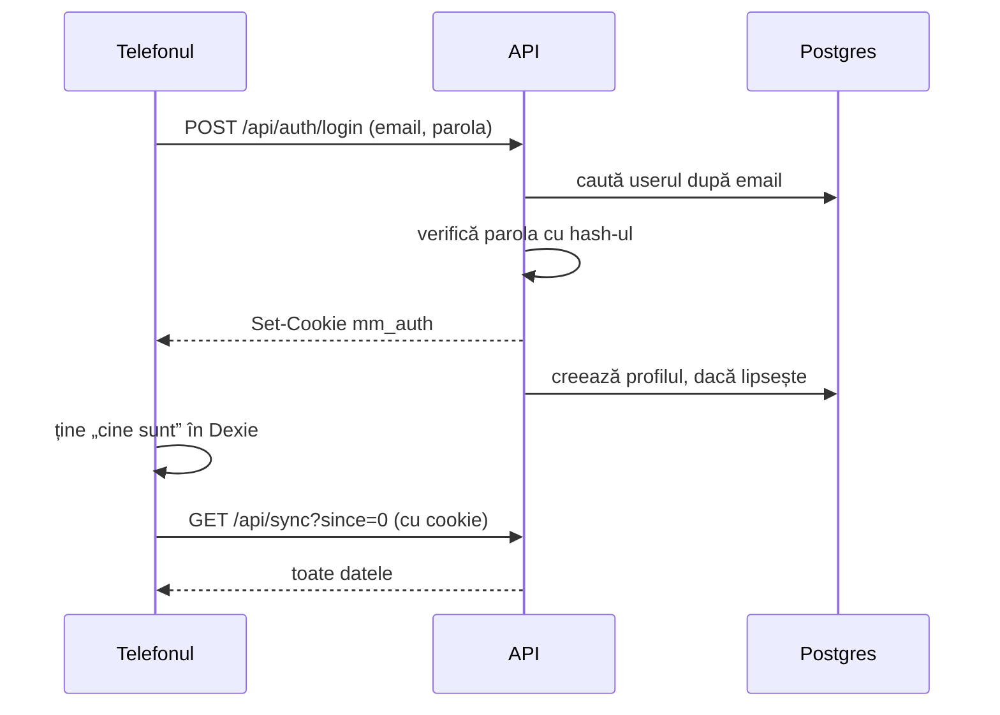
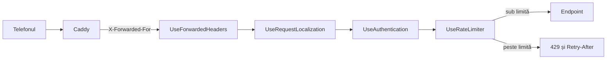

# 5. Login și securitate

Pentru conturi, .NET are un pachet de user management: **ASP.NET Core Identity**. Pachetul vine cu:
- tabelul de utilizatori;
- parolele salvate ca hash, nu în clar;
- blocarea contului după mai multe încercări greșite;
- verificarea parolei la login.

MacroMate îl folosește cu un **cookie**: după login, browserul primește un bilet semnat de server și îl trimite singur la fiecare cerere.

## Login-ul, pas cu pas



1. Telefonul trimite email-ul și parola la `/api/auth/login` (`Features/Auth/AuthEndpoints.cs`).
2. API-ul caută userul și cheamă `PasswordSignInAsync`. Funcția compară parola cu hash-ul din tabelul `users`.
3. Dacă parola e bună, API-ul pune în răspuns un cookie, `mm_auth`. Conținutul e criptat cu chei pe care le are doar serverul.
4. Telefonul ține în Dexie cine e logat, apoi face prima sincronizare, de la zero.

## Cookie-ul și ce face fiecare setare

Răspunsul la login conține:

```
set-cookie: mm_auth=…; expires=…; path=/; secure; samesite=lax; httponly
```

| Setare | Ce face | De ce |
|---|---|---|
| `httponly` | JavaScript-ul din pagină nu poate citi cookie-ul | Un script străin ajuns cumva în pagină nu poate fura sesiunea |
| `secure` | Cookie-ul pleacă doar pe HTTPS | Nu poate fi citit de pe o rețea Wi-Fi publică |
| `samesite=lax` | Cookie-ul nu pleacă la cererile `POST` venite de pe alt site | Un site străin nu poate face modificări în numele tău |
| `expires` + `SlidingExpiration` | 90 de zile, iar fiecare folosire le reia de la capăt | Nu te loghezi des de pe telefon |

Setările sunt în `Program.cs`, la `AddCookie`.

**De ce nu e nevoie de token anti-CSRF.** CSRF e atacul în care un site străin trimite o cerere spre API-ul tău, iar browserul atașează singur cookie-ul. Aici sunt două protecții:
- cu `samesite=lax`, cookie-ul nu pleacă la un `POST` venit de pe alt site;
- toate scrierile sunt JSON. Un formular de pe alt site nu poate trimite JSON fără să întrebe întâi serverul (cererea „preflight” de CORS). API-ul nu răspunde la ea, deci browserul nu trimite cererea.

**De ce cookie-urile supraviețuiesc unui deploy.** Cheile cu care se criptează cookie-ul stau în `/data/keys`, pe volumul serverului (`AddDataProtection().PersistKeysToFileSystem`). Fără ele, fiecare repornire ar face chei noi și ar deloga pe toată lumea. Cu aceleași chei se semnează și linkurile din emailurile de resetare a parolei.

**De ce serverul știe că cererea a venit pe HTTPS.** Caddy primește cererea pe HTTPS și o trimite la API pe HTTP, în rețeaua internă Docker. În header-ul `X-Forwarded-Proto: https` îi spune API-ului cum a venit cererea. `UseForwardedHeaders()` citește header-ul, iar API-ul pune `secure` pe cookie.

## Blocarea și parola

Din `Program.cs`:
- parola are minim 10 caractere, fără alte reguli. Lungimea apără mai bine decât „o literă mare și o cifră”;
- după 5 încercări greșite, contul e blocat 5 minute. Răspunsul e 429, cu mesajul „Prea multe încercări. Încearcă din nou peste 5 minute.”. Blocarea e pe cont: contează parolele greșite pentru același email, de oriunde ar veni.

## Cum se face un cont

Aplicația nu are înregistrare publică. Un cont se face în două feluri:
- **pe server**, cu comanda `create-user` (`Admin/AdminCommands.cs`): pentru primul cont. Parola se tastează ascuns și nu rămâne în istoricul terminalului;
- **dintr-un link de invitație** în bucătărie: `POST /api/invites/<token>/register`. Linkul îl face cineva care are deja cont, merge o singură dată și expiră după 7 zile. Contul nou intră direct în bucătăria celui care a invitat.

## Contul și emailurile, pe scurt

„Contul tău” din Profil schimbă numele, emailul și parola. „Ai uitat parola?” trimite un link pe email. Regulile de securitate:
- schimbarea parolei și a emailului cer **parola actuală**;
- emailul nou se schimbă doar după ce deschizi linkul trimis pe el;
- linkurile merg 2 ore și sunt semnate de server;
- la „Am uitat parola”, API-ul răspunde **la fel** și pentru un email care nu are cont. Așa nimeni nu poate afla ce adrese au cont, încercându-le una câte una;
- adresa din link vine din setarea `Email:PublicUrl`, nu din headerul `Host` al cererii. Headerul `Host` îl scrie cine trimite cererea; un atacator l-ar putea folosi ca linkul din emailul tău să ducă la site-ul lui, cu tokenul tău în el.

Mecanismul complet, cu emailurile prin Resend, e în capitolul despre cont și emailuri.

## Limitarea cererilor

ASP.NET Core are un **limitator de cereri** inclus (rate limiter): o piesă prin care trec cererile și care numără câte a trimis fiecare client într-un interval. Peste limită, cererea e refuzată înainte să ajungă la endpoint.

Blocarea de mai sus apără un cont. Limitatorul apără serverul: oprește pe cineva care încearcă multe emailuri, trimite sute de cereri de resetare sau cheltuie tokenii DeepSeek.

MacroMate are două **politici**, adică două seturi de reguli cu nume, în `Features/Security/RateLimiting.cs`:

| Politica | Se numără separat pentru | Limita | Pe ce endpoint-uri |
|---|---|---|---|
| `auth` | fiecare adresă IP | 10 cereri pe minut | login, „Am uitat parola”, resetarea parolei, confirmarea emailului, schimbarea parolei și a emailului, toate `/api/invites/*` |
| `ai` | fiecare cont logat | 30 de cereri la 10 minute | toate `/api/ai/*`: completarea alimentului, rețeta generată, scanarea farfuriei, starea cheii |

Limita e pe toate endpoint-urile politicii împreună: 6 login-uri și 4 resetări în același minut fac 10.



Fiecare cerere trece prin piesele din `Program.cs`, în ordinea în care sunt scrise. O piesă de felul ăsta se numește **middleware**. Ordinea contează:
1. **`UseForwardedHeaders`** e primul. Pe server, cererea vine de la Caddy, nu direct de la telefon. Caddy scrie adresa IP a telefonului în headerul `X-Forwarded-For`, iar `UseForwardedHeaders` o pune în `Connection.RemoteIpAddress`. Fără el, toate cererile ar părea că vin de la Caddy și ar împărți aceeași limită. Un `X-Forwarded-For` trimis de telefon nu trece: Caddy îl înlocuiește cu adresa reală.
2. **`UseRequestLocalization`** alege limba, ca mesajul de refuz să fie în limba ta.
3. **`UseAuthentication`** citește cookie-ul. Abia după el, limitatorul știe ce cont trimite cererea, pentru politica `ai`.
4. **`UseRateLimiter`** numără și decide.

Politica `auth`, din `RateLimiting.cs`:

```csharp
o.AddPolicy(Auth, http => RateLimitPartition.GetFixedWindowLimiter(
    $"ip:{http.Connection.RemoteIpAddress}",
    _ => Window(Limits(http).AuthPerMinute, TimeSpan.FromMinutes(1))));
```

- **Partiția** e cheia după care se numără separat: aici `ip:203.0.113.7`. La politica `ai` e `user:<id-ul contului>`.
- **Fereastra fixă** (`FixedWindowLimiter`) e un contor care pornește de la 0 la începutul fiecărui interval. Fiecare cerere îl crește cu 1. Când ajunge la limită, următoarele cereri din același interval sunt refuzate. La intervalul următor, contorul revine la 0.

Endpoint-ul își alege politica cu `RequireRateLimiting`:

```csharp
group.MapPost("/login", Login).RequireRateLimiting(RateLimiting.Auth);
```

**Peste limită**, API-ul răspunde:

```
HTTP/1.1 429 Too Many Requests
Retry-After: 42
{ "status": 429, "detail": "Prea multe cereri. Încearcă din nou peste 1 min." }
```

`Retry-After` spune în câte secunde se reia fereastra. Mesajul vine din `Messages.resx` sau `Messages.en.resx`, după limba cererii. Testul `Too_many_auth_requests_from_one_address_get_429` trimite de la aceeași adresă exact atâtea cereri cât e limita, verifică 429, `Retry-After` și mesajul la următoarea, apoi verifică faptul că altă adresă IP trece în continuare. (În teste limita e ridicată la 200, din `ApiFactory.cs`, ca celelalte teste să nu se lovească de ea.)

**Limitele se pot schimba** fără cod, prin setări:

| Setare | Implicit |
|---|---|
| `RateLimits__AuthPerMinute` | 10 |
| `RateLimits__AiPerTenMinutes` | 30 |

Pe server le adaugi în `deploy/compose.prod.yaml`, la `api` → `environment`. Telefoanele din aceeași rețea Wi-Fi ies pe internet cu aceeași adresă IP, deci împart limita `auth`. Pentru câteva conturi, 10 pe minut ajung.

## Cine vede ce

| Date | Cine le vede | Unde e regula |
|---|---|---|
| alimente | toate conturile; le modifică doar autorul și cei din bucătăria lui | `FoodTable` din `SyncTables.cs` |
| rețete, variante, planuri, liste, cămară | membrii bucătăriei | `KitchenTable`: `kitchen_id` la scriere, `where KitchenId == …` la citire, în `SyncEndpoints.cs` |
| jurnal, planul zilei, greutate, profil | doar proprietarul | `PersonalTable`: `IsOwnedBy` la scriere, `where UserId == …` la citire |
| pozele | doar cine e logat | `PhotoEndpoints.cs`: `RequireAuthorization()` |

Testele verifică regulile:
- `Personal_rows_stay_with_their_owner`: jurnalul tău nu ajunge la altcineva, iar o încercare de a-ți modifica o intrare primește `not-owner`;
- `Recipes_stay_inside_their_kitchen`: o rețetă nu ajunge la un cont din altă bucătărie;
- `Only_the_kitchen_of_the_author_can_change_a_food`: un aliment îl modifică doar bucătăria celui care l-a adăugat.

## Ce verifică serverul la fiecare scriere

Telefonul verifică datele când le scrii, dar serverul nu se bazează pe asta. Orice cerere poate fi trimisă și de mână, cu `curl`. De aceea API-ul face trei lucruri:
1. **Validează fiecare rând** (`SyncRules.cs`): nume obligatoriu, categorie din listă, valori în limite, cel mult 5 mese într-un plan.
2. **Ignoră câmpurile pe care le scrie doar el**: autorul, proprietarul, `version`, datele.
3. **Limitează mărimea cererilor**:
   - cel mult 2.000 de modificări într-o cerere;
   - poze doar JPEG, sub 8 MB;
   - poza de etichetă sau de farfurie trimisă la AI, sub 6 MB;
   - cererea pentru rețetă, sub 500 de caractere.

## Cheia DeepSeek

Cheia stă doar pe server: în `deploy/.env` în producție, în user-secrets pe laptop. Telefonul nu o vede niciodată. Când vrei o notă de la AI, telefonul cere `/api/ai/...`, iar API-ul cheamă DeepSeek cu cheia lui. Dacă cheia ar fi în telefon, oricine deschide DevTools ar putea s-o copieze și s-o folosească pe banii tăi.

## Logat fără internet

Telefonul ține în Dexie cine e logat (`meta.me`). La deschidere, aplicația te lasă în ea fără să întrebe serverul, apoi verifică sesiunea în fundal (`verifySession` din `web/src/db/session.ts`):
- dacă serverul răspunde 401 (sesiune expirată), te trimite la login;
- dacă serverul nu răspunde deloc, rămâi în aplicație și lucrezi offline.

La „Ieși din cont”, aplicația încearcă întâi să trimită coada. Dacă ești offline și ai modificări netrimise, te oprește, pentru că altfel s-ar pierde.
