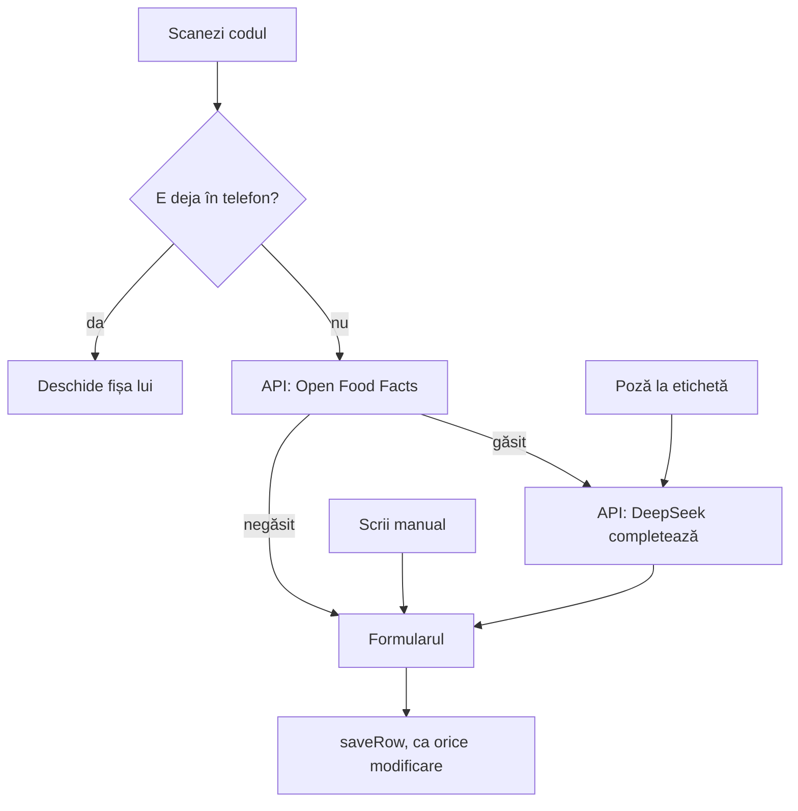
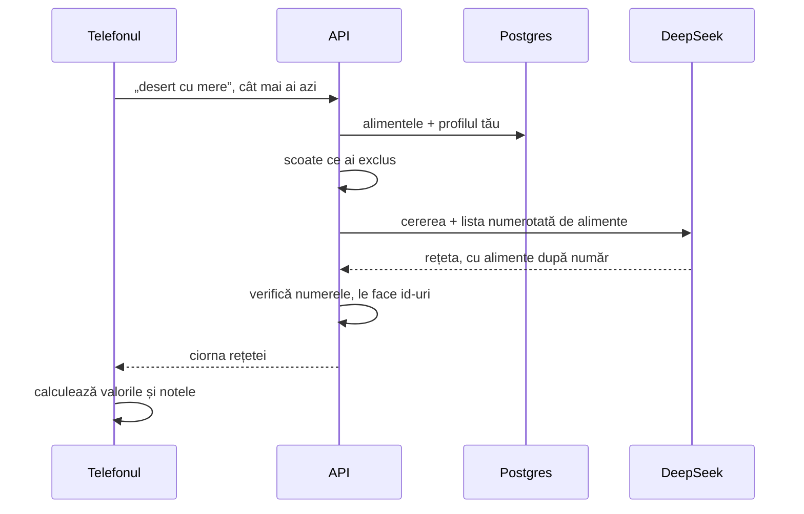

# 6. Alimente, scanare și AI

Un aliment nou intră în bază pe unul din trei drumuri: scanezi codul de bare, faci o poză la etichetă sau îl scrii de mână. Toate trei ajung în același formular, unde verifici ce s-a completat și salvezi.



Codul pentru ecran e în `web/src/routes/_app/foods/new.tsx`.

## Scannerul

Browserele au o funcție pentru coduri de bare, `BarcodeDetector`, dar Safari de pe iPhone nu o are. Așa că aplicația folosește **zxing**, o bibliotecă de citit coduri, compilată în WebAssembly (`.wasm`): cod rapid care rulează în browser.

- Fișierul `.wasm` e servit de aplicația ta, nu de pe un site extern. Așa, scannerul merge și offline și nu trimite nimic în afară.
- Formatele citite: EAN-13 și EAN-8 (codurile de pe produsele din România), UPC și QR.
- Camera pornește cu `getUserMedia`. Browserul cere permisiunea o dată și merge doar pe HTTPS sau pe `localhost`.

Codul e în `web/src/components/app/scanner.tsx`. La fiecare 120 ms, scannerul ia o imagine din video și caută un cod în ea. Când găsește unul, telefonul vibrează scurt și oprește camera.

## Open Food Facts

Open Food Facts e o bază publică și gratuită de produse, completată de oameni din toată lumea. Telefonul nu o întreabă direct, ci prin API:

```
GET /api/barcode/5941234567890
```

`OpenFoodFactsClient.cs` cere de la `world.openfoodfacts.org` doar câmpurile de care e nevoie și le transformă:
- **calorii**: ia `energy-kcal_100g`; dacă lipsește, împarte kilojoulii la 4,184;
- **sodiu**: Open Food Facts îl dă în grame, aplicația îl vrea în miligrame (×1000). Dacă lipsește, îl calculează din sare: sarea are 40% sodiu, deci 1 g de sare înseamnă 400 mg de sodiu;
- **numele**: întâi numele în română, dacă există.

Produsele românești lipsesc des. Atunci formularul se deschide doar cu codul completat, iar tu faci o poză la etichetă sau scrii valorile.

## DeepSeek completează alimentul

DeepSeek primește ce se știe deja și întoarce JSON. Cererea pleacă din telefon la API, iar API-ul cheamă DeepSeek, ca cheia să rămână pe server:

```
POST /api/ai/foods/enrich
{ "name": "Iaurt grecesc", "brand": "Olympus", "values": { "kcal": 73, "proteinG": 10, "carbsG": null, ... }, "labelImageDataUrl": null }
```

Instrucțiunile pentru AI sunt în `Features/Ai/AiPrompts.cs`, la `FoodEnrich`. Pe scurt, îi cer:
1. să citească valorile de pe etichetă, dacă e o poză;
2. să completeze valorile lipsă;
3. să aleagă o categorie din lista fixă;
4. să dea nota glicemică A, B sau C, după încărcătura glicemică a unei porții obișnuite (criteriile sunt în specificație);
5. să dea nota de slăbit A, B sau C, al cărei criteriu principal e numărul de calorii la 100 g;
6. să scrie o propoziție în română cu motivul.

**Regula după care API-ul combină răspunsul** (`EnrichFood` din `AiEndpoints.cs`):
- o valoare pe care ai dat-o tu sau Open Food Facts **rămâne**. AI-ul nu o poate schimba;
- o valoare citită de pe etichetă e **exactă**;
- o valoare completată de AI fără etichetă e **„estimat”** și apare în formular cu un chenar portocaliu;
- tot ce vine de la AI e adus în limite: calorii 0–900, macro 0–100 g, notele A/B/C (altceva devine B). O categorie care nu e în listă rămâne goală, ca s-o alegi tu.

DeepSeek e apelat cu `response_format: json_object`, deci răspunsul e sigur JSON valid. Codul e în `DeepSeekClient.cs`.

## Poza la etichetă

1. Telefonul micșorează poza la 1600 px pe latura mare și o face JPEG. Așa o poză de 4 MB ajunge la câteva sute de KB.
2. Poza pleacă la API ca text (`data:image/jpeg;base64,...`).
3. API-ul o pune lângă întrebare, în cererea spre DeepSeek. Modelul `deepseek-flash` primește și imagini.

## Rețeta generată



Câteva alegeri, cu motivul lor:
- **Alimentele sunt trimise numerotate (0, 1, 2…), nu cu id-ul lor.** Un număr scurt e mai greu de greșit pentru AI decât un id de 36 de caractere. API-ul verifică fiecare număr și îl transformă înapoi în id. Numerele care nu există se aruncă.
- **Excluderile se aplică pe server.** Alimentele și categoriile excluse nici nu ajung la DeepSeek, așa că nu are cum să le folosească.
- **Valorile le calculează aplicația, nu AI-ul.** Ciorna arată calorii calculate din alimentele din bază, cu aceleași formule ca peste tot în aplicație.
- **Ce lipsește din bază vine separat** („Lipsesc din bază”). Nu intră în calcul până nu adaugi alimentul.

## Când AI-ul nu merge

| Situație | Ce vezi | Codul HTTP |
|---|---|---|
| nu e cheie pe server | „Cheia DeepSeek nu e setată pe server.” | 503 |
| DeepSeek răspunde cu eroare sau cu JSON greșit | mesajul de eroare; formularul rămâne cum era | 502 |
| ești offline | butoanele de AI sunt dezactivate | — |

Alimentul se poate salva și fără note. Le calculezi mai târziu: Editează → „Completează cu AI”.
