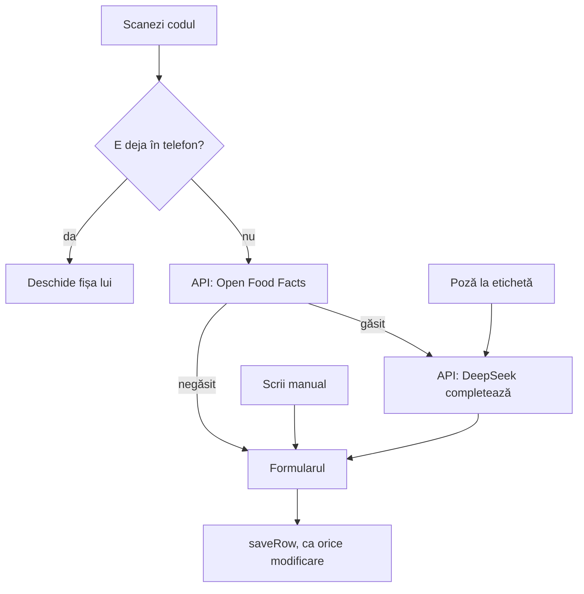
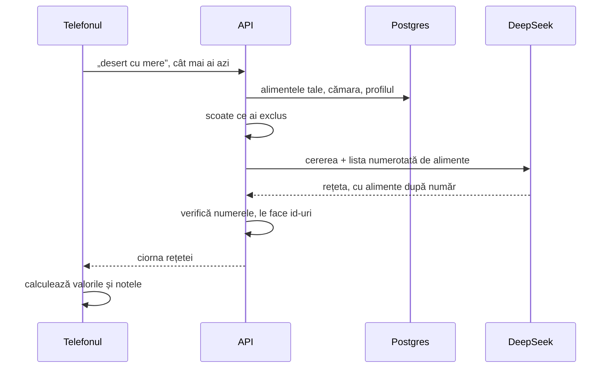
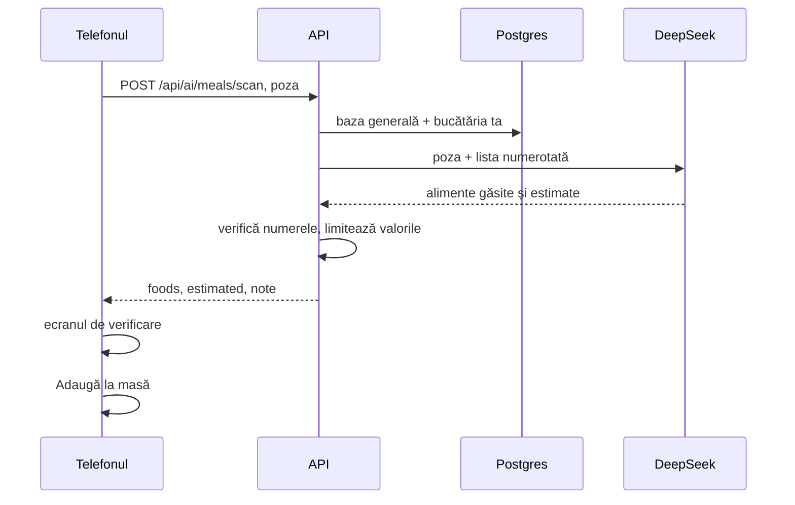

# 6. Alimente, scanare și AI

Un aliment nou intră în aplicație pe unul din trei drumuri: scanezi codul de bare, faci o poză la etichetă sau îl scrii de mână. Toate trei ajung în același formular, unde verifici ce s-a completat și salvezi. Alimentul intră în **bucătăria ta**, unde îl văd doar membrii ei, și direct în cămară. Un admin are în plus bifa **„Adaugă în baza generală”**: așa alimentul îl văd toate conturile. Cine modifică ce aliment e explicat în [capitolul 15](15-conturi-si-roluri.md).



Codul pentru ecran e în `web/src/routes/_app/foods/new.tsx`.

## Scannerul

Browserele au o funcție pentru coduri de bare, `BarcodeDetector`, dar Safari de pe iPhone nu o are. Așa că aplicația folosește **zxing**, o bibliotecă de citit coduri, compilată în WebAssembly (`.wasm`): cod rapid care rulează în browser.

- Fișierul `.wasm` e servit de aplicația ta, nu de pe un site extern. Așa, scannerul merge și offline și nu trimite nimic în afară.
- Formatele citite: EAN-13 și EAN-8 (codurile de pe produsele din România), UPC și QR.
- Camera pornește cu `getUserMedia`. Browserul cere permisiunea o dată și merge doar pe HTTPS sau pe `localhost`.

Codul e în `web/src/components/app/scanner.tsx`. La fiecare 120 ms, scannerul ia o imagine din video și caută un cod în ea. Când găsește unul, telefonul vibrează scurt și oprește camera.

## Open Food Facts

Open Food Facts e o bază publică și gratuită de produse, completată de oameni din toată lumea. Telefonul nu o întreabă direct, ci prin API:

```
GET /api/barcode/5941234567890
```

`OpenFoodFactsClient.cs` cere de la `world.openfoodfacts.org` doar câmpurile de care e nevoie și le transformă:
- **calorii**: ia `energy-kcal_100g`; dacă lipsește, împarte kilojoulii la 4,184;
- **sodiu**: Open Food Facts îl dă în grame, aplicația îl vrea în miligrame (×1000). Dacă lipsește, îl calculează din sare: sarea are 40% sodiu, deci 1 g de sare înseamnă 400 mg de sodiu;
- **numele**: întâi numele în română, dacă există.

Produsele românești lipsesc des. Atunci formularul se deschide doar cu codul completat, iar tu faci o poză la etichetă sau scrii valorile.

## DeepSeek

**DeepSeek** e serviciul de AI. Aplicația folosește modelul `deepseek-flash`, adică DeepSeek-V4.1-Flash: primește text și imagini. Modelul e setat în `appsettings.json`, la `DeepSeek:Model`. Codul care îl cheamă e `DeepSeekClient.cs`.

DeepSeek face patru lucruri în aplicație:

| Ce | Endpoint | Cât durează, cam |
|---|---|---|
| completează un aliment după nume | `POST /api/ai/foods/enrich` | 3–15 s |
| citește eticheta dintr-o poză | același, cu poza | 3–15 s |
| generează o rețetă dintr-o poftă | `POST /api/ai/recipes/generate` | 10–20 s |
| recunoaște mâncarea dintr-o poză | `POST /api/ai/meals/scan` | 10–20 s |

Toate sunt apelate cu `response_format: json_object`, deci răspunsul e sigur JSON valid.

**Cheia** stă doar pe server: în `deploy/.env` în producție, în user-secrets pe laptop. Pe laptop o pui cu:

```bash
read -rs "KEY?Cheia DeepSeek: " && dotnet user-secrets set DeepSeek:ApiKey "$KEY" --project api/MacroMate.Api; unset KEY
```

Caută: `Successfully saved DeepSeek:ApiKey to the secret store.` Testele nu cheamă DeepSeek.

## DeepSeek completează alimentul

DeepSeek primește ce se știe deja și întoarce JSON. Cererea pleacă din telefon la API, iar API-ul cheamă DeepSeek, ca cheia să rămână pe server:

```
POST /api/ai/foods/enrich
{ "name": "Iaurt grecesc", "nameEn": null, "brand": "Olympus", "values": { "kcal": 73, "proteinG": 10, "carbsG": null, ... }, "labelImageDataUrl": null }
```

Instrucțiunile pentru AI sunt în `Features/Ai/AiPrompts.cs`, la `FoodEnrich`. Pe scurt, îi cer:
1. să citească valorile de pe etichetă, dacă e o poză;
2. să completeze valorile lipsă;
3. să aleagă o categorie din lista fixă;
4. să dea nota glicemică A, B sau C, după încărcătura glicemică a unei porții obișnuite (criteriile sunt în specificație);
5. să scrie motivul notei glicemice într-o propoziție, în română (`reason`) și în engleză (`reasonEn`);
6. să dea numele în română (`name`) și în engleză (`nameEn`). Un nume pe care l-ai scris tu rămâne; AI-ul îl traduce pentru celălalt.

Numele și motivul ajung în coloanele `name`, `name_en`, `grades_reason` și `grades_reason_en`. Aplicația arată varianta limbii de acum, cu `foodName` și `foodReason` din `web/src/lib/food-name.ts`. Căutarea merge pe ambele nume: „blueberries” găsește „Afine”. Formularul arată întâi numele în limba de acum, apoi pe celălalt.

Notele de proteină și de volum nu vin de la AI: le calculează aplicația din valori, în `proteinGrade` și `volumeGrade` din `web/src/lib/nutrition.ts`.

**Regula după care API-ul combină răspunsul** (`EnrichFood` din `AiEndpoints.cs`):
- o valoare pe care ai dat-o tu sau Open Food Facts **rămâne**. AI-ul nu o poate schimba;
- o valoare citită de pe etichetă e **exactă**;
- o valoare completată de AI fără etichetă e **„estimat”** și apare în formular cu un chenar portocaliu;
- tot ce vine de la AI e adus în limite: calorii 0–900, macro 0–100 g, nota glicemică A/B/C (altceva devine B). O categorie care nu e în listă rămâne goală, ca s-o alegi tu.

## Poza la etichetă

1. Telefonul micșorează poza la 1600 px pe latura mare și o face JPEG. Așa o poză de 4 MB ajunge la câteva sute de KB.
2. Poza pleacă la API ca text (`data:image/jpeg;base64,...`).
3. API-ul o pune lângă întrebare, în cererea spre DeepSeek.

Sarea de pe etichetă devine sodiu, cu aceeași regulă: 1 g de sare înseamnă 400 mg de sodiu.

## Rețeta generată



Câteva alegeri, cu motivul lor:
- **Alimentele sunt trimise numerotate (0, 1, 2…), nu cu id-ul lor.** Un număr scurt e mai greu de greșit pentru AI decât un id de 36 de caractere. API-ul verifică fiecare număr și îl transformă înapoi în id. Numerele care nu există se aruncă.
- **Doar alimentele pe care le vezi.** API-ul trimite alimentele din baza generală și din bucătăria ta. Alimentele altor bucătării nu ajung la DeepSeek.
- **Excluderile se aplică pe server.** Alimentele și categoriile excluse nici nu ajung la DeepSeek, așa că nu are cum să le folosească.
- **Cămara are întâietate.** În listă, alimentele din cămara bucătăriei tale au semnul `pantry`, iar cele care îți plac semnul `liked`. Promptul cere să le folosească întâi pe cele din cămară, apoi pe cele care îți plac.
- **Valorile le calculează aplicația, nu AI-ul.** Ciorna arată calorii calculate din alimentele din bază, cu aceleași formule ca peste tot în aplicație.
- **Ce lipsește din bază vine separat** („Lipsesc din bază”). Nu intră în calcul până nu adaugi alimentul.
- **Pașii vin fără numere.** Promptul cere câte un pas pe rând, fără numere. DeepSeek mai pune uneori „1.”, așa că `recipeSteps` din `web/src/lib/recipes.ts` scoate numerele și liniuțele de la începutul rândurilor. Altfel, pe ecran ar apărea „1. 1. Spală merele”.
- **Limba.** Numele, pașii și ce lipsește vin în limba aplicației.

## Scanarea farfuriei

Faci o poză la mâncare, iar aplicația propune ce să notezi în jurnal. Butonul e camera din antetul ecranului Azi. Codul e în `web/src/components/app/meal-scan.tsx` și în `ScanMeal` din `AiEndpoints.cs`.



1. Telefonul micșorează poza la 1280 px și o trimite ca text, ca la etichetă.
2. API-ul trimite la DeepSeek poza și lista alimentelor din baza generală și din bucătăria ta: număr, nume în română, nume în engleză, categorie, valori la 100 g.
3. DeepSeek întoarce, pentru fiecare lucru din farfurie:
   - dacă e în listă: numărul lui și gramele;
   - dacă nu e: numele, gramele și valorile estimate pentru porția aceea, nu la 100 g;
   - plus o notă despre ce nu se vede în poză: uleiul, untul, zahărul.
4. API-ul transformă numerele în id-uri, aruncă numerele care nu există și aduce valorile în limite (de exemplu 1–3000 g).
5. Telefonul arată ecranul de verificare: fiecare aliment cu gramele lui, pe care le schimbi cu + și −, sau îl scoți. Alegi masa și apeși **„Adaugă la masă”**.

### Gramele în starea din bază

Valorile din bază sunt pentru alimentul cum îl cumperi: orezul, pastele, ovăzul și lintea sunt **uscate**, carnea și peștele sunt **crude**. În farfurie le vezi gătite. Orezul fiert cântărește cam de 2,5–3 ori cât cel uscat, iar carnea gătită cu 25–30% mai puțin decât cea crudă.

Așa că DeepSeek întoarce două numere:
- `grams`: cantitatea în starea din bază, din care se calculează valorile;
- `servedGrams`: cât se vede în farfurie, gătit. Ecranul îl arată ca „în farfurie ≈ 150 g gătit”.

Exemplu, cu orezul alb din bază (365 kcal la 100 g, uscat) și 150 g de orez fiert în farfurie:

| Cum sunt socotite cele 150 g | Grame în calcul | kcal |
|---|---|---|
| greșit, ca orez uscat | 150 | 365 × 150 / 100 = **548** |
| corect, cam 55 g de orez uscat | 55 | 365 × 55 / 100 = **201** |

La legume, fructe, pâine, brânză și iaurt, cele două numere sunt egale.

### Ce intră în jurnal

- Un aliment găsit în bază intră cu `foodId` și grame, ca orice aliment notat. Valorile vin din bază, nu de la AI.
- Un aliment **estimat** intră **fără `foodId`**, cu valorile estimate salvate direct în intrarea din jurnal (`logEstimatedItem` din `web/src/lib/journal.ts`). În jurnal apare cu eticheta „estimat”.
- Baza de alimente nu se umple cu ghiceli: estimatele rămân doar în jurnalul tău.

## Limita la AI

Fiecare cont are cel mult **30 de cereri la 10 minute** spre `/api/ai/*`. Limita e numărată pe cont, de limitatorul de cereri din ASP.NET Core (politica `ai`). Peste ea, API-ul răspunde 429 cu „Prea multe cereri. Încearcă din nou peste N min.” și headerul `Retry-After`; N sunt minutele până se golește fereastra de 10 minute, calculate din același `Retry-After`. Așa, un cont scăpat sau un script nu poate cheltui tokenii DeepSeek. Limita se schimbă cu setarea `RateLimits__AiPerTenMinutes`. Verificarea „e AI-ul pregătit?” (`GET /api/ai/status`), pe care aplicația o face din câteva în câteva minute, nu intră în limită: are `.DisableRateLimiting()`.

Pe lângă ea e o **limită pe zi**, numărată în Postgres, în tabelul `ai_usage`, de filtrul `AiQuotaFilter` din `Features/Ai/AiQuota.cs`:
- un utilizator: 20 de cereri pe zi (`RateLimits__AiPerUserPerDay`);
- un cont de probă: 5 (`RateLimits__AiPerDemoPerDay`);
- toată aplicația: 300 (`RateLimits__AiTotalPerDay`);
- un admin: fără limită.

Contează completarea alimentului, rețeta generată și scanarea farfuriei. Ziua e ziua UTC. Cererea se numără înainte să ruleze endpoint-ul, deci și una respinsă apoi, de exemplu cu o poză prea mare. Detaliile sunt în [capitolul 15](15-conturi-si-roluri.md).

## Când AI-ul nu merge

| Situație | Ce vezi | Codul HTTP |
|---|---|---|
| nu e cheie pe server | „AI-ul nu e configurat: lipsește cheia DeepSeek pe server.” | 503 |
| DeepSeek răspunde cu eroare sau cu JSON greșit | mesajul de eroare; formularul rămâne cum era | 502 |
| prea multe cereri spre AI | „Prea multe cereri. Încearcă din nou peste N min.” (N până la 10) | 429 |
| ai folosit cererile tale de azi | „Ai folosit cele 20 cereri AI de azi. Mâine poți din nou.” (5 la un cont de probă) | 429 |
| toată aplicația a folosit cererile de azi | „AI-ul a ajuns la limita de azi pentru toată aplicația. Încearcă mâine.” | 429 |
| ești offline | butoanele de AI sunt dezactivate | — |

Alimentul se poate salva și fără note. Le calculezi mai târziu: Editează → „Completează cu AI”.
