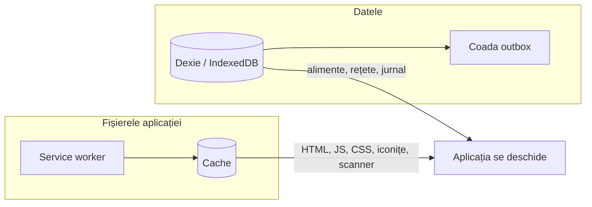

# 8. PWA și offline

**PWA** (Progressive Web App) e un site obișnuit care are în plus două lucruri:
1. **un manifest**: un fișier JSON cu numele, iconițele și felul în care se deschide aplicația. Cu el, telefonul o poate pune pe ecran ca pe o aplicație;
2. **un service worker**: un script pe care browserul îl instalează și îl ține între vizite. Prinde cererile paginii și poate răspunde din cache, fără internet.

## Offline are două jumătăți

- **Fișierele aplicației** (HTML, JavaScript, CSS, iconițe, scannerul `.wasm`) le ține service worker-ul. Fără el, offline ai vedea ecranul browserului „No internet”.
- **Datele** le ține Dexie, în baza browserului. Fără ea, aplicația s-ar deschide, dar ar fi goală.

## Manifestul

Se generează din `web/vite.config.ts`, la `VitePWA({ manifest: … })`:

| Câmp | Valoare | Ce face |
|---|---|---|
| `name` | MacroMate | numele de sub iconiță |
| `display` | `standalone` | se deschide pe tot ecranul, fără bara browserului |
| `icons` | 64, 192, 512 px + varianta „maskable” | iconițele; cea „maskable” are margine, ca Android s-o poată tăia rotund |
| `shortcuts` | „Scanează”, „Jurnal” | ce apare la apăsare lungă pe iconiță, pe Android |

Iconițele se generează din `web/public/logo.svg`, cu comanda `pnpm --dir web gen:icons`.

## Service worker-ul

Îl scrie **Workbox**, prin `vite-plugin-pwa`, la `pnpm build`. Ce face:
- **Precache.** La prima vizită, descarcă toate fișierele aplicației (în jur de 90, cam 2 MB, cu tot cu scannerul) și le pune în cache.
- **Navigare offline.** Orice adresă din aplicație, de exemplu `/recipes/abc`, primește `index.html` din cache, iar router-ul React desenează ecranul potrivit.
- **Pozele.** Pozele de la `/api/photos/…` se țin în cache după prima vedere, până la 500 de poze. O poză nu se schimbă niciodată, pentru că una nouă primește un id nou.
- **Restul de `/api`** nu trece prin cache. Datele vin din Dexie, deci nu e nevoie.

## Actualizările

Când faci un deploy nou:
1. telefonul deschide aplicația din cache, adică versiunea veche;
2. service worker-ul vede că pe server e o versiune nouă și o descarcă în fundal;
3. apare mesajul „Există o versiune nouă a aplicației” cu butonul **Actualizează**;
4. apeși butonul, iar pagina se reîncarcă pe versiunea nouă.

Codul e `UpdatePrompt` din `web/src/routes/__root.tsx`. `registerType: 'prompt'` înseamnă că actualizarea nu se face fără să întrebe. Așa nu se reîncarcă pagina cât ești în mijlocul unei rețete.

## Instalarea pe telefon

- **iPhone**: Safari → Share → „Add to Home Screen”. iPhone-ul nu arată un buton automat de instalare. Scurtăturile la apăsare lungă nu există pe iPhone.
- **Android**: Chrome arată „Instalează aplicația” în meniu, iar uneori o propune singur. Ține degetul pe iconiță ca să vezi „Scanează” și „Jurnal”.

Pe iPhone, Safari poate șterge datele unei aplicații web nefolosite mai multe zile. Nu e grav: toate datele sunt și pe server, iar dacă telefonul pierde copia locală, următoarea sincronizare o aduce înapoi. S-ar pierde doar ce era în coadă și netrimis, iar coada se golește la câteva secunde după fiecare salvare făcută cu internet.

## De ce e nevoie de HTTPS

Și camera, și service worker-ul merg doar pe HTTPS. Excepția e `localhost`, pentru dezvoltare. Așa că serverul are nevoie de un domeniu: Caddy cere singur certificatul de la Let's Encrypt pentru el.

## Cum am verificat

Browserul din aplicația Claude nu acceptă service worker-e, așa că testul l-am făcut cu Chrome pornit fără interfață, pe build-ul de producție (`pnpm build` + `vite preview`):
1. prima vizită a instalat service worker-ul și a pus toate fișierele aplicației în cache, inclusiv scannerul;
2. cu Chrome în modul offline, pagina de login s-a deschis din cache;
3. după login, tot offline, s-au deschis Azi, Alimente și Cumpărături, cu datele din Dexie, iar iconița de sincronizare arăta „Offline”.

Pe laptop, cu `pnpm dev`, service worker-ul e oprit, ca să nu-ți servească fișiere vechi cât lucrezi.
