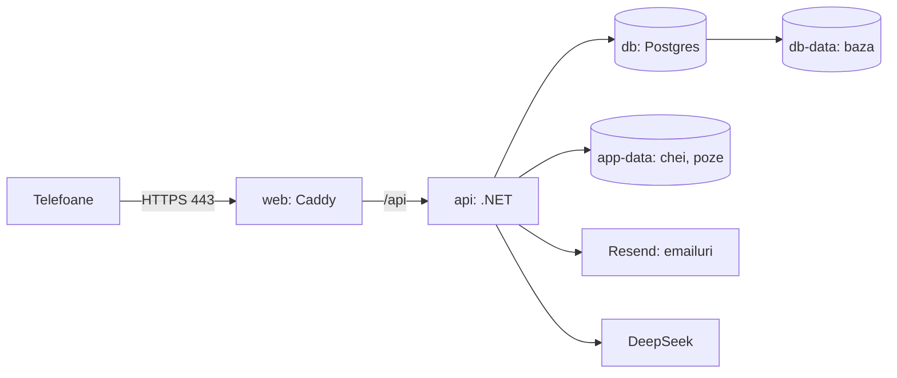

# 9. Deploy pe VPS (OVH)

**Deploy-ul** e mutarea aplicației pe un server pornit tot timpul, cu adresă publică, ca s-o deschideți de pe telefoane de oriunde.

Serverul e un **VPS** (virtual private server): o mașină virtuală închiriată, cu Linux, pe care ai drepturi depline. Aici e **OVH VPS-1**:
- centrul de date din Varșovia;
- Ubuntu 24.04;
- fără angajament;
- cam 4,49 € + TVA pe lună.

Pe server rulează trei containere Docker, pornite împreună de Docker Compose:



- **web**: Caddy, cu fișierele aplicației înăuntru. E singurul container deschis spre internet, pe porturile 80 și 443.
- **api**: API-ul .NET. Nu are port deschis în afară; primește cereri doar de la Caddy.
- **db**: Postgres. Nici el nu are port deschis în afară.

Datele stau pe **volume** Docker: foldere de pe disc care rămân și când containerele se refac la un deploy. Sunt patru: `db-data` (baza), `app-data` (cheile și pozele), `caddy-data` și `caddy-config` (certificatele HTTPS).

Fișierele sunt în `deploy/`:
- `compose.prod.yaml`: cele trei containere și volumele;
- `Caddyfile`: HTTPS, fișierele aplicației, trimiterea spre API;
- `web.Dockerfile`: construiește aplicația și o pune în imaginea Caddy;
- `../api/Dockerfile`: construiește API-ul;
- `.env.example`: modelul pentru setări;
- `backup.sh`: copia de rezervă a bazei.

**Înainte să începi** îți trebuie:
- VPS-ul comandat la OVH, cu cheia ta SSH pusă la comandă;
- domeniul din Namecheap;
- cheia DeepSeek;
- un cont Resend (îl faci la pasul 7).

Peste tot mai jos, `macromate.exemplu.com` e adresa ta și `IP_SERVER` e adresa IPv4 a VPS-ului, din emailul OVH sau din panoul OVH. Le înlocuiești cu ale tale.

## 1. Prima intrare pe server

**SSH** e programul cu care deschizi un terminal pe alt calculator, prin internet. Te recunoaște după **cheia SSH**: o pereche de fișiere de pe laptop. Partea publică (`~/.ssh/id_ed25519.pub`) ai pus-o la comanda OVH. Partea privată rămâne doar pe laptop.

Dacă nu ai cheie, o faci pe laptop cu `ssh-keygen -t ed25519`, apoi o adaugi în panoul OVH.

De pe laptop:

```bash
ssh ubuntu@IP_SERVER
```

Caută: prima dată, SSH întreabă `Are you sure you want to continue connecting (yes/no/[fingerprint])?`. Scrii `yes`. Apoi vezi un prompt de felul `ubuntu@vps-…:~$`.

Utilizatorul de la OVH e **`ubuntu`**, nu `root`. Comenzile de administrare le scrii cu **`sudo`** în față: `sudo` rulează comanda ca `root`, adică cu drepturi depline.

Aduci la zi pachetele instalate:

```bash
sudo apt update && sudo apt upgrade -y
```

Caută: la final, niciun rând care începe cu `E:` (eroare).

Verifici dacă actualizările cer repornire:

```bash
ls /var/run/reboot-required
```

Caută: dacă vezi `/var/run/reboot-required`, repornești cu `sudo reboot`, aștepți un minut și intri iar cu `ssh`. Dacă vezi `No such file or directory`, nu e nevoie.

### Actualizările de securitate automate

**unattended-upgrades** e un serviciu din Ubuntu care instalează singur, zilnic, actualizările de securitate. Pe imaginea OVH poate fi deja instalat; comanda de mai jos îl instalează, dacă lipsește, și îl pornește:

```bash
sudo apt install -y unattended-upgrades && sudo dpkg-reconfigure -plow unattended-upgrades
```

Caută: o fereastră albastră cu întrebarea `Automatically download and install stable updates?`. Alegi **Yes** și apeși Enter.

Verifici:

```bash
cat /etc/apt/apt.conf.d/20auto-upgrades
```

Caută: rândul `APT::Periodic::Unattended-Upgrade "1";`.

Serviciul nu repornește serverul singur. O dată pe lună, rulezi comanda cu `reboot-required` de mai sus.

## 2. Firewall-ul

**ufw** (uncomplicated firewall) e programul din Ubuntu care alege pe ce porturi primește serverul conexiuni din afară. Un **port** e un număr care spune cărui program îi e destinată o conexiune.

Lași deschise doar patru:

| Port | Pentru ce |
|---|---|
| 22 TCP | SSH, ca să intri tu pe server |
| 80 TCP | HTTP: Let's Encrypt verifică domeniul pe el, iar Caddy trimite de aici spre HTTPS |
| 443 TCP | HTTPS: aplicația |
| 443 UDP | HTTP/3, varianta mai nouă de HTTPS, pe care Caddy o oferă singur |

Ordinea contează: întâi permiți portul 22, apoi pornești firewall-ul. Invers, conexiunea ta SSH se taie.

```bash
sudo ufw allow 22/tcp && sudo ufw allow 80/tcp && sudo ufw allow 443/tcp && sudo ufw allow 443/udp && sudo ufw enable
```

Caută: întrebarea `Command may disrupt existing ssh connections. Proceed with operation (y|n)?`. Scrii `y`. Apoi `Firewall is active and enabled on system startup`.

```bash
sudo ufw status verbose
```

Caută: `Status: active`, `Default: deny (incoming)` și câte un rând `ALLOW IN` pentru `22/tcp`, `80/tcp`, `443/tcp`, `443/udp` (plus aceleași cu `(v6)`).

**Docker și ufw.** Docker scrie reguli de rețea proprii pentru porturile pe care le publică un container, iar regulile astea trec pe lângă ufw. În `compose.prod.yaml`, doar `web` publică porturi, 80 și 443, adică exact cele deschise oricum. `api` și `db` nu au `ports:`, deci nu se pot atinge din afară, cu sau fără ufw. Regula de ținut minte: nu adaugi `ports:` la `api` sau la `db`.

**Firewall-ul OVH.** În panoul OVH, la adresa IP a serverului, există și un firewall de rețea opțional (Edge Network Firewall). Filtrează conexiunile înainte să ajungă la server. E oprit implicit. Dacă îl pornești, adaugi și acolo reguli care lasă TCP 22, 80, 443 și UDP 443. Dacă blochează 80 sau 443, Let's Encrypt nu poate da certificatul, iar site-ul nu se deschide.

Dacă te-ai blocat afară (ai pornit ufw fără portul 22), intri din panoul OVH cu consola KVM: un terminal al serverului, deschis în browser. Acolo rulezi `sudo ufw allow 22/tcp`.

## 3. Docker

**Docker Engine** e programul care rulează containerele. **Pluginul compose** adaugă comanda `docker compose`, care pornește mai multe containere descrise într-un fișier.

Le instalezi din depozitul oficial Docker pentru Ubuntu. Întâi adaugi cheia cu care Docker își semnează pachetele:

```bash
sudo apt-get update && sudo apt-get install -y ca-certificates curl && sudo install -m 0755 -d /etc/apt/keyrings && sudo curl -fsSL https://download.docker.com/linux/ubuntu/gpg -o /etc/apt/keyrings/docker.asc && sudo chmod a+r /etc/apt/keyrings/docker.asc
```

Caută: fără rânduri cu `E:` sau `curl: (`.

Adaugi depozitul în lista de surse a lui `apt`:

```bash
echo "deb [arch=$(dpkg --print-architecture) signed-by=/etc/apt/keyrings/docker.asc] https://download.docker.com/linux/ubuntu $(. /etc/os-release && echo "${UBUNTU_CODENAME:-$VERSION_CODENAME}") stable" | sudo tee /etc/apt/sources.list.d/docker.list > /dev/null
```

Caută: comanda nu afișează nimic. `cat /etc/apt/sources.list.d/docker.list` arată un rând care se termină cu `noble stable` (`noble` e numele lui Ubuntu 24.04).

Instalezi Docker și pluginul compose:

```bash
sudo apt-get update && sudo apt-get install -y docker-ce docker-ce-cli containerd.io docker-buildx-plugin docker-compose-plugin
```

Caută la final, cu `docker --version` și `docker compose version`: `Docker version 2…` și `Docker Compose version v2…`.

Pui utilizatorul `ubuntu` în grupul **`docker`**. Cine e în grupul ăsta folosește Docker fără `sudo`. Asta înseamnă practic drepturi de `root`, deci nu pui alți utilizatori în el.

```bash
sudo usermod -aG docker ubuntu
```

Grupul nou se aplică doar la o intrare nouă. Ieși cu `exit`, intri iar cu `ssh ubuntu@IP_SERVER`, apoi:

```bash
docker run --rm hello-world
```

Caută: `Hello from Docker!`.

## 4. DNS în Namecheap

**DNS** e sistemul care traduce un nume (`macromate.exemplu.com`) într-o adresă IP. O **înregistrare A** leagă un nume de o adresă IPv4. O **înregistrare AAAA** leagă un nume de o adresă IPv6.

În Namecheap: **Domain List** → **Manage** la domeniul tău → **Advanced DNS** → **Add New Record**:

| Type | Host | Value | TTL |
|---|---|---|---|
| A Record | `macromate` | `IP_SERVER` | Automatic |

La **Host** scrii doar partea dinaintea domeniului. Namecheap adaugă singur restul, deci `macromate` devine `macromate.exemplu.com`.

**AAAA, doar dacă IPv6 merge pe server.** VPS-ul OVH are și o adresă IPv6. Verifici pe server dacă iese pe internet prin ea:

```bash
ping -6 -c 3 one.one.one.one
```

Caută: `3 packets transmitted, 3 received`. Dacă da, adresa o vezi cu `ip -6 addr show scope global` (rândul `inet6 2001:…`) și adaugi o înregistrare **AAAA Record** cu același Host, `macromate`. Dacă ping-ul nu merge, nu pui AAAA: Let's Encrypt ar încerca adresa IPv6 și certificatul n-ar ieși.

Verifici de pe laptop:

```bash
dig +short A macromate.exemplu.com
```

Caută: `IP_SERVER`. Dacă nu apare nimic, mai aștepți: o schimbare DNS poate dura de la câteva minute la câteva ore. Pentru AAAA, aceeași comandă cu `AAAA` în loc de `A`.

Nu pornești aplicația (pasul 8) până nu vezi IP-ul aici. Caddy reîncearcă singur, dar Let's Encrypt limitează încercările eșuate pentru același nume (cam 5 pe oră).

## 5. Codul pe server

`/opt` e folderul din Linux pentru programele instalate de mână. Faci în el folderul aplicației, al utilizatorului `ubuntu`, și clonezi repo-ul. Repo-ul e public, deci `git` nu cere parolă.

```bash
sudo apt install -y git && sudo mkdir -p /opt/macromate && sudo chown ubuntu:ubuntu /opt/macromate && git clone https://github.com/developedbyflow/macro-mate.git /opt/macromate
```

Caută: `Cloning into '/opt/macromate'...` și niciun rând cu `fatal:`. `ls /opt/macromate` arată `api`, `deploy`, `docs`, `web`.

## 6. Setările (`.env`)

**`.env`** e un fișier cu variabile pe care Docker Compose le citește la pornire și le pune în `compose.prod.yaml`, acolo unde scrie `${NUME}`. Rămâne doar pe server: e în `.gitignore`.

Îl faci din model și pui parola bazei:

```bash
cd /opt/macromate/deploy && cp .env.example .env && chmod 600 .env && sed -i "s|^POSTGRES_PASSWORD=.*|POSTGRES_PASSWORD=$(openssl rand -hex 32)|" .env && ls -l .env && grep -c '^POSTGRES_PASSWORD=[0-9a-f]\{64\}$' .env
```

- `chmod 600` face ca doar `ubuntu` să poată citi fișierul;
- `openssl rand -hex 32` generează o parolă de 64 de caractere, doar cifre și literele a–f, ca să nu strice șirul de conectare la bază;
- `sed` o scrie direct în fișier. N-o vezi și nu trebuie s-o ții minte: API-ul și Postgres o citesc din `.env`.

Caută: `-rw-------`, apoi `1` (parola e pusă).

Deschizi fișierul cu `nano .env` și completezi restul:

```
DOMAIN=macromate.exemplu.com
DEEPSEEK_API_KEY=sk-...
EMAIL_FROM=MacroMate <noreply@macromate.exemplu.com>
RESEND_API_KEY=re_...
```

| Variabila | Ce pui |
|---|---|
| `DOMAIN` | adresa aplicației, fără `https://` |
| `POSTGRES_PASSWORD` | pusă deja de comanda de mai sus |
| `DEEPSEEK_API_KEY` | cheia de la DeepSeek |
| `EMAIL_FROM` | expeditorul emailurilor. Adresa de după `@` trebuie să fie pe domeniul verificat în Resend |
| `RESEND_API_KEY` | cheia Resend; o iei la pasul 7 și revii aici |

Salvezi cu `Ctrl+O`, Enter, și ieși cu `Ctrl+X`.

**Ce se calculează singur.** În `compose.prod.yaml`, containerul `api` primește variabilele așa:

```yaml
environment:
  ConnectionStrings__Default: Host=db;Database=macromate;Username=macromate;Password=${POSTGRES_PASSWORD};GSS Encryption Mode=Disable
  DeepSeek__ApiKey: ${DEEPSEEK_API_KEY:-}
  Email__PublicUrl: https://${DOMAIN}
  Email__From: ${EMAIL_FROM:-}
  Email__ResendApiKey: ${RESEND_API_KEY:-}
```

În .NET, setările vin din `appsettings.json` și din variabile de mediu. `__` (două liniuțe jos) desparte secțiunile: variabila `Email__PublicUrl` e setarea `Email:PublicUrl` din `appsettings.json`. **`Email__PublicUrl`** e adresa pusă în linkurile din emailuri. Se face din `DOMAIN`, deci n-o mai scrii tu.

**Parola bazei se scrie o singură dată.** Postgres folosește `POSTGRES_PASSWORD` doar când creează baza, la prima pornire. Dacă o schimbi mai târziu în `.env`, baza păstrează parola veche, iar API-ul nu se mai poate conecta.

## 7. Resend: emailurile

**Resend** e un serviciu care trimite emailuri la o cerere HTTP. API-ul îl cheamă la „Am uitat parola”, la schimbarea emailului și la confirmarea unui cont nou. Planul gratuit trimite un număr limitat de emailuri pe zi și pe lună; limitele exacte le vezi în panoul Resend.

Resend trimite doar de pe un domeniu pe care dovedești că îl ai. Dovada sunt câteva înregistrări DNS pe care ți le dă el:
- **SPF** (TXT): lista serverelor care au voie să trimită emailuri în numele domeniului;
- **DKIM** (TXT): o cheie publică cu care serverele care primesc emailul verifică semnătura lui;
- **MX**: unde se întorc răspunsurile automate (emailuri care n-au ajuns).

Pașii:
1. Pe resend.com îți faci cont.
2. **Domains** → **Add Domain** → scrii `macromate.exemplu.com`. Dacă te întreabă regiunea, o alegi pe cea din Europa.
3. Resend arată o listă de înregistrări: un MX și un TXT pe `send.macromate…` și un TXT pe `resend._domainkey.macromate…`. Le lași deschise.
4. În Namecheap, **Advanced DNS**:
   - TXT-urile le adaugi la **Host Records** → **Add New Record** → **TXT Record**;
   - MX-ul îl adaugi jos, la **Mail Settings**: alegi **Custom MX**, apoi adaugi rândul.
   - La Host scrii doar partea dinaintea domeniului tău: dacă Resend arată `resend._domainkey.macromate.exemplu.com`, scrii `resend._domainkey.macromate`.
   - Valorile le copiezi exact cum le arată Resend.
5. Înapoi în Resend, apeși **Verify DNS Records**.
6. **API Keys** → **Create API Key**, cu permisiunea **Sending access**. Cheia începe cu `re_` și apare o singură dată. O pui în `.env`, la `RESEND_API_KEY`.

Caută în Resend, la domeniu: starea **Verified**. Poate dura de la câteva minute la câteva ore, ca orice schimbare DNS.

Dacă folosești redirecționarea de email de la Namecheap pe domeniul principal, trecerea pe **Custom MX** o oprește. Atunci te uiți întâi ce înregistrări de email ai și le treci și pe ele la Custom MX.

**Fără cheie Resend** aplicația merge, dar emailurile nu pleacă. API-ul folosește atunci `LogEmailSender`, care scrie emailul în logurile lui. Linkul îl vezi cu `docker compose -f compose.prod.yaml logs api | grep -A6 "Email to"`.

## 8. Pornirea

```bash
cd /opt/macromate/deploy && docker compose -f compose.prod.yaml up -d --build
```

Prima dată durează câteva minute: se construiesc imaginile, adică se compilează API-ul și aplicația.

Caută la final: `Container deploy-db-1 Healthy`, `Container deploy-api-1 Started`, `Container deploy-web-1 Started`. `deploy` din nume vine de la folderul în care e `compose.prod.yaml`.

```bash
docker compose -f compose.prod.yaml ps
```

Caută: trei rânduri, `db`, `api`, `web`, toate cu `Up`; la `db` scrie și `(healthy)`.

Urmărești Caddy:

```bash
docker compose -f compose.prod.yaml logs -f web
```

Caută: `certificate obtained successfully`, cu domeniul tău. Ieși cu `Ctrl+C`.

Cum ia Caddy certificatul, pas cu pas:
1. Caddy citește din `Caddyfile` numele `{$DOMAIN}`.
2. Caddy cere un certificat de la Let's Encrypt, o autoritate gratuită de certificate.
3. Let's Encrypt se conectează la `macromate.exemplu.com` pe portul 80 sau 443 și verifică un răspuns pe care doar serverul tău îl poate da. Așa află că domeniul arată spre serverul tău.
4. Let's Encrypt dă certificatul, valabil 90 de zile. Caddy îl ține pe volumul `caddy-data` și îl reînnoiește singur.

Te uiți la API:

```bash
docker compose -f compose.prod.yaml logs api --tail 50
```

Caută: `Now listening on: http://[::]:8080` și niciun rând cu `fail:`. La pornire, API-ul a rulat și migrările bazei.

Verifici tot drumul, de pe laptop:

```bash
curl -s https://macromate.exemplu.com/api/health
```

Caută: `{"status":"ok"}`. Cererea a trecut prin DNS, prin Caddy cu HTTPS și a ajuns la API.

## 9. Primele conturi

Un cont se face în patru feluri:
- cu comanda `create-user`, pe server: pentru contul tău;
- din pagina de login, cu „Creează unul” și un link de confirmare pe email;
- dintr-un link de invitație în bucătărie;
- cu „Încearcă fără cont”: un cont de probă, șters după 24 de ore.

Creezi contul tău:

```bash
docker compose -f compose.prod.yaml exec api dotnet MacroMate.Api.dll create-user --email adresa-ta@exemplu.com --name Florin
```

Caută: `Parola (minim 10 caractere):`. Tastezi parola (pe ecran nu apare nimic), Enter, apoi `Contul adresa-ta@exemplu.com a fost creat.`

Ce face comanda, pas cu pas:
1. `docker compose exec api` pornește o comandă nouă în containerul `api`, care rulează deja.
2. Comanda e chiar programul API-ului, cu `create-user` ca prim argument.
3. Programul rulează migrările, apoi vede argumentul și nu mai pornește serverul web:
   ```csharp
   if (AdminCommands.IsCommand(args))
       return await AdminCommands.RunAsync(app, args);
   ```
4. `AdminCommands.cs` citește parola fără s-o afișeze și cheamă `KitchenService.CreateUserAsync`. Contul primește o bucătărie nouă, iar tu ești proprietarul ei. Contul e confirmat direct, fără email.

Îți dai rolul de **admin**. Fără el, nimeni nu poate modifica baza generală de alimente și nimeni nu vede pagina Administrare:

```bash
docker compose -f compose.prod.yaml exec api dotnet MacroMate.Api.dll set-role --email adresa-ta@exemplu.com --role admin
```

Caută: `Contul adresa-ta@exemplu.com are acum rolul admin.`

**Dacă serverul rula deja o versiune mai veche**, comanda asta o rulezi o dată, după primul deploy cu versiunea care are rolurile. Migrarea `AddAccountsAndRoles` nu face pe nimeni admin. Apoi reîncarci aplicația în telefon: în Profil și în meniul din stânga apare „Administrare”. Rolurile sunt explicate în [capitolul 15](15-conturi-si-roluri.md).

Pui cele 75 de alimente de start, cu tine ca autor:

```bash
docker compose -f compose.prod.yaml exec api dotnet MacroMate.Api.dll seed-foods --as adresa-ta@exemplu.com
```

Caută: `Am adăugat 75 alimente.` Dacă o rulezi din nou, scrie `Am adăugat 0 alimente.`: id-ul fiecărui aliment de start se calculează din numele lui, deci comanda vede ce există deja. Alimentele intră în baza generală, pe care o văd toate conturile. Cămara ta pornește goală.

**Prietena ta intră printr-o invitație:**
1. Te loghezi pe `https://macromate.exemplu.com`.
2. **Profil** → **Bucătăria** → **Invită în bucătărie** → **Trimite**.
3. Linkul arată așa: `https://macromate.exemplu.com/invite/<token>`. Merge o singură dată, 7 zile.
4. Ea îl deschide și completează numele, emailul și o parolă de minim 10 caractere → **Creează contul și intră**.
5. Contul ei se creează direct în bucătăria ta.

Emailul ei trebuie să fie real: pe el primește linkul de la „Am uitat parola”. Contul din invitație e confirmat direct, fără email.

## 10. Copia de rezervă a bazei

**`pg_dump`** e programul din Postgres care scrie toată baza într-un fișier SQL. Din fișierul ăsta baza se poate reface oricând.

`deploy/backup.sh` face trei lucruri:

```bash
docker compose -f compose.prod.yaml exec -T db pg_dump -U macromate macromate | gzip > "backups/macromate-$(date +%F).sql.gz"
ls -1t backups/macromate-*.sql.gz | tail -n +15 | xargs -r rm --
```

1. rulează `pg_dump` în containerul `db`;
2. comprimă rezultatul cu `gzip` în `deploy/backups/macromate-AAAA-LL-ZZ.sql.gz`;
3. păstrează cele mai noi 14 fișiere și le șterge pe celelalte.

Îl încerci o dată de mână:

```bash
/opt/macromate/deploy/backup.sh && ls -lh /opt/macromate/deploy/backups
```

Caută: un fișier `macromate-AAAA-LL-ZZ.sql.gz` cu data de azi și o mărime mai mare de zero.

**cron** e serviciul din Linux care rulează comenzi la ore fixe. **crontab** e lista lui de comenzi, câte una pentru fiecare utilizator. Programezi copia zilnic la 3 noaptea, ca `ubuntu` (fără `sudo`, pentru că `ubuntu` e în grupul `docker`):

```bash
(crontab -l 2>/dev/null; echo "0 3 * * * /opt/macromate/deploy/backup.sh >> /home/ubuntu/backup.log 2>&1") | crontab - && crontab -l
```

Caută: rândul `0 3 * * * /opt/macromate/deploy/backup.sh >> /home/ubuntu/backup.log 2>&1`. `0 3 * * *` înseamnă minutul 0, ora 3, în fiecare zi. Erorile ajung în `/home/ubuntu/backup.log`.

Ora e cea a serverului. `timedatectl` arată de obicei `Time zone: Etc/UTC`, deci 3:00 pe server e 6:00 vara în România și 5:00 iarna.

A doua zi verifici:

```bash
ls -lh /opt/macromate/deploy/backups && cat /home/ubuntu/backup.log
```

Caută: fișierul cu data de azi; `backup.log` gol sau fără erori.

**Copiile ies și de pe server.** Dacă se strică discul VPS-ului, se pierd și copiile de pe el. O dată pe săptămână, le copiezi pe laptop:

```bash
rsync -av ubuntu@IP_SERVER:/opt/macromate/deploy/backups/ ~/MacroMate-backups/
```

Caută: lista fișierelor `macromate-…sql.gz` copiate, apoi `total size is …`. OVH vinde și un backup automat al întregului VPS, ca opțiune plătită; acela prinde și pozele.

### Refaci baza dintr-o copie

Din `/opt/macromate/deploy`:
1. Oprești API-ul:
   ```bash
   docker compose -f compose.prod.yaml stop api
   ```
   Caută: `Container deploy-api-1 Stopped`.
2. Ștergi baza și o creezi goală:
   ```bash
   docker compose -f compose.prod.yaml exec db dropdb -U macromate macromate && docker compose -f compose.prod.yaml exec db createdb -U macromate macromate
   ```
   Caută: nicio eroare. Dacă scrie `is being accessed by other users`, API-ul nu e oprit.
3. Încarci copia (pui data fișierului):
   ```bash
   gunzip -c backups/macromate-AAAA-LL-ZZ.sql.gz | docker compose -f compose.prod.yaml exec -T db psql -U macromate macromate
   ```
   Caută: multe rânduri `CREATE TABLE`, `COPY …`, `ALTER TABLE` și niciun `ERROR:`.
4. Pornești API-ul:
   ```bash
   docker compose -f compose.prod.yaml start api
   ```
   Caută: `Container deploy-api-1 Started`.

Telefoanele își păstrează copia lor locală. La următoarea sincronizare primesc ce e mai nou decât cursorul lor.

## 11. Volumul `app-data`

Containerul `api` ține pe volumul `app-data`, montat la `/data`, două foldere:
- **`/data/keys`**: cheile **Data Protection**, adică cheile cu care .NET criptează cookie-ul de login și semnează linkurile de resetare a parolei, de confirmare a emailului și de confirmare a contului nou;
- **`/data/photos`**: pozele alimentelor și ale rețetelor.

Volumul trebuie să rămână de la un deploy la altul. Dacă se pierde:
- toți sunt delogați, pentru că cookie-urile vechi nu mai pot fi citite;
- linkurile de resetare și de confirmare trimise deja nu mai merg;
- pozele dispar, iar alimentele și rețetele arată fără poză.

Volumele le vezi cu:

```bash
docker volume ls
```

Caută: `deploy_app-data`, `deploy_db-data`, `deploy_caddy-data`, `deploy_caddy-config`.

**Nu rulezi niciodată `docker compose down -v`.** `-v` șterge volumele, adică baza, pozele, cheile și certificatele. `docker compose down`, fără `-v`, doar oprește și șterge containerele; datele rămân.

`backup.sh` salvează doar baza. Pozele și cheile le salvezi cu o arhivă a volumului:

```bash
docker run --rm -v deploy_app-data:/data -v /opt/macromate/deploy/backups:/backup alpine tar czf /backup/app-data-$(date +%F).tar.gz -C /data .
```

Caută: `ls -lh /opt/macromate/deploy/backups` arată `app-data-AAAA-LL-ZZ.tar.gz`. Comanda pornește un container mic (`alpine`), care vede volumul la `/data` și folderul de copii la `/backup`, face arhiva și se șterge. Arhivele astea `backup.sh` nu le șterge; le ștergi tu pe cele vechi.

## 12. Actualizările

Codul nou ajunge singur pe server: la fiecare push pe `main`, GitHub Actions rulează testele și, dacă trec, `deploy/deploy.sh` pe server. Cum merge și cum îl configurezi: [capitolul 14](14-ci-cd.md).

De mână, pe server, același lucru:

```bash
/opt/macromate/deploy/deploy.sh
```

Caută: `Deploying …`, apoi `Deployed …`. Fără argument pune ultimul commit de pe `main`; cu id-ul complet al unui commit, pune commit-ul acela.

Migrările bazei rulează singure la pornirea API-ului (`Database.MigrateAsync()` din `Program.cs`). Pe telefoane apare „Există o versiune nouă a aplicației” → **Actualizează**. `deploy.sh` șterge singur imaginile vechi.

Dacă ai schimbat doar `.env` (de exemplu cheia DeepSeek):

```bash
docker compose -f compose.prod.yaml up -d
```

Caută: `Container deploy-api-1 Recreated` sau `Started`. Compose reface doar containerele ale căror setări s-au schimbat.

## Când ceva nu merge

| Simptom | Te uiți la | Caută | Ce faci |
|---|---|---|---|
| certificatul nu se emite | `docker compose -f compose.prod.yaml logs web` | `challenge failed`, `NXDOMAIN`, `timeout` | DNS-ul nu arată încă spre server (`dig +short A …`) sau un firewall blochează 80/443 (`sudo ufw status`, firewall-ul OVH). După ce repari: `docker compose -f compose.prod.yaml restart web` |
| browserul arată 502 | `docker compose -f compose.prod.yaml ps` și `logs api --tail 100` | `api` oprit sau repornind; rânduri cu `fail:` | 502 vine de la Caddy: el merge, dar API-ul nu răspunde. Des: parola din `.env` schimbată după prima pornire |
| site-ul nu se deschide deloc | `docker compose -f compose.prod.yaml ps` | toate trei cu `Up` | `up -d`; apoi logurile containerului oprit |
| emailurile nu ajung | panoul Resend, la **Emails** | `Delivered`, `Bounced` sau nimic | Nimic în Resend: cheia lipsește (`logs api` arată `Email to …`), `EMAIL_FROM` nu e pe domeniul verificat sau domeniul nu e `Verified`. `Delivered`: folderul de spam |
| linkurile din email lipsesc | `docker compose -f compose.prod.yaml exec api printenv Email__PublicUrl` | `https://macromate.exemplu.com` | Fără ea, API-ul scrie în log `Email:PublicUrl is not set` și nu trimite linkul |
| AI-ul spune „lipsește cheia DeepSeek” | `deploy/.env` | `DEEPSEEK_API_KEY` completat | `docker compose -f compose.prod.yaml up -d` |
| „Prea multe cereri” (429) | — | — | limita de cereri: aștepți cel mult un minut la login și cel mult zece minute la AI |
| „Ai folosit cele 20 cereri AI de azi” sau „AI-ul a ajuns la limita de azi” (429) | `docker compose -f compose.prod.yaml exec db psql -U macromate macromate -c "select sum(count) from ai_usage where day = (now() at time zone 'utc')::date;"` | câte cereri AI s-au făcut azi, în total | limita zilnică: se golește la miezul nopții UTC. O ridici cu `RateLimits__AiPerUserPerDay` sau `RateLimits__AiTotalPerDay` |
| nu vezi „Administrare” | `set-role` din pasul 9 | `Contul … are acum rolul admin.` | după comandă, reîncarci aplicația |
| contul nou nu se poate face: „Trimiterea de emailuri nu e configurată pe server.” | `docker compose -f compose.prod.yaml exec api printenv Email__PublicUrl` | `https://macromate.exemplu.com` | fără `Email__PublicUrl`, `/register` răspunde 503 |

## Lista de verificare

- [ ] SSH ca `ubuntu`, cu cheie; pachetele la zi; `unattended-upgrades` pornit.
- [ ] ufw activ, cu 22/tcp, 80/tcp, 443/tcp, 443/udp. Firewall-ul OVH oprit sau cu aceleași porturi.
- [ ] Docker și `docker compose` instalate; `ubuntu` în grupul `docker`.
- [ ] DNS: A `macromate` → IPv4-ul serverului. AAAA doar dacă IPv6 merge.
- [ ] Resend: domeniul `Verified`, cheie cu Sending access.
- [ ] `deploy/.env` cu `DOMAIN`, `POSTGRES_PASSWORD`, `DEEPSEEK_API_KEY`, `EMAIL_FROM`, `RESEND_API_KEY`; `chmod 600`.
- [ ] `Email__PublicUrl` = `https://` + `DOMAIN`, pus automat de `compose.prod.yaml`.
- [ ] Limitele de cereri, adăugate dacă vrei altele în `compose.prod.yaml` la `api` → `environment`:
  - `RateLimits__AuthPerMinute`: 10 cereri pe minut pe adresă IP, la login și cont;
  - `RateLimits__AiPerTenMinutes`: 30 de cereri la 10 minute pe cont, la AI;
  - `RateLimits__AiPerUserPerDay`: 20 de cereri AI pe zi pentru un utilizator;
  - `RateLimits__AiPerDemoPerDay`: 5 cereri AI pe zi pentru un cont de probă;
  - `RateLimits__AiTotalPerDay`: 300 de cereri AI pe zi pentru toată aplicația;
  - `RateLimits__DemoMaxActive`: cel mult 200 de conturi de probă în același timp.
- [ ] Mediul .NET e `Production` (implicit în container): fără conturile de test, fără `/openapi`.
- [ ] Trei containere `Up`, certificat emis, `/api/health` răspunde `ok`.
- [ ] Contul tău (`create-user`), rolul tău de admin (`set-role --role admin`), alimentele (`seed-foods`), invitația pentru ea.
- [ ] Pe un server care rula o versiune mai veche: după primul deploy cu rolurile, `set-role --email adresa-ta --role admin`.
- [ ] Copia zilnică în cron, copia săptămânală pe laptop, arhiva `app-data`.
- [ ] Niciodată `docker compose down -v`.

## Costuri

| Ce | Cât |
|---|---|
| OVH VPS-1 | 4,49 € + TVA pe lună, fără angajament |
| domeniu Namecheap | plătit pe an, la Namecheap |
| Resend | planul gratuit |
| DeepSeek | din tokenii pe care îi ai |
