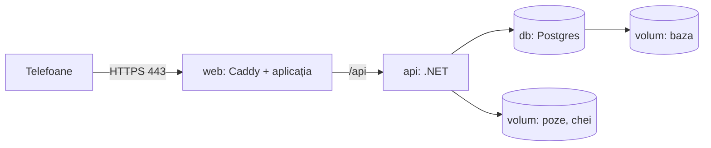

# 9. Deploy pe VPS

**Deploy-ul** e mutarea aplicației pe un server care e pornit tot timpul și are o adresă publică, ca s-o deschideți de pe telefoane de oriunde. Pe server rulează trei containere Docker, pornite împreună de Docker Compose:



- **web**: Caddy, cu fișierele aplicației înăuntru. E singurul container deschis spre internet, pe porturile 80 și 443.
- **api**: API-ul .NET. Nu are port deschis în afară; primește cereri doar de la Caddy.
- **db**: Postgres. Nici el nu are port deschis în afară.

Datele stau pe **volume** Docker: foldere de pe disc care rămân și când containerele se refac la un deploy.

Fișierele sunt în `deploy/`:
- `compose.prod.yaml`: cele trei containere;
- `Caddyfile`: HTTPS, fișierele aplicației, trimiterea spre API;
- `web.Dockerfile`: construiește aplicația și o pune în imaginea Caddy;
- `../api/Dockerfile`: construiește API-ul;
- `backup.sh`: copia de rezervă a bazei.

Tot stack-ul a fost pornit și testat local, cu `DOMAIN=localhost`, înainte de ghidul ăsta: HTTPS, rutele aplicației, login-ul cu cookie `secure`, crearea contului, alimentele de start.

## 1. Domeniul

Cumperi un domeniu, de exemplu `macromate.ro` sau un subdomeniu al unui domeniu pe care îl ai deja, de la orice registrar: ROTLD prin un partener, Namecheap, Cloudflare. Cam 10 €/an.

## 2. Serverul

În Hetzner Cloud (console.hetzner.cloud):
1. **Create Server**.
2. **Location**: Germania sau Finlanda.
3. **Image**: Ubuntu, ultima versiune LTS.
4. **Type**: cel mai ieftin din „Shared vCPU”, cu 2 vCPU și 4 GB RAM. Ajunge cu mult.
5. **SSH key**: adaugi cheia publică de pe laptop (`cat ~/.ssh/id_ed25519.pub`). Fără cheie, faci una cu `ssh-keygen -t ed25519`.
6. **Backups**: le bifezi. Costă cam 20% din prețul serverului și fac o copie a întregului server în fiecare zi, cu tot cu pozele.
7. **Firewall**: faci unul nou, cu reguli de intrare pentru TCP 22, TCP 80, TCP 443 și UDP 443.

Firewall-ul îl pui din consola Hetzner, nu cu `ufw` pe server. Docker ocolește regulile `ufw` pentru porturile pe care le deschide.

Când e gata, notezi adresa IP a serverului.

## 3. DNS

La registrar, în setările DNS ale domeniului, adaugi o înregistrare:

| Tip | Nume | Valoare |
|---|---|---|
| A | `@` (sau subdomeniul, ex. `macromate`) | IP-ul serverului |

Verifici de pe laptop:

```bash
dig +short macromate.ro
```

Caută: IP-ul serverului. Dacă nu apare, mai aștepți: o schimbare DNS poate dura de la câteva minute la câteva ore.

## 4. Docker pe server

Intri pe server:

```bash
ssh root@IP_SERVER
```

Instalezi Docker cu scriptul oficial:

```bash
curl -fsSL https://get.docker.com | sh
```

Caută la final: `docker version` arată și `Client`, și `Server`.

## 5. Codul pe server

De pe laptop, din folderul `TechProducts/`, copiezi proiectul fără fișierele generate:

```bash
rsync -av --delete --exclude node_modules --exclude bin --exclude obj --exclude dist --exclude .DS_Store --exclude api/MacroMate.Api/storage --exclude deploy/.env --exclude deploy/backups MacroMate/ root@IP_SERVER:/opt/macromate/
```

Dacă ții codul pe GitHub, poți face `git clone` pe server în loc de `rsync`.

## 6. Setările

Pe server:

```bash
cd /opt/macromate/deploy && cp .env.example .env && nano .env
```

Completezi trei rânduri:

```
DOMAIN=macromate.ro
POSTGRES_PASSWORD=...
DEEPSEEK_API_KEY=...
```

Pentru parola bazei, generezi una lungă:

```bash
openssl rand -base64 32
```

Fișierul `.env` rămâne doar pe server. E în `.gitignore`, iar `rsync` de mai sus nu-l suprascrie.

## 7. Pornirea

```bash
cd /opt/macromate/deploy && docker compose -f compose.prod.yaml up -d --build
```

Prima dată durează câteva minute, pentru că se construiesc imaginile. Apoi urmărești Caddy:

```bash
docker compose -f compose.prod.yaml logs -f web
```

Caută: `certificate obtained successfully`. Caddy a luat certificatul HTTPS de la Let's Encrypt. Ieși cu `Ctrl+C`.

Deschizi `https://macromate.ro` și vezi ecranul de login.

## 8. Conturile și alimentele de start

Creezi contul tău. Comanda îți cere parola ascuns, cu minim 10 caractere:

```bash
docker compose -f compose.prod.yaml exec api dotnet MacroMate.Api.dll create-user --email adresa-ta@exemplu.ro --name Florin
```

Caută: `Contul ... a fost creat.`

Repeți comanda cu email-ul și numele ei. Apoi pui cele 75 de alimente de start, cu tine ca autor:

```bash
docker compose -f compose.prod.yaml exec api dotnet MacroMate.Api.dll seed-foods --as adresa-ta@exemplu.ro
```

Caută: `Am adăugat 75 alimente.`

## 9. Copia de rezervă a bazei

Pe lângă backup-ul Hetzner, `backup.sh` face în fiecare noapte un `pg_dump`, adică un fișier SQL cu toată baza, și păstrează ultimele 14. Îl încerci o dată de mână:

```bash
/opt/macromate/deploy/backup.sh && ls -lh /opt/macromate/deploy/backups
```

Caută: un fișier `macromate-AAAA-LL-ZZ.sql.gz`.

Îl programezi zilnic la 3 noaptea:

```bash
(crontab -l 2>/dev/null; echo "0 3 * * * /opt/macromate/deploy/backup.sh") | crontab -
```

Dacă vreodată ai nevoie să refaci baza dintr-o copie, din `/opt/macromate/deploy`:
1. Oprești API-ul:
   ```bash
   docker compose -f compose.prod.yaml stop api
   ```
2. Ștergi baza și o creezi goală:
   ```bash
   docker compose -f compose.prod.yaml exec db dropdb -U macromate macromate && docker compose -f compose.prod.yaml exec db createdb -U macromate macromate
   ```
3. Încarci copia (pui data fișierului):
   ```bash
   gunzip -c backups/macromate-AAAA-LL-ZZ.sql.gz | docker compose -f compose.prod.yaml exec -T db psql -U macromate macromate
   ```
4. Pornești API-ul:
   ```bash
   docker compose -f compose.prod.yaml start api
   ```

## 10. Pe telefoane

Deschizi `https://macromate.ro` și te loghezi, apoi pui aplicația pe ecran:
- **iPhone**: Safari → Share → „Add to Home Screen”;
- **Android**: meniul Chrome → „Instalează aplicația”.

## Actualizările

Când schimbi codul, de pe laptop trimiți din nou fișierele, cu aceeași comandă `rsync` de la pasul 5. Apoi, pe server, reconstruiești și repornești:

```bash
cd /opt/macromate/deploy && docker compose -f compose.prod.yaml up -d --build
```

Migrările bazei rulează singure la pornirea API-ului. Pe telefoane apare „Există o versiune nouă” → **Actualizează**.

Dacă ai schimbat doar cheia DeepSeek în `.env`, repornești doar API-ul:

```bash
docker compose -f compose.prod.yaml up -d api
```

## Când ceva nu merge

| Simptom | Te uiți la | Caută |
|---|---|---|
| site-ul nu se deschide | `docker compose -f compose.prod.yaml ps` | toate trei au `Up` |
| eroare de certificat | `docker compose -f compose.prod.yaml logs web` | erori despre DNS: domeniul nu arată încă spre server |
| login-ul sau sincronizarea dau eroare | `docker compose -f compose.prod.yaml logs api --tail 100` | rânduri cu `fail:` |
| AI-ul spune „cheia nu e setată” | `deploy/.env` | `DEEPSEEK_API_KEY` completat, apoi `up -d api` |

## Costuri

| Ce | Cât |
|---|---|
| server | 4–6 € pe lună |
| backup Hetzner | ~1 € pe lună |
| domeniu | ~10 € pe an |
| DeepSeek | din tokenii pe care îi ai |
