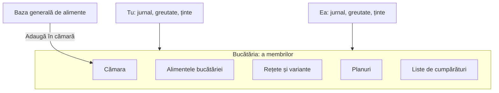
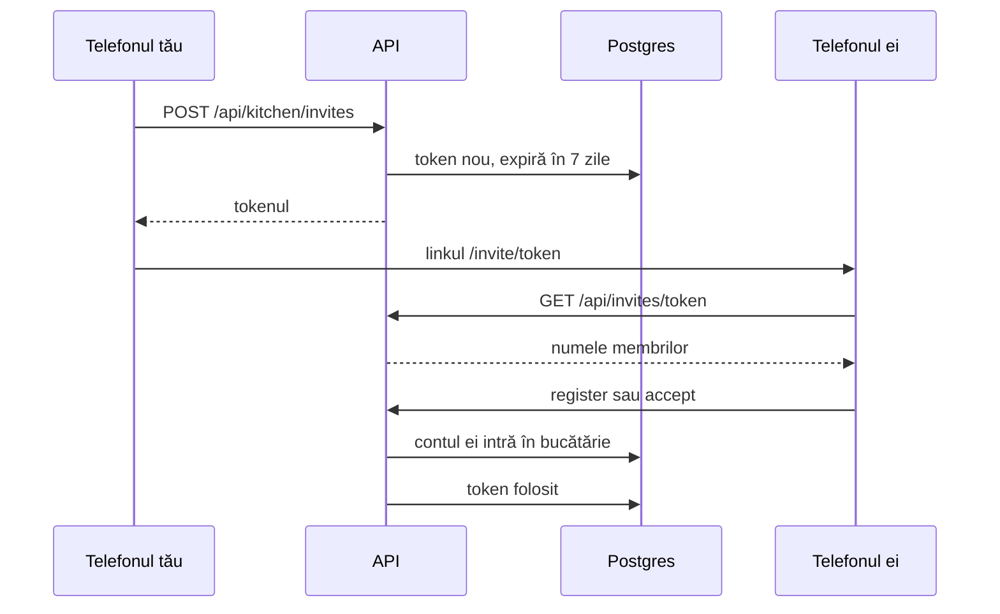

# 10. Bucătăria comună

**Bucătăria** e grupul de conturi care împart aceleași lucruri: alimentele adăugate de ei, cămara, rețetele, planurile și listele de cumpărături. Fiecare cont e într-o singură bucătărie la un moment dat. Un cont nou are bucătăria lui, goală.

Datele aplicației stau acum pe trei niveluri:



| Nivel | Ce e în el | Cine îl vede |
|---|---|---|
| baza generală | alimentele de start, cele adăugate de admini și cele puse în bază din pagina Administrare | toate conturile; le modifică doar adminii |
| bucătăria | alimentele adăugate de membri, cămara, rețetele, variantele, planurile, listele | membrii bucătăriei |
| personal | jurnalul, planul zilei, greutatea, profilul (ținte, excluderi, „îmi place”) | doar contul tău |

Specificația, scrisă înainte de cod, e în `docs/bucataria.md`.

## Tabelele

Pe server, în `api/MacroMate.Api/Data/Kitchen.cs` și `AppUser.cs`:

| Tabel sau coloană | Ce ține |
|---|---|
| `kitchens` | `id`, `owner_id` (proprietarul), `created_at` |
| `users.kitchen_id` | bucătăria în care e contul acum |
| `users.archive_kitchen_id` | arhiva contului, dacă are una (explicată mai jos) |
| `kitchen_invites` | `token`, bucătăria, cine a invitat, `expires_at` (după 7 zile), `used_at` |
| `pantry_items` | cămara: un rând pentru fiecare aliment din cămara unei bucătării |
| `kitchen_id` pe `recipes`, `recipe_variants`, `meal_plans`, `shopping_lists` | a cărei bucătării e rândul |
| `foods.kitchen_id` | gol: alimentul e în baza generală; altfel, bucătăria alimentului |

În C#, tabelele de bucătărie moștenesc o clasă comună:

```csharp
public abstract class KitchenEntity : SharedEntity
{
    public Guid KitchenId { get; set; }
}

public class Recipe : KitchenEntity { ... }
public class PantryItem : KitchenEntity
{
    public Guid FoodId { get; set; }
}
```

## Serverul filtrează după bucătărie

La sincronizare, telefonul cere `GET /api/sync?since=…`. În `SyncEndpoints.cs`, API-ul află întâi bucătăria ta, apoi o folosește la fiecare tabel de bucătărie:

```csharp
var kitchenId = await db.Users.Where(u => u.Id == userId).Select(u => u.KitchenId).SingleAsync(ct);
var foods = await db.Foods.AsNoTracking().Where(x => (x.KitchenId == null || x.KitchenId == kitchenId) && x.Version > since).ToListAsync(ct);
var recipes = await db.Recipes.AsNoTracking().Where(x => x.KitchenId == kitchenId && x.Version > since).ToListAsync(ct);
var pantry = await db.PantryItems.AsNoTracking().Where(x => x.KitchenId == kitchenId && x.Version > since).ToListAsync(ct);
```

Alimentele vin din baza generală și din bucătăria ta. Rețetele și cămara vin doar din bucătăria ta. Lista de conturi din răspuns, din care aplicația scrie „adăugat de …”, are doar membrii bucătăriei tale.

La scriere, `SyncTables.cs` are câte o regulă pe fel de tabel:

| Tabelul | Poți modifica un rând dacă… |
|---|---|
| alimente (`FoodTable`) | e în bucătăria ta; dacă e în baza generală, doar dacă ești admin |
| rețete, variante, planuri, liste, cămară (`KitchenTable`) | rândul e în bucătăria ta |
| jurnal, planul zilei, greutate, profil (`PersonalTable`) | rândul e al tău |

Altfel, rândul e respins cu `not-owner`. Un rând nou de bucătărie primește automat bucătăria ta: ce trimite telefonul în `kitchenId` se ignoră. La alimente, la fel, cu o excepție: un admin poate lăsa `kitchenId` gol, ca alimentul să intre în baza generală. Rolul de admin și regula completă sunt în [capitolul 15](15-conturi-si-roluri.md).

## Cămara

**Cămara** e lista de alimente pe care bucătăria le are de obicei acasă. A înlocuit favoritele.

- Pe un aliment: **„Adaugă în cămară”** / **„Scoate din cămară”** (iconița de frigider).
- Un aliment nou, scanat sau scris de tine, intră în bucătăria ta și direct în cămară (`addToPantry` din `routes/_app/foods/new.tsx`).
- La „Adaugă” sunt patru taburi: Recente, Cămara, Toate, Rețete.
- Pagina Alimente arată implicit cămara, dacă nu e goală; „Toată baza” e la un click.
- Alternativele unui ingredient vin întâi din cămară, apoi după apropierea valorilor.
- DeepSeek primește lista de alimente cu un semn „pantry” la cele din cămară și le folosește întâi.
- La trecerea pe modelul nou (migrarea `AddKitchens`), favoritele fiecăruia au intrat în cămara bucătăriei lui.

### Id-ul unui rând din cămară

Un rând din cămară are id-ul calculat din bucătărie și aliment. Telefonul și serverul îl calculează la fel.

```ts
export async function pantryItemId(kitchenId: string, foodId: string) {
  const hash = new Uint8Array(await crypto.subtle.digest('SHA-256', new TextEncoder().encode(`${kitchenId}:${foodId}`)))
  const hex = Array.from(hash.slice(0, 16), (b) => b.toString(16).padStart(2, '0')).join('')
  return `${hex.slice(0, 8)}-${hex.slice(8, 12)}-${hex.slice(12, 16)}-${hex.slice(16, 20)}-${hex.slice(20)}`
}
```

Același lucru în C#, în `Data/Kitchen.cs`:

```csharp
public static Guid IdFor(Guid kitchenId, Guid foodId)
{
    var hash = SHA256.HashData(Encoding.UTF8.GetBytes($"{kitchenId}:{foodId}"));
    return new Guid(Convert.ToHexString(hash, 0, 16));
}
```

**SHA-256** e o funcție care face din orice text un număr lung, mereu același pentru același text. Din el se iau primii 16 octeți, cât are un id `uuid`.

De ce: tu și ea adăugați offline „Ou întreg” în cămară, fiecare pe telefonul lui. Amândouă telefoanele calculează același id, deci în Postgres ajunge un singur rând. Cu id-uri aleatoare, ar ieși două rânduri pentru același aliment.

Serverul primește un rând nou în cămară doar dacă id-ul lui e exact cel calculat (`PantryTable.CanCreate`). Un aliment scos din cămară și pus la loc readuce același rând: rândul șters primește iar `deleted_at = null`.

## Invitația



1. În Profil → **Bucătăria** apeși **„Invită în bucătărie”**. API-ul face un **token**: 24 de octeți aleatori, scriși ca text sigur pentru adrese (`WebEncoders.Base64UrlEncode`).
2. Aplicația face linkul `https://…/invite/<token>`. **Trimite** deschide meniul de partajare al telefonului sau copiază linkul.
3. Ea deschide linkul. Pagina `web/src/routes/invite.$token.tsx` cere `GET /api/invites/<token>` și arată „Te invită: Florin.”.
4. Mai departe sunt două drumuri:
   - **nu are cont**: completează numele, emailul și parola → `POST /api/invites/<token>/register`. Contul se creează direct în bucătăria ta, fără bucătărie proprie;
   - **e logată**: alege „Aduci și ce ai tu?” → `POST /api/invites/<token>/accept`, cu `{ "bringMine": true }` sau `false`.
5. Tokenul primește `used_at`. Al doilea click pe același link primește 410, „Invitația nu mai e valabilă. Cere un link nou.”.

Dacă are cont, dar nu e logată, pagina are un link spre login. Login-ul primește `?invite=<token>` și o trimite înapoi la invitație.

## „Aduci și ce ai tu?”

`JoinAsync` din `Features/Kitchens/KitchenService.cs` face totul într-o singură scriere de sincronizare (`SyncWriter.WriteAsync`): cu lacăt și cu un singur `version` nou, ca toate rândurile mutate să ajungă la telefoane împreună.

| Alegerea | Ce se întâmplă cu ce avea ea |
|---|---|
| **Da, aduc tot** | alimentele, rețetele, variantele, planurile și listele ei primesc `kitchen_id` = bucătăria ta. Cămara ei se adaugă la a ta; un aliment din ambele cămări rămâne o dată |
| **Nu** | bucătăria ei veche devine **arhiva** ei (`archive_kitchen_id`), neatinsă, cu alimentele ei cu tot. Dacă avea deja o arhivă, lucrurile se adaugă în ea |

Înainte de mutare, API-ul verifică două lucruri:
- dacă e deja în bucătăria ta → 409, „Ești deja în bucătăria asta.”;
- dacă bucătăria ei are și alți membri → 409: întâi iese de acolo, apoi intră în a ta. Așa nu mută lucrurile altcuiva.

## Telefonul după schimbarea bucătăriei

Telefonul ei avea în Dexie rețetele bucătăriei vechi. Trebuie să le șteargă și să le ia pe ale voastre.

```ts
const knownKitchen = await getMeta('kitchenId')
if (knownKitchen && knownKitchen !== response.kitchenId && since > 0) {
  await resetKitchenData(response.kitchenId)
  await applyPull(await api.pull(0))
  return
}
```

1. Răspunsul de la `GET /api/sync` conține `kitchenId`.
2. `pull` din `web/src/db/sync.ts` îl compară cu cel ținut în Dexie.
3. Dacă diferă, `resetKitchenData` golește din telefon tabelele de bucătărie și alimentele, apoi pune cursorul la 0. Alimentele se golesc și ele, pentru că unele erau ale bucătăriei vechi.
4. Telefonul cere tot de la zero, `since=0`, și primește bucătăria nouă și baza generală.

Jurnalul, greutatea și profilul nu se ating: sunt personale.

`joinKitchen` din `web/src/db/kitchen.ts` trimite întâi coada, apoi cere intrarea, apoi sincronizează iar. Așa nimic din coadă nu rămâne în urmă.

## Plecarea

Din Profil, **„Ieși din bucătărie”** apare doar când sunteți cel puțin doi. `LeaveAsync`:
1. îți face o bucătărie nouă, cu tine ca proprietar;
2. copiază în ea tot ce e acum în bucătăria comună: alimentele bucătăriei, rețete, variante, planuri, liste, cămară. Copiile primesc **id-uri noi**, ca să nu se amestece cu originalele;
3. în copii, legăturile arată spre copii: o rețetă și o variantă arată spre alimentele copiate, un plan spre variantele și alimentele copiate, o listă spre planurile copiate, cămara spre alimentele copiate;
4. în jurnalul tău și în planurile tale de zi, alimentele, variantele și planurile se schimbă pe copii. La fel listele tale „îmi place” și „exclud” din profil. Așa „ce am mâncat ieri” arată în continuare alimentul și rețeta, din bucătăria ta nouă;
5. contul tău trece în bucătăria nouă.

Alimentele din baza generală nu se copiază: le vede oricum toată lumea.

Bucătăria comună rămâne la ceilalți, neschimbată. De acum, nimic nu se mai sincronizează între cele două.

Dacă ai o arhivă, după plecare apare **„Aduci înapoi și ce aveai înainte?”**. Cine a făcut invitația nu are arhivă, deci primește doar copia.

## Proprietarul

**Proprietarul** e contul care a creat bucătăria (`kitchens.owner_id`). Profilul arată „proprietar” lângă numele lui.

- Doar proprietarul vede **„Scoate”** lângă ceilalți membri. Un membru scos pățește la fel ca la o plecare: primește o bucătărie a lui, cu o copie.
- Dacă altcineva cere `POST /api/kitchen/members/{id}/remove`, API-ul răspunde 403, „Doar proprietarul bucătăriei poate scoate membri.”.
- Nimeni nu se poate scoate pe sine (400); pentru asta e „Ieși”.
- Dacă proprietarul pleacă sau își șterge contul, rolul trece la unul dintre membrii rămași.

```csharp
if (!await db.Kitchens.AnyAsync(k => k.Id == kitchenId && k.OwnerId == userId, ct))
    return new KitchenError(messages["OnlyOwnerCanRemove"], StatusCodes.Status403Forbidden);
return await LeaveAsync(db, memberId, messages, ct);
```

## Arhiva

**Arhiva** e o bucătărie fără membri, care ține ce aveai înainte să spui „Nu”. Profilul arată ce e în ea, de exemplu „3 alimente, 2 rețete, 5 alimente în cămară”, și butonul **„Adu tot înapoi”**.

`RestoreArchiveAsync` mută tot din arhivă în bucătăria în care ești acum, odată, și golește `archive_kitchen_id`. Alimentele care sunt deja în cămară nu se dublează.

## Unde e codul

| Ce | Fișier |
|---|---|
| tabelele | `api/MacroMate.Api/Data/Kitchen.cs`, `AppUser.cs` |
| intrarea, plecarea, scoaterea, arhiva | `api/MacroMate.Api/Features/Kitchens/KitchenService.cs` |
| endpoint-urile `/api/kitchen/*` și `/api/invites/*` | `api/MacroMate.Api/Features/Kitchens/KitchenEndpoints.cs` |
| regulile de scriere pe bucătărie | `api/MacroMate.Api/Features/Sync/SyncTables.cs` |
| migrarea: o bucătărie pentru fiecare cont, favoritele în cămară | `Data/Migrations/…_AddKitchens.cs`, `…_AddKitchenOwner.cs` |
| secțiunea din Profil | `web/src/components/app/kitchen-section.tsx` |
| pagina de invitație | `web/src/routes/invite.$token.tsx` |
| intrarea și plecarea din telefon | `web/src/db/kitchen.ts`, resetarea în `web/src/db/sync.ts` |
| cămara în telefon | `web/src/lib/pantry.ts` |
| testele | `api/MacroMate.Api.Tests/KitchenTests.cs` |

Testele au nume care spun regula, de exemplu `Joining_with_no_archives_your_things_and_leaving_offers_them_back`, `Only_the_owner_can_remove_a_member` și `The_pantry_id_matches_the_one_the_phone_computes`. Copierea alimentelor la plecare o verifică `Leaving_a_kitchen_copies_its_foods_and_points_the_copied_recipes_at_them`, din `AccountsAndRolesTests.cs`.
