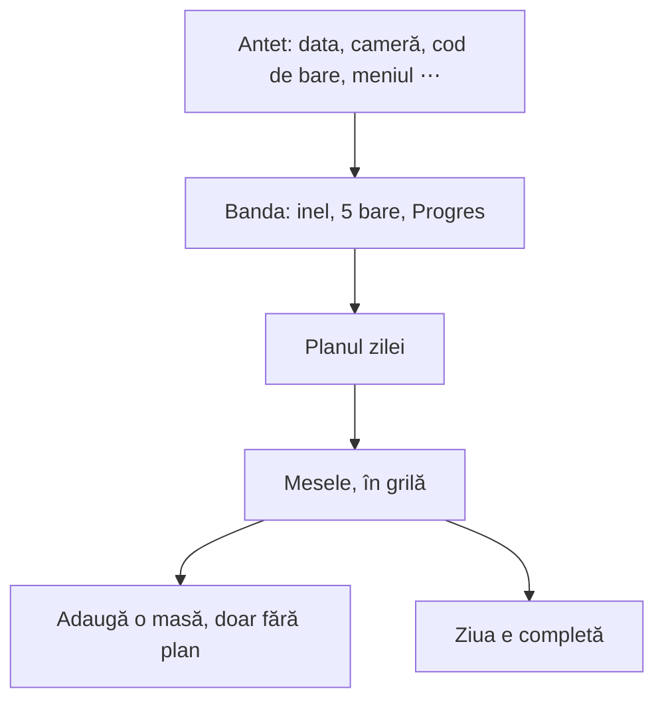

# 11. Ecranul Azi

**Azi** e ecranul principal: jurnalul zilei, adică ce ai mâncat, grupat pe mese, lângă ținta ta. Codul e în `web/src/routes/_app/index.tsx`.

Ca orice ecran, Azi citește doar din Dexie, din telefon. Fiecare intrare din jurnal e un rând în tabelul `journalEntries`, cu valorile copiate în momentul notării.

## Ce e pe ecran



| Bucata | Ce arată | Unde e codul |
|---|---|---|
| antetul | data, cu săgeți pentru ziua dinainte și de după; bifa „zi completă” lângă dată; camera (poză la mâncare), codul de bare, meniul ⋯ | `PageHeader` în `index.tsx` |
| banda de sus | inelul cu calorii, cinci bare (proteine, carbohidrați, grăsimi, fibre, sodiu) și, în dreapta, Progresul pe 7 zile | `DaySummaryBar` din `components/app/nutrients.tsx` |
| planul zilei | planul ales pentru azi, sau „Fără plan” | `planPicker` în `index.tsx` |
| mesele | câte un card pe masă, cu macro-urile mesei în antet | `groups` în `index.tsx` |
| ziua completă | butonul și, după apăsare, estimarea pe 4 săptămâni | `DayCompletion` în `index.tsx` |

## Pe desktop

De la 1024 px lățime în sus, aplicația schimbă așezarea:
- bara de jos devine un **meniu în stânga** (`components/app/side-nav.tsx`). Jos în meniu e numele tău, cu un cerc cu inițiala, în locul lui „Profil”. Lângă el e iconița de sincronizare;
- Azi ocupă toată lățimea;
- banda de sus e pe un rând. Progresul din dreapta apare de la 1280 px. Cele cinci bare stau pe trei coloane, iar de la 110rem (1760 px) pe cinci;
- mesele stau în grilă: două coloane, iar de la 110rem patru.

Pe telefon, în locul benzii e cercul cu calorii și cardul Progres, unul sub altul.

## Mesele: cu plan și fără plan

**Cu plan**, mesele sunt cele din plan, în ordinea lui. Ce e în plan și n-ai notat încă apare mai palid, cu un cerc punctat. O atingere pe cerc notează elementul. Butonul **„Tot”** din antetul mesei notează toată masa.

**Fără plan**, ziua pornește goală. Cardul **„Adaugă o masă”** apare doar fără plan:
1. îl apeși și scrii un nume, sau alegi o sugestie (Mic dejun, Prânz, Cină, Gustare, fără cele pe care le ai deja);
2. se deschide căutarea de alimente pentru masa aceea;
3. masa există din momentul în care notezi primul aliment în ea. Nu e un rând separat în bază: e eticheta `mealLabel` de pe intrările din jurnal.

Mesele fără plan se ordonează așa: întâi cele cunoscute, în ordinea zilei (Mic dejun, Prânz, Cină, Gustare), apoi cele cu nume ales de tine, în ordinea în care le-ai notat. Ordinea vine din `mealRank` din `lib/meals.ts`.

Fiecare card de masă are în antet totalul mesei: calorii și macro, adunate din intrările ei (`MacroLine`).

## Copierea dintr-o zi

Lângă „Fără plan”, când ziua e goală, apar două butoane:
- **„Copiază ziua de ieri”**: toată ziua de ieri;
- **„Copiază dintr-o zi…”**: alegi data.

Aceleași două sunt și în meniul ⋯ din antet, pentru toată ziua, și în meniul ⋯ al fiecărei mese, doar pentru masa aceea.

Ce face `copyFrom`, pas cu pas:
1. citește din Dexie intrările din ziua aleasă, nesterse, eventual doar cele dintr-o masă;
2. pentru fiecare, scrie o intrare nouă cu `saveRow`: id nou, data de azi, aceleași valori;
3. legătura cu un element de plan (`mealItemId`) rămâne doar dacă elementul e în planul de azi;
4. arată „Am copiat 3 elemente de ieri.”.

Copiile pleacă la server ca orice altă modificare, prin coadă.

## Butoanele de scanare din antet

| Butonul | Ce face |
|---|---|
| camera | deschide **scanarea farfuriei**: faci o poză la mâncare, DeepSeek recunoaște alimentele și gramele, tu verifici și adaugi (`components/app/meal-scan.tsx`) |
| codul de bare | deschide căutarea cu camera pornită, pentru **masa de acum** |

Masa de acum se alege după oră (`currentMeal`): înainte de 11 e prima masă, până la 16 a doua, până la 21 a treia, apoi a patra.

La scanarea farfuriei, alimentele recunoscute în bază intră cu `foodId`. Cele care nu sunt în bază intră **fără `foodId`**, cu valorile estimate salvate în intrare, și apar în jurnal cu eticheta „estimat”. Baza de alimente nu se umple cu ghiceli.

## Ziua e completă

Sub mese e butonul **„Ziua e completă”**. Îl apeși după ce ai notat tot ce ai mâncat.

1. Aplicația scrie în planul tău de zi (`dayPlans`) ora de acum, în `completedAt`. Pe server, coloana e `day_plans.completed_at`, adăugată de migrarea `AddDayCompleted`.
2. Lângă dată apare o bifă.
3. Cardul arată: „Dacă fiecare zi ar fi ca asta, în 4 săptămâni ai avea **83,0 kg** (−2,0 kg).”
4. **„Redeschide ziua”** șterge `completedAt`.

Estimarea vine din `projectedWeight` din `lib/targets.ts`:

```ts
export function projectedWeight(weightKg: number, dayKcal: number, maintenance: number, days = 28) {
  return weightKg + ((dayKcal - maintenance) * days) / kcalPerKg
}
```

Cu un exemplu: bărbat, 30 de ani, 180 cm, 85 kg, ușor activ, iar azi a mâncat 1970 kcal.

| Ce | Calcul | Rezultat |
|---|---|---|
| greutatea | media pe 7 zile a cântăririlor, sau greutatea din profil | 85 kg |
| menținerea | metabolism bazal × activitate: (10 × 85 + 6,25 × 180 − 5 × 30 + 5) × 1,375 | 2516 kcal |
| diferența pe zi | 1970 − 2516 | −546 kcal |
| în 28 de zile | −546 × 28 / 7700 (kcal într-un kg de grăsime) | −2,0 kg |
| estimarea | 85 − 2,0 | **83,0 kg** |

Dacă profilul n-are sex, an naștere, înălțime și activitate, cardul te trimite să le completezi.

`completedAt` e personal, ca tot planul de zi. Testul `A_completed_day_keeps_its_time_and_stays_personal` verifică asta.

## Unde e codul

| Ce | Fișier |
|---|---|
| ecranul | `web/src/routes/_app/index.tsx` |
| banda de sus, inelul, barele | `web/src/components/app/nutrients.tsx` |
| meniul din stânga | `web/src/components/app/side-nav.tsx` |
| scanarea farfuriei | `web/src/components/app/meal-scan.tsx` |
| scrierea intrărilor (aliment, rețetă, estimat) | `web/src/lib/journal.ts` |
| numele și ordinea meselor | `web/src/lib/meals.ts` |
| menținerea și estimarea | `maintenanceKcal`, `projectedWeight` din `web/src/lib/targets.ts` |
