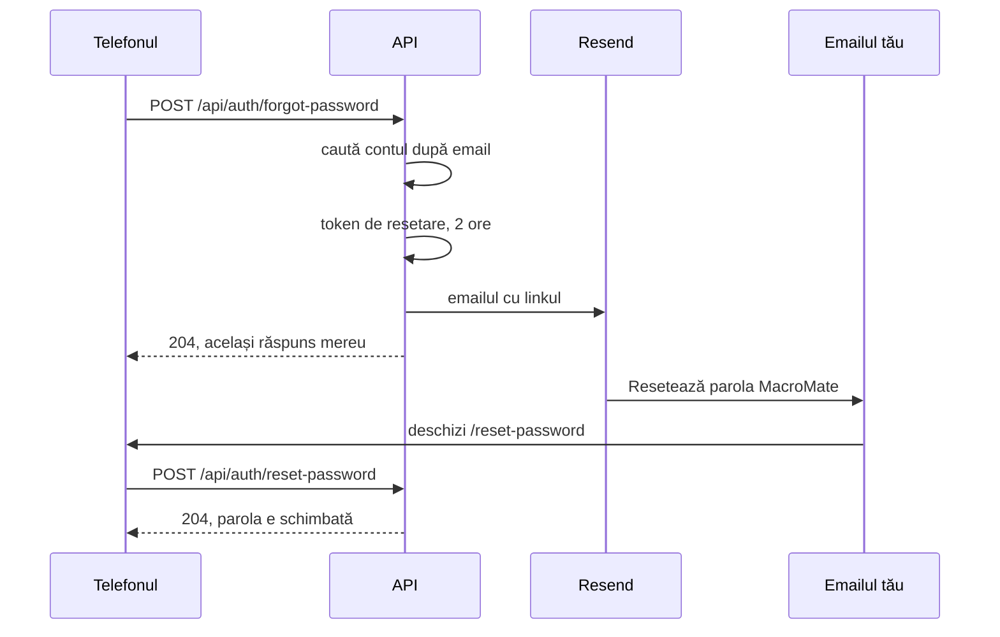

# 12. Contul și emailurile

În Profil, secțiunea **„Contul tău”** face patru lucruri:
- schimbă **numele**: direct;
- schimbă **emailul**: cu parola actuală și un link de confirmare trimis pe adresa nouă;
- schimbă **parola**: cu parola actuală;
- **șterge contul**: cu parola actuală.

Pe pagina de login sunt:
- **„Ai uitat parola?”**: trimite pe email un link cu care îți faci o parolă nouă;
- **„Nu ai cont? Creează unul”**: contul nou, activat dintr-un link trimis pe email;
- **„Încearcă fără cont”**: un cont de probă, care se șterge singur după 24 de ore.

Codul e în `api/MacroMate.Api/Features/Auth/AccountEndpoints.cs`, `SignupEndpoints.cs` și `web/src/components/app/account-section.tsx`. Toate cer internet: merg direct la API, nu prin coadă.

Contul nou, contul de probă și ștergerea contului sunt explicate pe larg în [capitolul 15, Conturi, roluri și contul de probă](15-conturi-si-roluri.md). Aici sunt pe scurt, la partea lor de email.

## Tokenurile din linkuri

ASP.NET Core Identity, pachetul de user management din .NET, are și generatoare de **tokenuri**: texte semnate de server, care dovedesc că linkul vine de la el și e pentru contul acela. `AddDefaultTokenProviders()` din `Program.cs` le pornește:

```csharp
builder.Services.AddIdentityCore<AppUser>(...)
    .AddDefaultTokenProviders();
builder.Services.Configure<DataProtectionTokenProviderOptions>(o => o.TokenLifespan = TimeSpan.FromHours(2));
```

- Un token e valabil **2 ore**.
- E semnat cu cheile Data Protection din `/data/keys`. Dacă cheile se pierd, linkurile trimise deja nu mai merg.
- Tokenul de resetare se invalidează după folosire: Identity îl leagă de „ștampila de securitate” a contului, care se schimbă la schimbarea parolei.
- Sunt trei feluri de tokenuri: de resetare a parolei, de schimbare a emailului și de confirmare a contului nou. Fiecare merge doar pentru treaba lui.
- Tokenul conține caractere care nu merg într-o adresă, așa că API-ul îl codează cu `WebEncoders.Base64UrlEncode` înainte să-l pună în link.

## „Am uitat parola”



1. Pe `/forgot-password` scrii emailul. Telefonul trimite `POST /api/auth/forgot-password`.
2. API-ul caută contul.
   - Dacă nu există, răspunde 204 și nu trimite nimic.
   - Dacă există, face tokenul, face linkul și trimite emailul. Răspunde tot 204.
3. Aplicația arată la fel în ambele cazuri: „Dacă există un cont cu adresa-ta@exemplu.com, ți-am trimis un link. Verifică și folderul de spam.”
4. Deschizi linkul din email. Pagina `/reset-password` îți cere parola nouă de două ori.
5. Telefonul trimite `POST /api/auth/reset-password` cu emailul, tokenul și parola. API-ul cheamă `ResetPasswordAsync`, apoi scoate blocarea contului, dacă era blocat după încercări greșite.
6. Te loghezi cu parola nouă.

**De ce același răspuns pentru un email necunoscut.** Dacă API-ul ar răspunde „nu există cont”, oricine ar putea afla ce adrese au cont, încercând adrese una câte una. Asta se numește **enumerarea conturilor**. Testul `An_unknown_email_gets_the_same_answer_and_no_mail` verifică asta.

## Schimbarea emailului

1. În „Contul tău” → Email → **Schimbă**, scrii adresa nouă și parola actuală.
2. `POST /api/auth/me/email`. API-ul verifică:
   - parola actuală. După 5 greșeli, contul se blochează 5 minute, ca la login;
   - că adresa nouă arată ca un email, e alta decât cea de acum și nu e a altui cont.
3. API-ul trimite pe **adresa nouă** un link spre `/confirm-email?userId=…&email=…&token=…`. Răspunde 202: cererea e primită, dar schimbarea nu e făcută încă.
4. Aplicația arată „Ți-am trimis un link pe … Adresa se schimbă după ce îl deschizi.”
5. Deschizi linkul. Pagina `/confirm-email` trimite `POST /api/auth/confirm-email`. API-ul cheamă `ChangeEmailAsync` și schimbă și numele de utilizator, care la MacroMate e tot emailul.

Linkul merge pe adresa nouă ca să dovedești că o ai. Până nu-l deschizi, contul rămâne pe adresa veche. Testul `A_new_email_takes_effect_only_after_the_link_is_opened` verifică asta.

## Contul nou și emailul de confirmare

1. Pe `/register` scrii numele, emailul și parola. Telefonul trimite `POST /api/auth/register`.
2. API-ul face contul cu `EmailConfirmed = false`, cu bucătăria lui, și răspunde 202.
3. Trimite pe adresa ta „Confirmă-ți contul MacroMate”, cu un link spre `/confirm-account?userId=…&token=…`, valabil 2 ore.
4. Deschizi linkul. Pagina trimite `POST /api/auth/confirm-account`. API-ul confirmă contul și te loghează.

Până deschizi linkul, login-ul cu parola bună răspunde 403: „Contul nu e confirmat încă. Deschide linkul din emailul de confirmare.” Cu parola greșită răspunde 401, ca la orice cont.

Dacă emailul nu a ajuns, **„Retrimite emailul”** cere `POST /api/auth/resend-confirmation`. Răspunsul e mereu 204, ca la „Am uitat parola”: nu spune dacă adresa are cont.

Conturile făcute din invitație, cu `create-user` sau ca cont de probă sunt confirmate direct. Migrarea `AddAccountsAndRoles` a confirmat toate conturile vechi.

## Schimbarea parolei

`POST /api/auth/me/password` cu parola actuală și cea nouă. `ChangePasswordAsync` verifică parola actuală. Dacă e greșită, răspunde 400, „Parola actuală nu e corectă.”. Parola nouă are minim 10 caractere.

După schimbare, `RefreshSignInAsync` îți dă un cookie nou, deci rămâi logat pe telefonul pe care ai schimbat-o.

## Ștergerea contului

Profil → Contul tău → **„Șterge contul”**, cu parola actuală → `POST /api/auth/me/delete`. API-ul șterge de tot jurnalul, planurile de zi, greutățile, profilul, rapoartele, numărătoarea cererilor AI și invitațiile tale. Dacă erai singur în bucătărie, o șterge și pe ea, cu alimentele, rețetele, planurile, listele și cămara ei. Dacă mai sunt membri, bucătăria rămâne la ei. La sfârșit șterge contul.

Parola greșită: 400, „Parola actuală nu e corectă.”. Dacă ești singurul admin: 409, „Ești singurul admin. Dă întâi rolul de admin altcuiva.”.

## Contul de probă

Contul de probă nu are email adevărat (`demo-…@demo.invalid`) și nici o parolă pe care s-o știi. De aceea:
- „Contul tău” nu arată Emailul și Parola, ci „Ești într-un cont de probă: emailul și parola nu se pot schimba.”;
- `POST /api/auth/me/email` și `POST /api/auth/me/password` răspund 403, „Contul de probă nu poate schimba emailul sau parola. Fă-ți un cont al tău.”;
- „Șterge contul” nu cere parola.

## Cine trimite emailul

API-ul nu știe direct de Resend. Cere o interfață, `IEmailSender`, adică lista de metode pe care trebuie s-o aibă orice trimițător de email:

```csharp
public interface IEmailSender
{
    Task SendAsync(EmailMessage message, CancellationToken ct);
}
```

Sunt două clase care o au, în `Features/Email/EmailSender.cs`:

| Clasa | Ce face | Când e folosită |
|---|---|---|
| `LogEmailSender` | scrie emailul în consola API-ului, cu `Email to …` | nu e cheie Resend: pe laptop, de obicei |
| `ResendEmailSender` | trimite `POST https://api.resend.com/emails`, cu cheia în header | `Email:ResendApiKey` e setat |

Alegerea se face o dată, la pornire, în `Program.cs`:

```csharp
if (string.IsNullOrWhiteSpace(builder.Configuration["Email:ResendApiKey"]))
    builder.Services.AddSingleton<IEmailSender, LogEmailSender>();
else
    builder.Services.AddHttpClient<IEmailSender, ResendEmailSender>(c => c.BaseAddress = new Uri("https://api.resend.com/"));
```

Pe laptop, linkul de resetare îl găsești în terminalul în care rulează API-ul:

```
warn: MacroMate.Api.Features.Email.LogEmailSender[0]
      Email to cont2@macromate.local: Resetează parola MacroMate
      Salut, Cont 2!
      ...
      http://localhost:5173/reset-password?email=...&token=...
```

Caută: rândul `Email to` și, câteva rânduri mai jos, linkul.

Textele emailurilor sunt în `Resources/Messages.resx` (română) și `Messages.en.resx` (engleză), la `ResetPasswordText`, `ChangeEmailText` și `ConfirmAccountText`. Emailul vine în limba în care era aplicația când l-ai cerut.

## Adresa din link: `Email:PublicUrl`

Linkul din email are nevoie de adresa aplicației, de exemplu `https://macromate.exemplu.com`. `Link` din `AccountEndpoints.cs` o alege așa:

```csharp
var origin = !string.IsNullOrWhiteSpace(options.Value.PublicUrl)
    ? options.Value.PublicUrl.TrimEnd('/')
    : env.IsDevelopment() ? $"{http.Request.Scheme}://{http.Request.Host}" : null;
```

1. Dacă `Email:PublicUrl` e setat, ia adresa de acolo.
2. Pe laptop (mediul `Development`), ia adresa din cerere, din headerul `Host`.
3. În producție, fără `PublicUrl`, nu face linkul deloc.

**De ce nu `Host` în producție.** Headerul `Host` îl scrie cine trimite cererea. Un atacator ar putea cere „Am uitat parola” pentru adresa ta cu `Host: site-ul-lui.com`. Emailul tău ar conține atunci un link spre site-ul lui, cu tokenul tău în el. Dacă îl deschizi, el primește tokenul și îți schimbă parola. Cu `PublicUrl` fix, linkul arată mereu spre aplicația ta.

Fără `PublicUrl` în producție:
- „Am uitat parola” răspunde tot 204, dar nu trimite nimic și scrie în log `Email:PublicUrl is not set, so the password reset link was not sent.`;
- schimbarea emailului răspunde 503, „Trimiterea de emailuri nu e configurată pe server.”;
- contul nou din `/register` răspunde tot 503 și nu se face. Fără link, nimeni nu l-ar putea activa.

Pe server, `compose.prod.yaml` pune `Email__PublicUrl: https://${DOMAIN}`, deci setarea vine din `DOMAIN`.

## Limita de cereri

Endpoint-urile contului sunt sub politica `auth` a limitatorului de cereri: cel mult 10 cereri pe minut de la aceeași adresă IP, pe toate împreună (login, „Am uitat parola”, resetarea, confirmarea emailului, schimbarea parolei și a emailului, invitațiile, contul nou, confirmarea și retrimiterea lui, contul de probă, ștergerea contului). A unsprezecea primește 429, „Prea multe cereri. Încearcă din nou peste 1 min.”. Așa nimeni nu poate încerca parole sau trimite sute de emailuri de resetare în buclă.

## Setările

| Setare | În `appsettings.json` | Pe server, în `.env` |
|---|---|---|
| cine apare ca expeditor | `Email:From` | `EMAIL_FROM` |
| cheia Resend | `Email:ResendApiKey` | `RESEND_API_KEY` |
| adresa din linkuri | `Email:PublicUrl` | se face din `DOMAIN` |
| cât merge un link | `TokenLifespan` în `Program.cs` | — |

## Unde e codul

| Ce | Fișier |
|---|---|
| endpoint-urile contului | `api/MacroMate.Api/Features/Auth/AccountEndpoints.cs` |
| contul nou, confirmarea lui, contul de probă, ștergerea | `api/MacroMate.Api/Features/Auth/SignupEndpoints.cs`, `AccountService.cs` |
| trimiterea emailurilor | `api/MacroMate.Api/Features/Email/EmailSender.cs` |
| textele emailurilor și ale erorilor | `api/MacroMate.Api/Resources/Messages.resx`, `Messages.en.resx` |
| „Contul tău” din Profil | `web/src/components/app/account-section.tsx` |
| paginile din linkuri | `web/src/routes/forgot-password.tsx`, `reset-password.tsx`, `confirm-email.tsx`, `confirm-account.tsx` |
| pagina de cont nou | `web/src/routes/register.tsx` |
| testele | `api/MacroMate.Api.Tests/AccountTests.cs`, `AccountsAndRolesTests.cs` |
