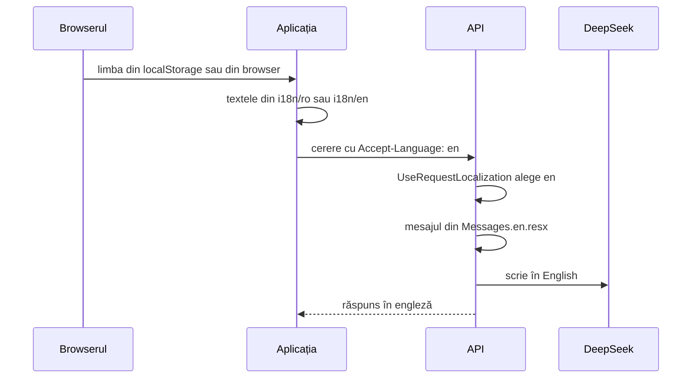

# 13. Română și engleză

Aplicația merge în română și în engleză. Pentru asta, niciun text nu mai e scris direct în cod: textele stau în fișiere separate, câte unul pe limbă, iar codul cere textul după o **cheie**, de exemplu `profile.kitchen.invite`. Mecanismul se numește **i18n** (internaționalizare; „18” sunt literele dintre „i” și „n”).

Limba atinge patru locuri:
1. textele din aplicație (React);
2. numerele și datele;
3. mesajele de la API;
4. ce scrie DeepSeek și numele alimentelor.



## 1. Textele din aplicație

Aplicația folosește **react-i18next**: biblioteca `i18next`, care ține textele și alege limba, plus legătura ei cu React.

Textele sunt în `web/src/i18n/ro/*.ts` și `web/src/i18n/en/*.ts`, câte un fișier pe zonă: `today.ts`, `foods.ts`, `profile.ts`, `auth.ts` și altele. Un fragment din `ro/profile.ts`:

```ts
kitchen: {
  title: 'Bucătăria',
  invite: 'Invită în bucătărie',
  linkNote: 'Linkul merge o singură dată, până pe {{date}}.',
}
```

În componentă, textul se cere cu `t` și cheia lui:

```tsx
const { t } = useTranslation()
<h2>{t('profile.kitchen.title')}</h2>
<p>{t('profile.kitchen.linkNote', { date: longDate(invite.expiresAt.slice(0, 10)) })}</p>
```

`{{date}}` e o **variabilă**: `t` o înlocuiește cu valoarea dată.

**Cheile sunt tipate.** `web/src/i18n/i18next.d.ts` îi spune lui TypeScript că textele au forma obiectului `ro`. O cheie scrisă greșit, de exemplu `t('profile.kitchen.titel')`, e eroare la compilare, nu text lipsă în aplicație.

### Pluralele

Româna are trei forme de plural, engleza două. i18next alege forma după numărul din `count`, cu regulile de plural ale browserului (`Intl.PluralRules`):

| Cheia | `count` | Textul |
|---|---|---|
| `recipes_one` | 1 | 1 rețetă |
| `recipes_few` | 0 și 2–19 | 5 rețete |
| `recipes_other` | 20–100 | 20 de rețete |

Regula se repetă la fiecare sută: 101 rețete, 120 de rețete.

În engleză sunt doar `recipes_one` (1 recipe) și `recipes_other` (5 recipes). Codul cere `t('profile.kitchen.archive.recipes', { count: 5 })`, fără sufix.

### Testul textelor

`web/src/i18n/i18n.test.ts` verifică trei lucruri:
1. româna și engleza au aceleași chei;
2. același text folosește aceleași variabile în ambele limbi;
3. fiecare plural are formele limbii lui: `one`, `few`, `other` în română; `one`, `other` în engleză.

```bash
pnpm --dir web test i18n
```

Caută: `Tests  3 passed (3)`.

## Cum se alege limba

Configurarea e în `web/src/i18n/index.ts`:

```ts
detection: { order: ['localStorage', 'navigator'], lookupLocalStorage: 'macromate.language', caches: ['localStorage'] },
fallbackLng: 'en',
```

1. Dacă ai ales o limbă, ea stă în `localStorage`, la cheia `macromate.language`. Se ia de acolo.
2. Altfel, se ia limba browserului (`navigator.language`): `ro-RO` dă română, `en-US` dă engleză.
3. Orice altă limbă (germană, franceză) dă engleză.

Limba se schimbă din **Profil** și de pe **pagina de login**, cu `LanguageSwitch`. Alegerea se scrie în `localStorage` și se păstrează la următoarea deschidere, și offline.

## 2. Numerele și datele

Numerele și datele le formatează browserul, cu `Intl`, după limbă: `ro-RO` sau `en-GB`.

| | Română | Engleză |
|---|---|---|
| un număr cu zecimală | 83,5 kg | 83.5 kg |
| o mie | 1.970 kcal | 1,970 kcal |
| o dată | 4 octombrie 2026 | 4 October 2026 |

Funcțiile sunt în `web/src/lib/format.ts` (`kcal`, `grams`, `kg`) și `web/src/lib/dates.ts` (`formatDay`, `longDate`). Ecranele nu formatează singure numerele.

## Numele meselor

Mesele din jurnal au eticheta salvată ca text (`mealLabel`), în limba în care le-ai notat: „Mic dejun”. Dacă schimbi pe engleză, ziua de ieri are „Mic dejun”, iar azi apare „Breakfast”. Fără o regulă, ar ieși două mese diferite.

`web/src/lib/meals.ts` recunoaște mesele implicite în ambele limbi:

```ts
export function mealKey(label: string): MealKey | null {
  return mealKeys.find((key) => ro.meals[key] === label || en.meals[key] === label) ?? null
}
```

- „Mic dejun” și „Breakfast” dau amândouă cheia `breakfast`;
- `mealLabel` arată masa în limba de acum;
- `sameMeal` le pune în același card;
- o masă cu nume ales de tine („După sală”) rămâne cum ai scris-o.

## Numele alimentelor și motivul notei

Alimentele au două nume și două motive ale notei glicemice:

| Coloană în `foods` | Ce ține |
|---|---|
| `name` | numele în română |
| `name_en` | numele în engleză |
| `grades_reason` | motivul notei glicemice, în română |
| `grades_reason_en` | același motiv, în engleză |

În aplicație, `web/src/lib/food-name.ts` alege ce se arată:

```ts
export function foodName(food: Named | null | undefined) {
  if (!food) return undefined
  return currentLanguage() === 'en' && food.nameEn ? food.nameEn : food.name
}
```

- În engleză se arată `nameEn`, dacă există; altfel numele în română. La fel `foodReason`, cu motivul.
- Căutarea merge pe ambele nume: `foodSearchText` pune numele, numele în engleză și marca într-un singur text. „blueberries” găsește „Afine” și în română.
- Formularul de aliment arată întâi numele în limba de acum, apoi pe celălalt: „Nume în engleză” în română, „Name in Romanian” în engleză.
- DeepSeek întoarce mereu `name` și `nameEn`, `reason` și `reasonEn`. Dacă ai scris tu un nume, îl păstrează și îl traduce pentru celălalt.
- `Seed/foods.json` are `nameEn` și `reasonEn` la toate cele 75 de alimente de start.

### Migrările care completează engleza

Migrările `AddFoodNameEn` și `AddFoodReasonEn` adaugă coloanele și le completează pentru cele 75 de alimente de start, după numele în română:

```sql
UPDATE foods f
SET name_en = v.name_en, version = nextval('sync_version'), updated_at = now()
FROM (VALUES
    ('Roșii', 'Tomatoes'),
    ('Castravete', 'Cucumber'),
    ...
```

`version = nextval('sync_version')` contează. Telefoanele cer doar rândurile cu `version` mai mare decât cursorul lor. Fără un `version` nou, alimentele vechi n-ar mai fi trimise niciodată, iar telefoanele n-ar primi numele în engleză.

## 3. Mesajele de la API

Telefonul trimite limba la fiecare cerere, în headerul **`Accept-Language`**: headerul HTTP prin care clientul spune în ce limbă vrea răspunsul. În `web/src/api/client.ts`:

```ts
headers: {
  'Accept-Language': currentLanguage(),
  ...
}
```

Pe server, .NET are un mecanism de traduceri inclus, **localization**. Are trei piese:
1. **`UseRequestLocalization`** din `Program.cs`: citește `Accept-Language` și setează limba cererii. Știe doar `ro` și `en`; orice altceva, sau niciun header, dă `ro`.
   ```csharp
   app.UseRequestLocalization(o =>
   {
       string[] cultures = ["ro", "en"];
       o.SetDefaultCulture("ro").AddSupportedCultures(cultures).AddSupportedUICultures(cultures);
       o.RequestCultureProviders = [new AcceptLanguageHeaderRequestCultureProvider()];
   });
   ```
2. **Fișierele `.resx`**: fișiere XML cu perechi cheie–text. `Resources/Messages.resx` are textele în română, `Resources/Messages.en.resx` în engleză.
   ```xml
   <data name="InvalidCredentials" xml:space="preserve">
     <value>Email sau parolă greșită.</value>
   </data>
   ```
3. **`IStringLocalizer<Messages>`**: serviciul care întoarce textul cheii în limba cererii. `Messages` e o clasă goală, folosită doar ca nume pentru fișierele `.resx`.

Endpoint-ul cere textul după cheie, ca `t` din React:

```csharp
return Results.Problem(messages["InvalidCredentials"], statusCode: StatusCodes.Status401Unauthorized);
```

Cu `Accept-Language: en`, răspunsul e „Wrong email or password.”. Fără header, e „Email sau parolă greșită.”.

**Erorile lui Identity.** Identity are mesajele lui, în engleză, de exemplu „Passwords must be at least 10 characters.”. `LocalizedIdentityErrorDescriber` din `Features/Auth` le înlocuiește cu texte din `Messages.resx`:

```csharp
public override IdentityError PasswordTooShort(int length) =>
    Error(nameof(PasswordTooShort), messages["PasswordTooShort", length]);
```

Se înregistrează în `Program.cs` cu `.AddErrorDescriber<LocalizedIdentityErrorDescriber>()`.

**Testele.** `LocalizationTests.cs` trimite aceleași cereri cu `en`, `en-US,en;q=0.9`, `ro` și fără header și verifică textul. `Every_message_has_an_english_text` verifică faptul că fiecare cheie din `Messages.resx` are text și în `Messages.en.resx`.

## 4. DeepSeek

API-ul alege limba pentru DeepSeek din limba cererii (`AiPrompts.LanguageOf`): `en` dă „English”, orice altceva „Romanian”. Promptul cere:
- **rețeta generată**: numele, pașii și ce lipsește din bază, în limba cererii;
- **scanarea farfuriei**: numele alimentelor estimate și nota, în limba cererii;
- **alimentul completat**: mereu ambele nume și ambele motive, ca alimentul să meargă în ambele limbi.

## Adaugi un text nou

1. Pui cheia în `web/src/i18n/ro/<zonă>.ts`, cu textul în română.
2. Pui aceeași cheie în `web/src/i18n/en/<zonă>.ts`, cu textul în engleză.
3. În componentă: `t('zonă.cheie')`.
4. Rulezi `pnpm --dir web test`. Caută: `Tests  … passed` și niciun `failed`. Testul textelor prinde o cheie lipsă în engleză.

Pentru un mesaj de la API:
1. Adaugi `<data name="CheiaTa">` în `Resources/Messages.resx` și în `Messages.en.resx`.
2. În endpoint: `messages["CheiaTa"]`.
3. Rulezi `dotnet test api`. Caută: `Failed: 0`.

## Unde e codul

| Ce | Fișier |
|---|---|
| pornirea i18next și alegerea limbii | `web/src/i18n/index.ts` |
| textele | `web/src/i18n/ro/*.ts`, `web/src/i18n/en/*.ts` |
| cheile tipate | `web/src/i18n/i18next.d.ts` |
| testul textelor | `web/src/i18n/i18n.test.ts` |
| comutatorul de limbă | `web/src/components/app/language-switch.tsx` |
| numere și date | `web/src/lib/format.ts`, `web/src/lib/dates.ts` |
| mesele în ambele limbi | `web/src/lib/meals.ts` |
| numele și motivul alimentelor | `web/src/lib/food-name.ts` |
| headerul `Accept-Language` | `web/src/api/client.ts` |
| limba pe server | `UseRequestLocalization` din `api/MacroMate.Api/Program.cs` |
| mesajele API-ului | `api/MacroMate.Api/Resources/Messages.resx`, `Messages.en.resx` |
| erorile Identity | `api/MacroMate.Api/Features/Auth/LocalizedIdentityErrorDescriber.cs` |
