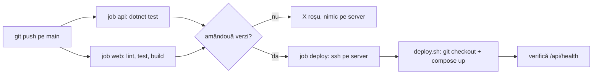

# 14. CI/CD: deploy la fiecare push pe `main`

**CI/CD** e un program care rulează singur la fiecare push pe GitHub:
- **CI** (continuous integration): rulează testele, lint-ul și build-ul pe un calculator al GitHub-ului. Dacă ceva pică, ai un X roșu la commit.
- **CD** (continuous deployment): dacă totul a trecut și commit-ul e pe `main`, pune codul pe server.

Programul ăsta e **GitHub Actions**. Pașii lui sunt scriși în `.github/workflows/ci-cd.yml`. Un fișier de felul ăsta se numește **workflow**, iar fiecare bloc din el se numește **job**.



## Ce rulează la fiecare push

| Job | Ce face | Când |
|---|---|---|
| `api` | pornește un Postgres 18 lângă el și rulează `dotnet test api` | la orice push și la orice pull request spre `main` |
| `web` | `pnpm install`, `pnpm lint`, `pnpm test`, `pnpm build` (cu `tsc -b`) | la fel |
| `deploy` | intră pe server cu SSH și rulează `deploy/deploy.sh` | doar pe `main`, doar dacă `api` și `web` au trecut |

`api` și `web` rulează în paralel. `deploy` le așteaptă pe amândouă (`needs: [api, web]`).

La un **pull request** rulează doar testele: vezi dacă ramura strică ceva înainte s-o unești în `main`.

## Ce face `deploy.sh` pe server

```bash
git fetch --quiet origin main
git checkout --quiet --detach "$target"
docker compose -f compose.prod.yaml up -d --build --remove-orphans
```

1. Aduce de pe GitHub commit-urile noi.
2. Trece exact pe commit-ul care a trecut testele. GitHub îi trimite id-ul lui, cele 40 de caractere din `git log`. Dacă între timp ai mai dat un push, fiecare deploy pune commit-ul lui, în ordine.
3. Reconstruiește imaginile și reface containerele care s-au schimbat. Migrările bazei rulează singure la pornirea API-ului.
4. Întreabă API-ul `/api/health`, din containerul `web`, de cel mult 30 de ori, la 2 secunde. Dacă răspunde, șterge imaginile vechi și iese cu succes. Dacă nu, afișează ultimele 50 de rânduri din logurile API-ului și iese cu eroare, iar job-ul din GitHub devine roșu.

După `deploy.sh`, GitHub mai verifică o dată `https://macromate.developedbyflow.com/api/health`, de pe internet.

Cât durează: 2–4 minute pentru teste, apoi 1–3 minute pentru build pe server. Aplicația e oprită doar cât se reface containerul, câteva secunde.

## Cheia de deploy: poate face un singur lucru

GitHub intră pe server cu o cheie SSH separată, făcută doar pentru el. Pe server, cheia e scrisă în `~/.ssh/authorized_keys` așa:

```
command="/opt/macromate/deploy/deploy.sh",restrict ssh-ed25519 AAAA… github-actions-deploy
```

- `command="…"`: oricine intră cu cheia asta rulează doar `deploy.sh`, orice ar cere. Ce cere ajunge în `deploy.sh` ca `SSH_ORIGINAL_COMMAND`.
- `restrict`: fără terminal, fără redirecționări de porturi.
- `deploy.sh` acceptă doar un id de commit de 40 de caractere (`0-9a-f`). Orice altceva e refuzat cu `Expected a full commit id`.

Dacă cineva fură cheia din GitHub, tot ce poate face e să pună pe server un commit care există deja în repo.

Cheia ta personală (`~/.ssh/id_ed25519`) rămâne neatinsă: cu ea intri tu, cu terminal, ca până acum.

## Setările din GitHub

| Nume | Fel | Ce e |
|---|---|---|
| `DEPLOY_SSH_KEY` | secret | partea privată a cheii de deploy |
| `DEPLOY_KNOWN_HOSTS` | secret | amprenta serverului, ca GitHub să știe că vorbește cu serverul tău și nu cu altul |
| `DEPLOY_HOST` | variabilă | IP-ul serverului |

Un **secret** nu se mai poate citi după ce l-ai salvat, nici de tine; GitHub îl ascunde și din loguri. O **variabilă** se vede.

Cât timp `DEPLOY_HOST` nu e setată, job-ul `deploy` e sărit (`skipped`), iar testele rulează în continuare.

## Configurarea, o singură dată

Toate comenzile sunt pe **laptop**, în afară de cea marcată „pe server”.

1. Faci cheia de deploy, fără parolă (GitHub n-are cine s-o tasteze):

   ```bash
   ssh-keygen -t ed25519 -f ~/.ssh/macromate_deploy -N "" -C "github-actions-deploy"
   ```

   Caută: `Your identification has been saved in …/macromate_deploy`.

2. Pui partea publică pe server, cu `command=` și `restrict`:

   ```bash
   ssh ubuntu@57.131.199.95 "echo 'command=\"/opt/macromate/deploy/deploy.sh\",restrict $(cat ~/.ssh/macromate_deploy.pub)' >> ~/.ssh/authorized_keys && tail -1 ~/.ssh/authorized_keys"
   ```

   Caută: un rând care începe cu `command="/opt/macromate/deploy/deploy.sh",restrict ssh-ed25519` și se termină cu `github-actions-deploy`.

3. Pe server, aduci commit-ul care conține `deploy.sh`:

   ```bash
   cd /opt/macromate && git pull
   ```

   Caută: `deploy/deploy.sh` în lista de fișiere noi.

4. Încerci cheia de pe laptop, ca GitHub:

   ```bash
   ssh -i ~/.ssh/macromate_deploy -o IdentitiesOnly=yes ubuntu@57.131.199.95
   ```

   Caută: `Deploying …`, mesajele lui compose, apoi `Deployed …`. Conexiunea se închide singură.

5. Te loghezi în GitHub CLI, dacă n-ai făcut-o:

   ```bash
   gh auth login
   ```

   Alegi `GitHub.com`, `HTTPS`, apoi `Login with a web browser`.

6. Pui cele trei setări:

   ```bash
   gh secret set DEPLOY_SSH_KEY --repo developedbyflow/macro-mate < ~/.ssh/macromate_deploy
   ```

   ```bash
   ssh-keyscan -t ed25519 57.131.199.95 | gh secret set DEPLOY_KNOWN_HOSTS --repo developedbyflow/macro-mate
   ```

   ```bash
   gh variable set DEPLOY_HOST --repo developedbyflow/macro-mate --body 57.131.199.95
   ```

   Caută: `✓ Set Actions secret …` și `✓ Created variable DEPLOY_HOST`.

7. Ștergi de pe laptop partea privată a cheii de deploy. Acum e în GitHub, iar pe laptop nu-ți mai trebuie:

   ```bash
   rm ~/.ssh/macromate_deploy
   ```

8. Pornești workflow-ul de mână, prima dată:

   ```bash
   gh workflow run ci-cd.yml --repo developedbyflow/macro-mate && sleep 5 && gh run watch --repo developedbyflow/macro-mate
   ```

   Caută: `✓ API tests`, `✓ Web lint, tests and build`, `✓ Deploy to production`.

## Unde te uiți

- Pe GitHub, tab-ul **Actions**: fiecare rulare, cu pașii și logurile lor.
- La fiecare commit, lângă mesaj: o bifă verde sau un X roșu.
- Pe pagina repo-ului, în dreapta, **Deployments → production**: ce commit e acum pe server.
- În terminal: `gh run list --repo developedbyflow/macro-mate`.

## Când ceva nu merge

| Simptom | Te uiți la | Ce faci |
|---|---|---|
| X roșu la `API tests` sau `Web lint, tests and build` | logul job-ului, în Actions | repari testul pe laptop, rulezi `dotnet test api` și `pnpm --dir web test`, dai push din nou. Pe server nu s-a schimbat nimic |
| `Permission denied (publickey)` la deploy | rândul din `authorized_keys` de pe server, secretul `DEPLOY_SSH_KEY` | repeți pașii 1, 2 și 6 cu o cheie nouă |
| `Host key verification failed` | secretul `DEPLOY_KNOWN_HOSTS` | apare după o reinstalare a serverului: rulezi iar comanda cu `ssh-keyscan` din pasul 6 |
| `The API did not answer /api/health` | ultimele rânduri din logul job-ului (sunt logurile API-ului) | des: o migrare care pică. Repari, dai push; sau revii la commit-ul vechi, mai jos |
| `deploy` apare `skipped` | variabila `DEPLOY_HOST` | `gh variable list --repo developedbyflow/macro-mate` |

## Revii la o versiune veche

Pe server, cu id-ul complet al commit-ului bun (îl iei din `git log` sau din GitHub):

```bash
/opt/macromate/deploy/deploy.sh ID_COMMIT_COMPLET
```

Fără argument, `deploy.sh` pune ultimul commit de pe `main`. O migrare deja rulată nu se anulează la revenire; codul vechi trebuie să meargă cu baza nouă.
