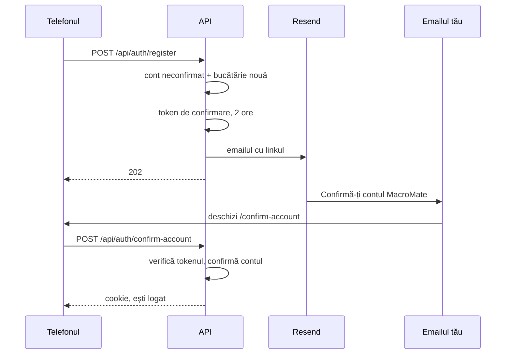
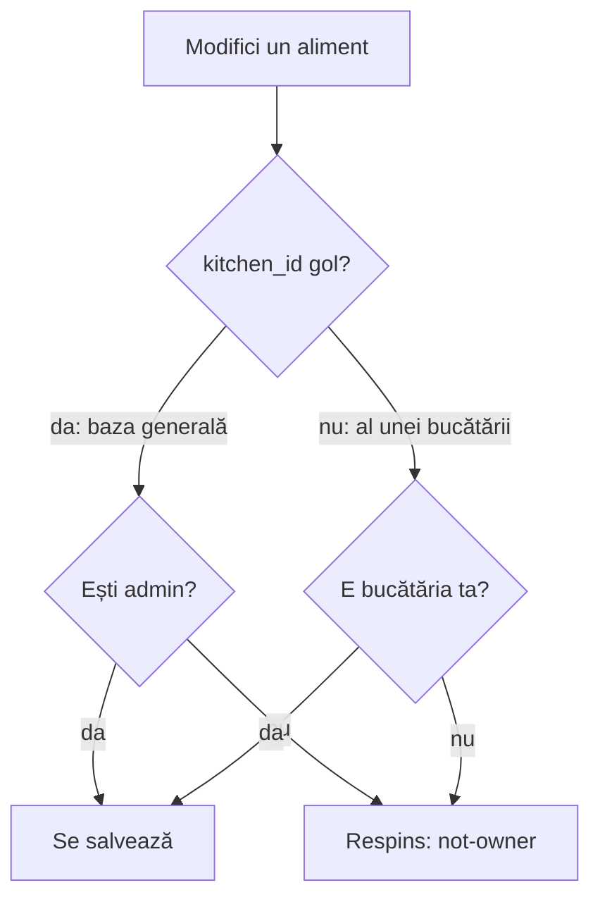
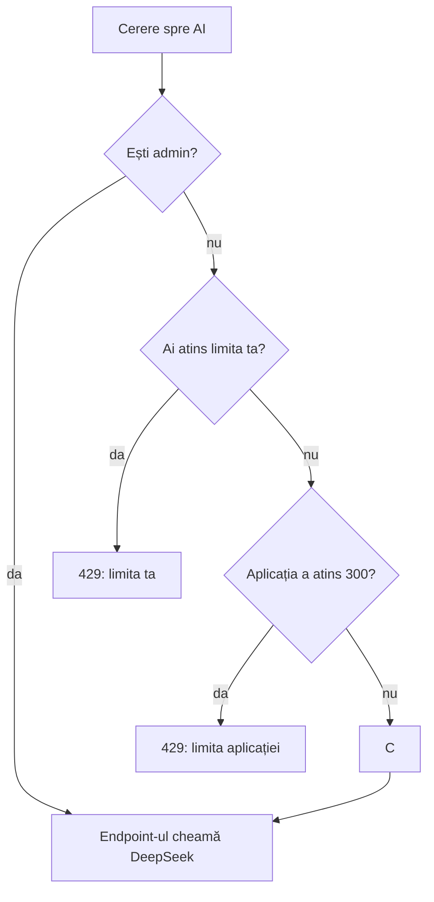

# 15. Conturi, roluri și contul de probă

Până acum, un cont se făcea doar cu `create-user` pe server sau dintr-o invitație. Acum aplicația are:
- **contul nou din pagina de login**, cu un email de confirmare;
- **rolul de admin**, care modifică baza generală de alimente;
- **alimentele bucătăriei**: ce adaugă un utilizator rămâne în bucătăria lui;
- pagina **Administrare**, cu cererea de alimente, rapoartele și rolurile;
- **„Raportează o greșeală”** la alimentele din baza generală;
- o **limită zilnică la AI**, pe cont și pe toată aplicația;
- **ștergerea contului**, din Profil;
- **contul de probă**: „Încearcă fără cont”.

Codul nou e în `api/MacroMate.Api/Features/Auth/SignupEndpoints.cs`, `Features/Admin/AdminEndpoints.cs` și `Features/Ai/AiQuota.cs`. Tabelele noi vin din migrarea `AddAccountsAndRoles`.

## Contul nou

Pe login e un link nou: **„Nu ai cont? Creează unul”**. Duce la `/register`, unde scrii numele, emailul și o parolă de minim 10 caractere.



1. Telefonul trimite `POST /api/auth/register` cu numele, emailul și parola.
2. API-ul verifică numele (1–60 de caractere), emailul și faptul că adresa nu are deja cont.
3. Face contul cu `EmailConfirmed = false` și o **bucătărie nouă**, a lui. Răspunde 202: contul există, dar nu merge încă.
4. Trimite pe adresa ta un link spre `/confirm-account?userId=…&token=…`. Linkul merge **2 ore**, ca toate linkurile din emailuri.
5. Deschizi linkul. Pagina trimite singură `POST /api/auth/confirm-account`. API-ul cheamă `ConfirmEmailAsync`, te loghează și te duce în aplicație.

`ConfirmEmailAsync` verifică tokenul de fiecare dată, și la un cont deja confirmat. Fără un token bun, răspunsul e 400 și nu te loghează. Linkul deschis a doua oară, în cele 2 ore, merge din nou: tokenul e tot valabil.

Tokenul îl face Identity, cu `GenerateEmailConfirmationTokenAsync`, la fel ca pe cel de la „Am uitat parola”. E semnat cu cheile din `/data/keys`.

| Răspuns la `register` | Când |
|---|---|
| 202 | contul e făcut, emailul a plecat |
| 400 | numele, emailul sau parola nu trec. Ex.: „Scrie un nume de cel mult 60 de caractere.” |
| 409 | adresa are deja cont: „Există deja un cont cu adresa asta.” |
| 503 | în producție, fără `Email:PublicUrl`: „Trimiterea de emailuri nu e configurată pe server.” Contul nu se face |

La 409, API-ul spune că adresa are deja cont. „Am uitat parola” nu spune asta niciodată.

### Login-ul unui cont neconfirmat

În `AuthEndpoints.cs`, înainte de verificarea obișnuită:

```csharp
if (!user.EmailConfirmed)
    return await users.CheckPasswordAsync(user, request.Password)
        ? Results.Problem(messages["EmailNotConfirmed"], statusCode: StatusCodes.Status403Forbidden)
        : Results.Problem(messages["InvalidCredentials"], statusCode: StatusCodes.Status401Unauthorized);
```

- Parola bună: 403, „Contul nu e confirmat încă. Deschide linkul din emailul de confirmare.” Sub mesaj apare butonul **„Retrimite emailul de confirmare”**.
- Parola greșită: 401, „Email sau parolă greșită.”, ca la orice cont.

Așa, cine nu știe parola nu află dacă un cont e confirmat sau nu.

### Retrimiterea emailului

`POST /api/auth/resend-confirmation` cu emailul. Răspunde mereu 204. Trimite emailul doar dacă adresa are un cont neconfirmat. Butonul e pe pagina de după înregistrare și pe login, după un 403.

### Ce conturi sunt confirmate direct

| Cum se face contul | Confirmat |
|---|---|
| din pagina de login (`/register`) | după link |
| din invitația în bucătărie | direct |
| cu `create-user` pe server | direct |
| conturile de test de pe laptop (`DevSeed`) | direct |
| contul de probă | direct |

Toate trec prin `KitchenService.CreateUserAsync`, care primește acum `emailConfirmed`. Migrarea `AddAccountsAndRoles` a marcat confirmate toate conturile care existau deja:

```sql
UPDATE users SET email_confirmed = true;
```

## Rolurile: user și admin

Un **rol** e un nume pus pe un cont, după care serverul decide ce are voie contul să facă. ASP.NET Core Identity are rolurile incluse. Le pornește `.AddRoles<IdentityRole<Guid>>()` din `Program.cs`.

MacroMate are un singur rol, `admin`. Un cont fără rol e un utilizator obișnuit: „user” nu e un rând în bază, e lipsa rolului.

Rolurile stau în două tabele Identity, care existau din prima migrare, dar erau goale:

| Tabel | Ce ține |
|---|---|
| `roles` | rolurile: un rând, `admin` |
| `user_roles` | perechi cont–rol: cine e admin |

Rândul `admin` din `roles` îl face API-ul la fiecare pornire, dacă lipsește (`Data/AppRoles.cs`):

```csharp
public static async Task EnsureAsync(RoleManager<IdentityRole<Guid>> roles)
{
    if (!await roles.RoleExistsAsync(Admin))
        await roles.CreateAsync(new IdentityRole<Guid>(Admin) { Id = Guid.NewGuid() });
}
```

### Ce face un admin în plus

- modifică și șterge alimentele din **baza generală**;
- adaugă alimente noi direct în baza generală;
- deschide pagina **Administrare** (`/admin`), din meniul din stânga sau din Profil;
- dă și ia rolul de admin altor conturi;
- nu are limită zilnică la AI.

Un admin **nu** vede rețetele, planurile sau jurnalul altor conturi. Nici nu modifică alimentele altor bucătării.

### Cum află telefonul rolul

Răspunsul de la login și de la `GET /api/auth/me` (`MeResponse`) are acum trei câmpuri noi: `isAdmin`, `isDemo`, `demoExpiresAt`. Telefonul îl ține în Dexie, ca până acum. Ecranele ascund butoanele pe care contul nu le poate folosi.

Serverul nu se bazează pe ce ascunde telefonul. Endpoint-urile `/api/admin/*` trec printr-un filtru care verifică rolul în bază la fiecare cerere:

```csharp
public sealed class AdminOnly(AppDbContext db, CurrentUser me) : IEndpointFilter
{
    public async ValueTask<object?> InvokeAsync(EndpointFilterInvocationContext context, EndpointFilterDelegate next) =>
        await AppRoles.IsAdminAsync(db, me.Id, context.HttpContext.RequestAborted) ? await next(context) : Results.StatusCode(StatusCodes.Status403Forbidden);
}
```

Un **filtru de endpoint** (`IEndpointFilter`) e o funcție care rulează înaintea endpoint-ului și poate opri cererea. Aici: dacă nu ești admin, răspunde 403 și endpoint-ul nu mai rulează.

### Cum dai rolul

**Primul admin**, pe server. După primul deploy cu versiunea asta, nimeni nu e admin. Îți dai rolul contului tău:

```bash
cd /opt/macromate/deploy && docker compose -f compose.prod.yaml exec api dotnet MacroMate.Api.dll set-role --email adresa-ta@exemplu.com --role admin
```

Caută: `Contul adresa-ta@exemplu.com are acum rolul admin.` Dacă scrie `Nu există contul …`, adresa e greșită.

Comanda e programul API-ului, cu `set-role` ca prim argument, la fel ca `create-user` și `seed-foods` (`Admin/AdminCommands.cs`). Reîncarci aplicația: la deschidere, ea cere `GET /api/auth/me`, primește `isAdmin: true` și arată „Administrare”.

Ca să iei rolul cuiva, de pe server:

```bash
cd /opt/macromate/deploy && docker compose -f compose.prod.yaml exec api dotnet MacroMate.Api.dll set-role --email adresa@exemplu.com --role user
```

Caută: `Contul adresa@exemplu.com are acum rolul user.`

Vezi cine e admin, direct în Postgres:

```bash
cd /opt/macromate/deploy && docker compose -f compose.prod.yaml exec db psql -U macromate macromate -c "select u.email from users u join user_roles ur on ur.user_id = u.id join roles r on r.id = ur.role_id where r.name = 'admin';"
```

Caută: adresa ta în coloana `email`, apoi `(1 row)`.

**Din aplicație**, după ce ești admin: Administrare → **Utilizatori**. Lângă fiecare cont e o bifă **Admin**. Lista nu arată conturile de probă, iar lângă un cont care nu și-a deschis încă linkul scrie „neconfirmat”.

**Ultimul admin rămâne admin.** Dacă ești singurul admin și îți scoți bifa, API-ul răspunde 409: „Ești singurul admin. Dă întâi rolul de admin altcuiva.” Aceeași regulă oprește ștergerea contului și comanda `set-role --role user` de pe server, care scrie atunci „E singurul admin. Dă întâi rolul de admin altui cont.”

**Pe laptop**, primul cont de test din `appsettings.Development.json` (Florin) primește rolul la fiecare pornire, din `DevSeed.cs`. Al doilea cont (`cont2@macromate.local`) e utilizator obișnuit, deci pe același laptop încerci ambele feluri de cont.

## Alimentele: baza generală și alimentele bucătăriei

Tabelul `foods` are o coloană nouă, `kitchen_id`:

| `kitchen_id` | Ce e alimentul | Cine îl vede | Cine îl modifică și îl șterge |
|---|---|---|---|
| gol (`null`) | din **baza generală** | toate conturile | doar adminii |
| id-ul unei bucătării | al **bucătăriei** | doar membrii ei | doar membrii ei |

Toate alimentele care existau înainte de migrare au `kitchen_id` gol, deci sunt în baza generală. Tot acolo intră cele 75 de alimente de start.



Regula e în `FoodTable` din `Features/Sync/SyncTables.cs`:

```csharp
protected override Task<bool> IsOwnedByAsync(AppDbContext db, Food food, SyncActor actor, CancellationToken ct) =>
    Task.FromResult(food.KitchenId is { } kitchenId ? kitchenId == actor.KitchenId : actor.IsAdmin);

protected override void SetOwner(Food food, SyncActor actor)
{
    food.CreatedBy = actor.UserId;
    food.KitchenId = actor.IsAdmin && food.KitchenId is null ? null : actor.KitchenId;
}
```

- `IsOwnedByAsync` decide cine poate modifica un aliment care există deja.
- `SetOwner` rulează la un aliment nou. Un utilizator obișnuit primește mereu bucătăria lui, orice ar trimite telefonul. Doar un admin poate lăsa `kitchen_id` gol.
- La o modificare, `kitchen_id` rămâne cel din bază (`Food.KeepServerFieldsFrom`). Un aliment nu trece din bucătărie în baza generală prin editare.

### Un aliment nou

- **Utilizator**: alimentul intră în bucătăria ta. În listă are eticheta „bucătăria ta”, iar pe fișă scrie „Din bucătăria ta · adăugat de …”.
- **Admin**: pe pagina „Aliment nou” e bifa **„Adaugă în baza generală”**, bifată de la început. Debifată, alimentul rămâne în bucătăria adminului.

În telefon, `saveRow` din `web/src/db/mutations.ts` pune `kitchenId` pe aliment: gol pentru baza generală, altfel bucătăria ținută în Dexie.

### Un aliment din baza generală, pentru un utilizator

Fișa nu are creionul de editare și nici butonul de ștergere. În locul lor scrie „Alimentele din baza generală le modifică doar adminul.” și e butonul **„Raportează o greșeală”**.

### Ce primește telefonul

În `SyncEndpoints.cs`, citirea ia baza generală plus alimentele bucătăriei tale:

```csharp
var users = await db.Users.AsNoTracking().Where(u => u.KitchenId == kitchenId).Select(u => new SyncUser(u.Id, u.DisplayName)).ToListAsync(ct);
var foods = await db.Foods.AsNoTracking().Where(x => (x.KitchenId == null || x.KitchenId == kitchenId) && x.Version > since).ToListAsync(ct);
```

Și lista de conturi din răspuns s-a schimbat: are doar membrii bucătăriei tale, nu toate conturile. Din ea, aplicația scrie „adăugat de Florin”.

**AI-ul** primește aceeași listă: la rețeta generată și la scanarea farfuriei, API-ul trimite la DeepSeek doar alimentele din baza generală și din bucătăria ta.

### Plecarea și intrarea în bucătărie

Alimentele bucătăriei se mută și se copiază la fel ca rețetele:
- **la plecare**, alimentele bucătăriei comune se copiază în bucătăria ta nouă, cu id-uri noi. Rețetele, variantele, planurile, cămara, jurnalul tău și listele tale „îmi place” și „exclud” arată apoi spre copii;
- **la intrare** cu „Da, aduc tot”, alimentele bucătăriei tale intră în bucătăria comună. Cu „Nu”, rămân în arhivă;
- arhiva arată și câte alimente are, de exemplu „3 alimente”.

Detaliile sunt în [capitolul 10](10-bucataria.md).

## Pagina Administrare

Pagina `/admin` are trei taburi și cere internet. Un cont fără rol care deschide adresa vede doar „Eroare 403”.

### Cerere

Tabul arată ce alimente adaugă utilizatorii în bucătăriile lor, ca să știi ce merită pus în baza generală. `GET /api/admin/food-demand`:

1. Ia toate alimentele din bucătării, fără bucătăriile conturilor de probă.
2. Le grupează: după **codul de bare**, dacă au; altfel după **nume**, scris cu litere mici și fără diacritice. „Brânză de vaci” și „branza de vaci” ajung în același grup.
3. Pentru fiecare grup numără **în câte bucătării** apare.
4. Pune semnul **„deja în bază”** dacă un aliment din baza generală are același cod de bare sau același nume.
5. Ordinea: întâi cele care nu sunt în bază, apoi după numărul de bucătării. Arată cel mult 100 de rânduri.

Numele se aduc la aceeași formă cu `NormalizeName`:

```csharp
var decomposed = name.Trim().ToLowerInvariant().Normalize(NormalizationForm.FormD);
foreach (var c in decomposed)
    if (CharUnicodeInfo.GetUnicodeCategory(c) != UnicodeCategory.NonSpacingMark)
        builder.Append(char.IsWhiteSpace(c) ? ' ' : c);
```

`Normalize(NormalizationForm.FormD)` desparte fiecare literă de semnul ei: „â” devine „a” plus „^”. Bucla păstrează literele și aruncă semnele.

**„Pune în bază”** (`POST /api/admin/food-demand/{foodId}/promote`) face o **copie** a alimentului în baza generală, cu id nou și cu tine ca autor. Alimentele din bucătării rămân neatinse: cine le avea vede de acum și copia din baza generală.

### Rapoarte

Greșelile trimise de utilizatori, cele mai vechi primele. Fiecare are numele alimentului, mesajul, cine l-a trimis și data. **„Deschide alimentul”** duce la fișă, unde îl corectezi. **„Rezolvat”** pune `resolved_at` și scoate raportul din listă.

### Utilizatori

Lista conturilor, fără conturile de probă, cu bifa **Admin**. Regulile sunt mai sus, la roluri.

## „Raportează o greșeală”

Pe un aliment din baza generală, un utilizator apasă **„Raportează o greșeală”** și scrie ce e greșit, de exemplu „Pe eticheta mea, proteina e 10 g la 100 g, nu 3 g.”.

- Telefonul trimite `POST /api/foods/{foodId}/reports`. Cere internet.
- Mesajul are între 3 și 500 de caractere. Altfel: 400, „Scrie ce e greșit, între 3 și 500 de caractere.”
- Se poate raporta doar un aliment din baza generală. La alimentele bucătăriei tale nu e nevoie: le corectezi singur.
- Endpoint-ul e sub limita `auth`: 10 cereri pe minut de la o adresă IP.
- Raportul ajunge în tabelul `food_reports` și în tabul **Rapoarte**.

## Limita zilnică la AI

Pe lângă limita veche, 30 de cereri la 10 minute pe cont, AI-ul are acum o limită pe zi. Ea apără tokenii DeepSeek de conturi noi făcute în serie.

| Cine | Limita pe zi |
|---|---|
| un utilizator | 20 de cereri |
| un cont de probă | 5 cereri |
| toată aplicația | 300 de cereri |
| un admin | fără limită |

Contează cele trei endpoint-uri care cheamă DeepSeek: completarea alimentului, rețeta generată și scanarea farfuriei. Verificarea „e AI-ul pregătit?” nu contează.

**Ziua** e ziua UTC. În România, contorul pornește de la zero la 3 noaptea vara și la 2 noaptea iarna.

Numărătoarea stă în tabelul `ai_usage`: un rând pe cont și pe zi, cu `count`. Un filtru de endpoint, `AiQuotaFilter` din `Features/Ai/AiQuota.cs`, rulează înaintea fiecărui endpoint de AI:



Creșterea e un singur SQL, ca două cereri în același timp să nu piardă una:

```sql
INSERT INTO ai_usage (user_id, day, count) VALUES (@user, @day, 1)
ON CONFLICT (user_id, day) DO UPDATE SET count = ai_usage.count + 1
```

`ON CONFLICT` înseamnă: dacă rândul pentru ziua asta există deja, crește-l; altfel, fă-l.

Câteva lucruri care decurg din cod:
- cererea se numără **înainte** să ruleze endpoint-ul. Una pe care endpoint-ul o respinge apoi, de exemplu o poză prea mare, se numără și ea;
- o cerere oprită de limita de 30 la 10 minute nu se numără: limitatorul o oprește înainte de filtru;
- cererile adminilor nu se numără deloc, deci nu intră nici în totalul de 300.

Mesajele:
- limita ta: 429, „Ai folosit cele 20 cereri AI de azi. Mâine poți din nou.” (5 la un cont de probă);
- limita aplicației: 429, „AI-ul a ajuns la limita de azi pentru toată aplicația. Încearcă mâine.”

Vezi cât s-a folosit azi, pe server:

```bash
cd /opt/macromate/deploy && docker compose -f compose.prod.yaml exec db psql -U macromate macromate -c "select u.email, a.count from ai_usage a join users u on u.id = a.user_id where a.day = (now() at time zone 'utc')::date order by a.count desc;"
```

Caută: câte cereri are fiecare cont azi. `(now() at time zone 'utc')::date` e ziua UTC, aceeași ca în filtru.

## Ștergerea contului

Profil → Contul tău → **„Șterge contul”**. Scrii parola, confirmi „Șterge definitiv”. Telefonul trimite `POST /api/auth/me/delete`. Contul de probă nu cere parola.

`AccountService.DeleteAsync` face totul într-o tranzacție: ori se șterge tot, ori nimic.

1. Șterge datele tale: jurnalul, planurile de zi, greutățile, profilul, rapoartele trimise, rândurile din `ai_usage`, invitațiile făcute de tine.
2. Bucătăria:
   - dacă ești **singur** în ea, o șterge cu tot: alimentele ei, rețetele, variantele, planurile, listele, cămara, invitațiile;
   - dacă mai sunt membri, bucătăria rămâne la ei. Dacă erai proprietarul, rolul trece la alt membru.
3. Dacă ai o arhivă, o șterge.
4. Șterge contul din Identity (`users.DeleteAsync`), cu rolurile lui.

Telefonul golește apoi Dexie și te duce la login.

Rândurile se șterg de tot (`ExecuteDeleteAsync`), nu doar se marchează cu `deleted_at`. E ștergerea cerută de GDPR: datele tale nu mai rămân pe server. Excepție: copiile de rezervă. Cele din `deploy/backups` le mai au până se rotesc, după 14 zile; cele luate pe laptop, până le ștergi.

| Răspuns | Când |
|---|---|
| 204 | contul e șters |
| 400 | parola e greșită: „Parola actuală nu e corectă.” |
| 409 | ești singurul admin: „Ești singurul admin. Dă întâi rolul de admin altcuiva.” |

## Contul de probă

Pe login, sub formular, e butonul **„Încearcă fără cont”**. Cine vrea să vadă aplicația intră fără email și fără parolă.

`POST /api/auth/demo`:
1. Verifică câte conturi de probă există. La 200 răspunde 503: „Conturile de probă sunt ocupate acum. Încearcă mai târziu.”
2. Face un cont `demo-<32 de caractere>@demo.invalid`, cu numele „Vizitator”, o parolă aleatoare pe care n-o știe nimeni, `is_demo = true` și `demo_expires_at` = peste 24 de ore. Contul are bucătăria lui.
3. Pune date de exemplu (`DemoData.cs`), din alimentele de start:
   - profilul, cu ținta de 1800 kcal și 150 g proteine;
   - trei rețete: omletă cu spanac, pui cu orez și broccoli, iaurt cu afine și ovăz;
   - planul „Zi obișnuită”, cu patru mese;
   - ultimele 7 zile cu planul ales și jurnalul completat. Azi are doar micul dejun;
   - opt cântăriri, la 3 zile una, de la 78 kg în jos;
   - alimentele folosite, în cămară.
4. Te loghează cu un cookie de sesiune, fără `expires`: browserul îl uită când îl închizi.

Dacă alimentele de start lipsesc din bază, contul pornește doar cu profilul și cântăririle.

`.invalid` e un domeniu rezervat, care nu există pe internet. Așa nicio adresă de probă nu e a cuiva.

**Ce vede contul de probă:** sus, o bandă: „Cont de probă. Se șterge pe …, cu tot ce ai pus în el.”, cu butonul **„Fă-ți cont”**. Butonul te deloghează și te duce la `/register`. Datele de probă nu trec în contul nou.

**Ce nu poate:**
- să schimbe emailul sau parola: 403, „Contul de probă nu poate schimba emailul sau parola. Fă-ți un cont al tău.”;
- să primească rolul de admin. Nici nu apare în lista Utilizatori;
- să folosească AI-ul mai mult de 5 ori pe zi.

Alimentele adăugate de conturile de probă nu intră în tabul Cerere.

### Ștergerea automată

`DemoCleanup` din `Features/Auth/DemoCleanup.cs` e un **serviciu de fundal** (`BackgroundService`): o clasă pe care .NET o pornește odată cu API-ul și o lasă să ruleze alături de cereri. La pornire și apoi la fiecare 30 de minute, șterge conturile de probă expirate, cu același `AccountService.DeleteAsync` ca la ștergerea din Profil. Un cont de probă dispare deci între 24 de ore și 24 de ore și jumătate după ce a fost făcut.

```bash
cd /opt/macromate/deploy && docker compose -f compose.prod.yaml logs api | grep -i "demo accounts"
```

Caută: `Deleted 3 expired demo accounts`. Rândul apare doar când s-a șters ceva. `Deleting expired demo accounts failed` înseamnă o eroare: rândurile de sub el spun care.

Vezi câte conturi de probă sunt acum:

```bash
cd /opt/macromate/deploy && docker compose -f compose.prod.yaml exec db psql -U macromate macromate -c "select count(*) from users where is_demo;"
```

Caută: numărul din coloana `count`. Peste 200 nu urcă.

## Setările

Toate sunt în `RateLimitOptions` din `Features/Security/RateLimiting.cs`. Pe server le adaugi în `deploy/compose.prod.yaml`, la `api` → `environment`.

| Setare | Implicit | Ce e |
|---|---|---|
| `RateLimits__AiPerUserPerDay` | 20 | cereri AI pe zi pentru un utilizator |
| `RateLimits__AiPerDemoPerDay` | 5 | cereri AI pe zi pentru un cont de probă |
| `RateLimits__AiTotalPerDay` | 300 | cereri AI pe zi pentru toată aplicația |
| `RateLimits__DemoMaxActive` | 200 | câte conturi de probă pot exista în același timp |
| `RateLimits__AiPerTenMinutes` | 30 | limita veche, pe cont, la 10 minute |
| `RateLimits__AuthPerMinute` | 10 | limita veche, pe adresă IP, la login și cont |

Cât merge contul de probă (24 de ore) e în cod: `SignupEndpoints.DemoLifetime`.

## Unde e codul

| Ce | Fișier |
|---|---|
| contul nou, confirmarea, retrimiterea, contul de probă, ștergerea | `api/MacroMate.Api/Features/Auth/SignupEndpoints.cs` |
| ștergerea datelor unui cont | `api/MacroMate.Api/Features/Auth/AccountService.cs` |
| datele de exemplu ale contului de probă | `api/MacroMate.Api/Features/Auth/DemoData.cs` |
| ștergerea automată a conturilor de probă | `api/MacroMate.Api/Features/Auth/DemoCleanup.cs` |
| login-ul unui cont neconfirmat | `api/MacroMate.Api/Features/Auth/AuthEndpoints.cs` |
| rolul `admin` | `api/MacroMate.Api/Data/AppRoles.cs` |
| comanda `set-role` | `api/MacroMate.Api/Admin/AdminCommands.cs` |
| endpoint-urile `/api/admin/*` | `api/MacroMate.Api/Features/Admin/AdminEndpoints.cs` |
| raportarea unei greșeli | `api/MacroMate.Api/Features/Foods/FoodReportEndpoints.cs`, `Data/FoodReport.cs` |
| limita zilnică la AI | `api/MacroMate.Api/Features/Ai/AiQuota.cs`, `Data/AiUsage.cs` |
| cine modifică un aliment | `FoodTable` din `api/MacroMate.Api/Features/Sync/SyncTables.cs` |
| migrarea | `api/MacroMate.Api/Data/Migrations/20261004173155_AddAccountsAndRoles.cs` |
| textele mesajelor și ale emailului | `api/MacroMate.Api/Resources/Messages.resx`, `Messages.en.resx` |
| pagina de cont nou | `web/src/routes/register.tsx` |
| pagina din linkul de confirmare | `web/src/routes/confirm-account.tsx` |
| pagina Administrare | `web/src/routes/_app/admin.tsx` |
| butonul „Încearcă fără cont” | `web/src/routes/login.tsx` |
| banda contului de probă | `DemoBanner` din `web/src/routes/_app.tsx` |
| „Șterge contul” | `web/src/components/app/account-section.tsx` |
| „Raportează o greșeală”, fișa fără editare | `web/src/routes/_app/foods/$foodId/index.tsx` |
| cine poate edita, în telefon | `canEditFood` din `web/src/hooks/use-data.ts` |
| testele | `api/MacroMate.Api.Tests/AccountsAndRolesTests.cs` |

Testele au nume care spun regula, de exemplu `A_new_account_works_only_after_the_emailed_link_is_opened`, `Base_foods_are_read_only_for_users_and_editable_by_admins`, `Leaving_a_kitchen_copies_its_foods_and_points_the_copied_recipes_at_them` și `A_demo_account_has_a_small_daily_ai_limit`.
