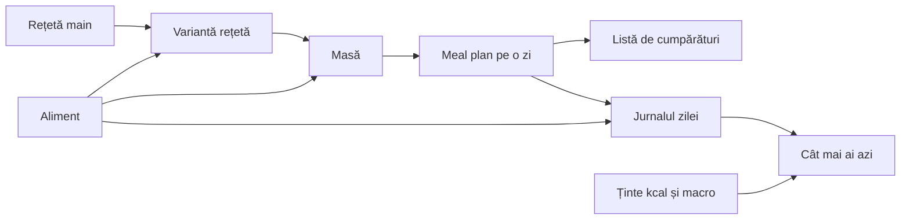
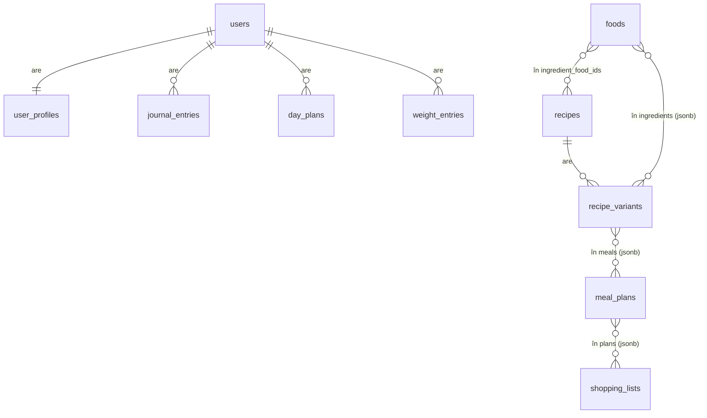
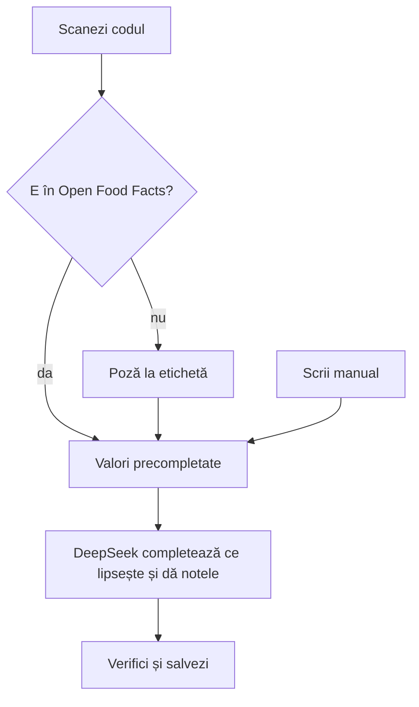

# MacroMate — specificație v1

PWA pentru Florin și prietena lui. Se instalează pe telefon, merge offline și folosește camera.
Baza de date e comună, fiecare are contul lui.

---

## 1. Ce face aplicația, pe scurt

- **Aliment**: valori la 100 g și trei note A–C: glicemic (de la DeepSeek), proteină și volum (calculate din valori).
- **Rețetă main**: lista de ingrediente și modul de preparare, fără cantități.
- **Variantă**: aceeași rețetă cu gramaje (ex. „600 kcal”, „700 kcal”). Valorile se arată pe o porție.
- **Masă**: variante de rețete și alimente simple. Ex.: „Breakfast” = omletă, 1 porție + 1 banană.
- **Meal plan**: o zi cu 1–5 mese, fiecare cu eticheta ei.
- **Listă de cumpărături**: unul sau mai multe planuri, fiecare cu numărul lui de zile.
- **Jurnalul zilei**: ce ai mâncat azi. Ecranul principal arată cât mai ai până la țintă.
- **Progres**: media, ziua cea mai mare și cea mai mică, zilele în țintă, macro, de unde vin carbohidrații și greutatea, pe 7 / 30 / 90 de zile.

---

## 2. Stack

| Ce | Alegerea | Cine a ales |
|---|---|---|
| Frontend | React + TypeScript + Vite | Florin |
| Pagini | TanStack Router (aplicație doar în browser, fără TanStack Start) | Florin |
| Date în telefon | Dexie (bibliotecă peste IndexedDB, baza de date din browser): toate datele stau în telefon, iar modificările făcute offline stau într-o coadă | schimbat la construcție |
| Cereri care merg doar online | TanStack Query (login, cod de bare, DeepSeek) | Florin |
| UI | shadcn/ui (pe Tailwind) | Florin |
| PWA | vite-plugin-pwa (instalare pe telefon, merge offline) | propus |
| Scanner | bibliotecă zxing (citește coduri de bare și QR, merge și pe iPhone) | propus |
| API | ASP.NET Core (.NET 10), Minimal API, în C# | Florin |
| Bază de date | PostgreSQL | Florin |
| Acces la bază din cod | EF Core, cu providerul Npgsql pentru Postgres | propus |
| Login | ASP.NET Core Identity (pachetul de user management din .NET), cu cookie | propus |
| Tipurile din frontend | generate automat din descrierea OpenAPI a API-ului (openapi-typescript) | propus |
| Server | un VPS (ex. Hetzner), cu Docker Compose: API + Postgres + Caddy | Florin (VPS), propus (restul) |
| HTTPS și frontend | Caddy: pune singur certificatul HTTPS, servește fișierele frontend-ului și trimite `/api` la API. Totul pe același domeniu, deci fără CORS | propus |
| Poze | pe discul VPS-ului, servite de API (doar celor logați) | propus |
| Copii de rezervă | backup-ul automat al VPS-ului (o copie pe zi) + `pg_dump` zilnic | propus |
| Produse după cod de bare | Open Food Facts (bază publică, gratuită) | propus |
| AI | DeepSeek API, modelul `deepseek-flash` (primește și imagini), apelat din API | Florin |

**Costuri**: VPS-ul costă cam 4–6 €/lună, plus backup-ul automat (aproximativ încă 1 €/lună).
Pentru HTTPS îți trebuie un domeniu (ex. `macromate.ro`), cam 10 €/an. Fără HTTPS, browserul nu dă voie la cameră.
DeepSeek se plătește din tokenii pe care îi ai deja.
Cheia DeepSeek stă doar pe server, nu ajunge niciodată în telefon.

**Căutarea de alimente** se face în telefon, ca să meargă și offline:
- „branza” găsește „brânză” (diacriticele se ignoră);
- „bnana” găsește „banana” (se acceptă o greșeală de tastare).

**Schimbat la construcție (2026-10-04)**:
- Dexie în loc de TanStack Query pentru date. Motivul: căutarea, alternativele și lista de cumpărături au nevoie de toate datele în telefon. TanStack Query ține doar răspunsuri primite deja de la server, deci o căutare nouă făcută offline nu ar găsi nimic.
- Căutarea se face în TypeScript, nu cu `unaccent` și `pg_trgm` în Postgres, pentru că trebuie să meargă offline.

---

## 3. Conturi

- Două conturi, al tău și al ei. Înregistrarea e închisă: conturile le creăm noi, cu un script.
- Login cu email și parolă. Sesiunea ține mult, ca să nu te loghezi des de pe telefon.
- **Comune**: alimentele, rețetele, variantele, meal plan-urile și listele de cumpărături.
- **Ale fiecăruia**: țintele, jurnalul, favoritele, excluderile și ce îi place.
- Tot ce se adaugă are câmpul **„adăugat de”**.

---

## 4. Modelul de date

Reguli pentru toate tabelele sincronizate:
- `id` e de tip `uuid` și e generat în telefon, deci un rând se poate crea și fără internet.
- `created_at`, `updated_at` sunt `timestamptz`.
- `version` e un număr care crește la fiecare scriere. Telefonul cere „tot ce are `version` mai mare decât ultimul văzut”.
- Ștergerea doar marchează rândul (`deleted_at`). Așa află și celălalt telefon că a dispărut.
- Sincronizarea are două endpoint-uri: `GET /api/sync?since=` dă ce s-a schimbat, `POST /api/sync` primește ce s-a modificat offline.

| Tabel | Al cui e | Ce ține |
|---|---|---|
| `foods` | comun | nume, marcă, cod de bare, categorie, valori la 100 g, greutatea unei bucăți, notele, motivul notelor, câmpurile estimate (`text[]`), sursa, poza |
| `recipes` | comun | nume, preparare, timp, dificultate, poză, ingredientele main (`uuid[]`, fără cantități) |
| `recipe_variants` | comun | rețeta, nume, porții, ingredientele cu grame (`jsonb`) |
| `meal_plans` | comun | nume, mesele (`jsonb`: etichetă + elemente, fiecare element e rețetă cu porții sau aliment cu grame) |
| `shopping_lists` | comun | nume, planurile cu zile (`jsonb`), ce s-a bifat (`text[]`) |
| `day_plans` | al fiecăruia | ziua și planul ales pentru ea |
| `journal_entries` | al fiecăruia | ziua, masa, ce s-a mâncat, cantitatea și valorile copiate în momentul notării |
| `user_profiles` | al fiecăruia | datele din calculator, țintele, favoritele, excluderile, „îmi place” |
| `weight_entries` | al fiecăruia | ziua și greutatea; o cântărire pe zi |
| `users`, `roles`, `user_*` | — | tabelele de login ale ASP.NET Core Identity |

**De ce unele liste stau în `jsonb` sau în coloane-listă și nu în tabele separate**: o variantă fără ingredientele ei nu are sens, iar serverul nu caută niciodată „toate variantele care conțin oul X”. Așa că varianta se scrie și se sincronizează dintr-o bucată. Conflictul se rezolvă pe tot rândul: câștigă ultima salvare.

**De ce jurnalul copiază valorile**: dacă mâine schimbi varianta „Omletă 350 kcal”, ce ai mâncat ieri rămâne cum l-ai notat.

---

## 5. Ecrane

Bara de jos are cinci taburi: **Azi · Planuri · Rețete · Alimente · Cumpărături**. Profilul se deschide din colțul de sus. Pe ecrane de cel puțin 1024 px, bara de jos devine un meniu în stânga, cu **Progres** în plus, iar paginile se întind pe două coloane; alimentele apar ca tabel cu coloane sortabile.

1. **Azi** — jurnalul, în stilul MyFitnessPal, dar cu mai puține atingeri
   - Sus: ținta, cât ai mâncat și cât mai ai, pentru kcal, proteine, carbohidrați, grăsimi, fibre și sodiu.
   - Jurnalul e grupat pe mesele planului zilei, cu etichetele lor.
   - **O atingere** pe o masă din plan o trece în jurnal cu tot ce are. Poți și să bifezi doar un element din ea.
   - **„Adaugă”** la o masă deschide o căutare cu ce ai mâncat recent și favoritele sus. Butonul de scanare e chiar acolo.
   - **Cantitatea** se schimbă cu butoane de + și − (sau în bucăți, unde alimentul are `unit_weight_g`), fără tastatură.
   - **„Copiază de ieri”** pe o masă sau pe toată ziua (meniul ⋯ din antet; butonul apare și când ziua e goală).
   - **Scanarea** din antet deschide camera pentru masa de acum (după oră). Un cod necunoscut deschide „Aliment nou” cu codul deja căutat.
   - Cercul cu calorii și cardul de sub el duc la **Progres**.
   - Fără reclame și fără duplicate: baza e doar a voastră, fiecare aliment apare o singură dată.
2. **Alimente**
   - Listă cu căutare și filtre: categorie, notă glicemică, de proteină și de volum, favorite.
   - Fișa alimentului arată valorile (la 100 g, pe o bucată sau la orice gramaj), notele, motivul notelor și cine l-a adăugat.
   - Un aliment nou se adaugă scanând codul, cu o poză la etichetă sau manual (§6).
3. **Rețete**
   - Listă cu poză, timp, dificultate și note.
   - Pagina rețetei: main (ingrediente și preparare), sub ea variantele.
   - Pagina variantei: gramaje, valori pe o porție și note. La fiecare ingredient e butonul „schimbă”, cu 2 alternative.
   - Butonul **„Generează rețetă”** (§8).
4. **Planuri**
   - Lista de meal plan-uri, cu buton de duplicare.
   - Editorul: 1–5 mese cu etichete. În fiecare masă pui variante și alimente. Totalul pe zi apare lângă ținta ta.
5. **Cumpărături**
   - Alegi planurile și câte zile, ex. „A × 5 zile” + „B × 5 zile”.
   - Lista e grupată pe rețete, iar alimentele simple au grupul lor. Fiecare produs are bifă. Merge offline, în magazin.
6. **Progres**
   - Perioada: 7, 30 sau 90 de zile. Zilele fără nimic notat nu intră în medii.
   - Calorii: media, ziua cea mai mare și cea mai mică, zilele în țintă (±10%), o bară pe zi față de țintă.
   - Macro: media pe zi față de țintă și în câte zile ai atins proteina.
   - Carbohidrații: ce parte vine din alimente A, B și C, și ce alimente C au adus cei mai mulți.
   - Obiectivul, sus: de unde ai pornit, unde ești, cât mai ai, data estimată după ritmul ales și după ritmul tău real (media pe 7 zile, pe ultimele 2–4 săptămâni).
   - Greutatea: cântăririle și media pe 7 zile. Când media se depărtează cu cel puțin 1 kg de greutatea din profil, poți recalcula țintele cu un buton.
   - Zilele notate la rând și ultimele 30 de zile.
7. **Profil**
   - Calculatorul și țintele (modificabile), cu obiectivul: greutatea țintă și ritmul.
   - Excluderi și „îmi place”.
   - Favorite și ieșirea din cont.

Peste tot unde apare o listă de rețete sau alimente, ce ai exclus nu apare.

---

## 6. Adăugarea unui aliment

- Ce citește DeepSeek din poza etichetei e exact. Ce completează doar după nume e marcat „estimat”.
- La fiecare aliment, DeepSeek întoarce: valorile care lipsesc, categoria, `glycemic_grade` și un motiv de o propoziție.
- Fără internet, alimentul se salvează cu ce ai completat tu. Notele vin când revine internetul.

**Criteriile date AI-ului**, ca notele să fie la fel de la un aliment la altul:
- **Glicemic**, pentru cine are rezistență la insulină. Se judecă după **încărcătura glicemică** a unei porții obișnuite: indicele glicemic × gramele de carbohidrați din porție / 100.
  - **A**: 10 sau mai puțin.
  - **B**: 11–19.
  - **C**: 20 sau mai mult.
  - Excepții: laptele și proteina din zer primesc cel puțin B, pentru că urcă insulina mai mult decât arată indicele glicemic. Zahărul, mierea și siropurile primesc C indiferent de porție; alte dulciuri și sosurile cu zahăr adăugat primesc cel puțin B.

**Notele calculate din valori**, fără AI, deci ies mereu la fel și apar și offline:
- **Proteină**, pentru dietele high protein. Contează partea din calorii care vine din proteină (proteine × 4 / kcal), plus un minim de grame, ca legumele să nu iasă A doar pentru că au foarte puține calorii.
  - **A**: cel puțin 30% din calorii și cel puțin 8 g la 100 g (pui, ton, albuș, iaurt grecesc, whey, ou).
  - **B**: cel puțin 15% din calorii și cel puțin 5 g la 100 g (linte, năut, brânzeturi).
  - **C**: restul (pâine, orez, nuci, dulciuri, legume).
- **Volum**: câte calorii are la 100 g. Puține calorii înseamnă porții mari care satură.
  - **A**: până la 150 kcal (legume, fructe, carne slabă, lactate degresate).
  - **B**: 151–400 kcal.
  - **C**: peste 400 kcal (nuci, uleiuri, dulciuri).
  - Cerealele și pastele sunt în bază crude, deci ies B, deși fierte ar avea volum A.

**Categorii** (listă fixă, AI-ul alege una dintre ele): legume, legume cu amidon, fructe, fructe de pădure, carne albă, carne roșie, mezeluri, pește și fructe de mare, ouă, lactate, brânzeturi, cereale și paste, pâine și panificație, leguminoase, nuci și semințe, uleiuri și grăsimi, sosuri și condimente, dulciuri, băuturi.

---

## 7. Calcule

**Valorile unei variante**
- Se adună valorile fiecărui ingredient: `grams / 100 × valoarea la 100 g`.
- Valorile pe o porție = totalul împărțit la `servings`.

**Notele unei variante**
- Nota glicemică = media notelor ingredientelor (A=1, B=2, C=3), ponderată după carbohidrații pe care îi aduce fiecare ingredient, apoi rotunjită. Dacă rețeta aproape nu are carbohidrați, nota e A.
- Nota de proteină și nota de volum se calculează din totalurile variantei (kcal, proteine, grame), cu aceleași praguri ca la un aliment. Uleiul nu aduce proteină, dar aduce calorii, deci coboară amândouă notele.

**Alternativele unui ingredient**
- Se caută în aceeași categorie, fără alimentele excluse de tine.
- Se aleg cele 2 alimente cu valorile cele mai apropiate (kcal, proteine, carbohidrați, grăsimi la 100 g).
- Gramajul se ajustează ca alternativa să aducă aceleași calorii.
- Se calculează în telefon, deci merge offline.

**Țintele din calculator** (valorile pornesc de aici, apoi le modifici cum vrei)
- Metabolism bazal, formula Mifflin-St Jeor: `10 × kg + 6,25 × cm − 5 × vârstă`, plus 5 la bărbați și minus 161 la femei.
- Înmulțit cu nivelul de activitate: sedentar 1,2 · ușor 1,375 · moderat 1,55 · foarte activ 1,725.
- Obiectiv: greutatea țintă și ritmul pe săptămână (slăbire 0,25 / 0,5 / 0,75 / 1 kg, masă 0,25 / 0,5 kg). 1 kg are cam 7.700 kcal, deci ritmul se scade (sau se adaugă) zilnic: 0,5 kg pe săptămână = 550 kcal pe zi. Ținta nu coboară sub metabolismul bazal; la menținere nu se schimbă nimic.
- Proteine 2 g/kg la slăbire, altfel 1,6 g/kg. Grăsimi 0,8 g/kg. Carbohidrații sunt caloriile rămase.
- Fibre 14 g la fiecare 1000 kcal. Sodiu maxim 2300 mg.

**Lista de cumpărături**
- Cantitate = gramele pe porție × porțiile din masă × zilele.
- Grupată pe rețete. Același aliment din două rețete apare în ambele grupuri.
- Unde alimentul are `unit_weight_g`, apare și „≈ N buc”.

---

## 8. Generează rețetă

Scrii ce vrei, ex. „am poftă de un desert cu mere”. Poți adăuga o limită, ex. „sub 300 kcal”.

DeepSeek primește:
- cererea ta;
- alimentele din bază, fără cele excluse de tine;
- ce îți place;
- limita ta sau, dacă nu ai dat una, cât mai ai azi din kcal și macro.

DeepSeek întoarce o rețetă completă: nume, ingrediente din bază cu gramaje, pași, timp, dificultate și porții.
Dacă îi trebuie un ingredient care nu e în bază, îl marchează „lipsește” și îl adaugi tu.

Vezi rețeta cu valorile calculate de aplicație (nu cele spuse de AI), o modifici dacă vrei și o salvezi ca rețetă nouă, cu prima variantă.
Fără internet, butonul nu e disponibil.

---

## 9. Stadiul

Construit pe 2026-10-04, toți cei 7 pași:
1. **Fundația**: proiectul, login-ul, baza de date, aplicația instalabilă pe telefon, offline.
2. **Alimente**: adăugare manuală, scanare, poză la etichetă, notele de la DeepSeek.
3. **Rețete**: main, variante, calculul valorilor și al notelor, alternativele.
4. **Meal plans**.
5. **Profil și Azi**: calculatorul, țintele, jurnalul, cât mai ai.
6. **Cumpărături**.
7. **Excluderi** și **Generează rețetă**.

Adăugat tot pe 2026-10-04, după primul test: versiunea de desktop, notele A–C (glicemic de la DeepSeek, proteină și volum calculate din valori), ecranul Progres cu greutatea, scanarea din Azi, copierea zilei de ieri, valorile pe porție și obiectivele (greutate țintă și ritm, cu progresul și data estimată în Progres).

Ce mai e de făcut:
- **Deploy-ul pe VPS**: îl faci tu, după `docs/ghid/09-deploy.md`.
- **Cheia DeepSeek**: până o pui, butoanele de AI arată „cheia nu e setată”.
- **Bucătăria, cămara și partajarea**, după deploy: specificația e în [bucataria.md](bucataria.md). Până atunci toate conturile văd și pot șterge aceleași alimente, rețete, planuri și liste, deci aplicația nu se poate deschide altora.
- **Densitatea nutrițională**: scorul NRF 9.3 din datele USDA, pentru alimentele generice.
